## 1. 프로듀서 디자인

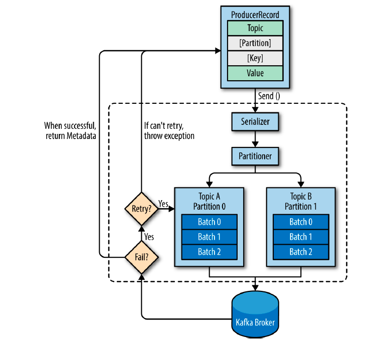

> ProducerRecord

- 카프카 브로커로 전송하기 위한 실제 데이터 (* 오프셋은 카프카 브로커에 저장된 후 생성)
  - 필수 : Topic, Value
  - 비필수 : Partition, Key

> send()

- Serializer

  - Key, Value 를 ByteArray 타입으로 직렬화
- Partitioner

  - 라운드 로빈, 스티키 파티셔닝
- 프로듀서 내부적으로 send() 메소드 동작 이후 레코드들을 파티션별로 잠시 저장

  - 프로듀서가 카프카로 전송하기 전, 배치 전송을 하기 위함
  - 전송 실패 시 재시도
    - 지정된 횟수만큼 재시도 후 실패 시 최종 실패 처리
    - 전송 성공 시 메타데이터 리턴

## 2. 프로듀서 주요 옵션

### 2.1 프로듀서 주요 옵션 (필수 옵션)

> bootstrap.servers

- 카프카 클러스터는 마스터 개념이 없기 때문에 클러스터 내 모든 서버가 클라이언트 요청을 받을 수 있음
- 클라이언트가 카프카 클러스터에 처음 연결하기 위한 호스트, 포트 정보 설정

> key.serializer

- 레코드의 메시지 키를 직렬화 하는 클래스 지정

> value.serializer

- 레코드의 메시지 값을 직렬화 하는 클래스 지정

### 2.2 프로듀서 주요 옵션 (선택 옵션)

> partitioner.class

- 레코드를 파티션에 전송할 때, 적용하는 파티셔너 클래스 지정 (기본값 : org.apache.kafka.clients.producer.internals.DefaultPartitioner)
  - UniformStickyPartitioner (2.5.0 버전 기준)

> buffer.memory

- 프로듀서가 카프카 브로커로 메시지를 보내기 위해 잠시 대기할 수 있는 전체 메모리 바이트 (기본값 : 33,554,432 byte (32MB))
  - 배치 전송, 딜레이

> compression.type

- 프로듀서가 카프카 브로커로 메시지 전송 시 선택 가능한 압축 타입 (기본값 : none)
  - none, gzip, snappy, lz4, zstd 등

> enable.idempotence

- 중복 없는 메시지 전송 (멱등성 프로듀서) 을 위한 설정
  - max.in.flight.requests.per.connection : 5 이하 설정 필요
  - retries : 0 이상 설정 필요
  - acks : all 설정 필요
  - 3.x 버전에서부터 기본값 true 로 변경

> max.in.flight.requests.per.connection

- 한 번에 요청하는 최대 커넥션 갯수 (기본값 : 5)
- 설정값만큼 동시에 전달 요청 수행
  - sender 쓰레드로 브로커에 데이터를 전송할 때, 사용되는 쓰레드 개수와 동일

> retries

- 카프카 브로커에 전송 실패한 메시지를 다시 보내기 위한 재시도 횟수 (기본값 : 2147483647)

> acks

- 프로듀서가 카프카 브로커의 리더 파티션으로 메시지를 전송 후 요청을 완료하기를 결정하는 옵션
- 0 : 전송 확인 (리더, 팔로워 파티션 저장 유무 미확인)
- 1 : 리더 파티션 저장 유무 확인
- 2 : 리더 파티션, 팔로워 파티션 저장 유무 모두 확인

> batch.size

- 동일한 파티션으로 보내는 여러 데이터를 함께 배치로 보내기 위한 사이즈 (기본값 : 16,384 byte (16KB))
  - 적절한 배치 크기 설정은 성능 향상에 도움
  - \* linger.ms 값을 0으로 설정 시 바로바로 레코드를 카프카 브로커로 전송하기 때문에 무의미

> linger.ms

- 배치 크기에 도달하지 못한 상태에서 linger.ms 에 설정한 제한 시간에 도달한 경우, 메시지 전송 (기본값 : 0)

> transactional.id

- 프로듀서가 레코드를 전송할 때, 레코드를 트랜잭션 단위로 묶을지 여부 설정 (기본값 : null)
  - 동일한 TransactionalId 를 정확히 한 번 전송하는 것 보장
- transactional.id 설정 시 enable.idempotence 는 자동 true 로 설정

### 2.3 ISR (In-Sync-Replicas) 와 acks 옵션

#### 2.3.1 ISR (In-Sync-Replicas)

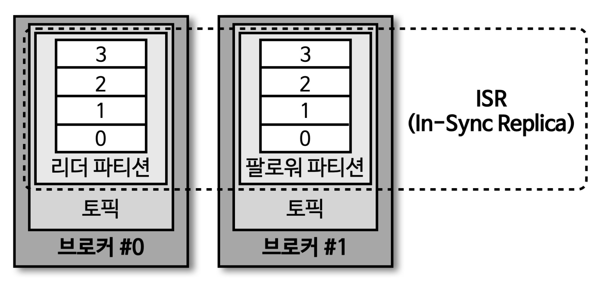

> ISR 은 리더 파티션과 팔로워 파티션이 모두 동기화된 상태를 의미

- 동기화가 완료됐다는 의미는 리더 파티션의 모든 데이터가 팔로워 파티션에 복제된 상태 의미

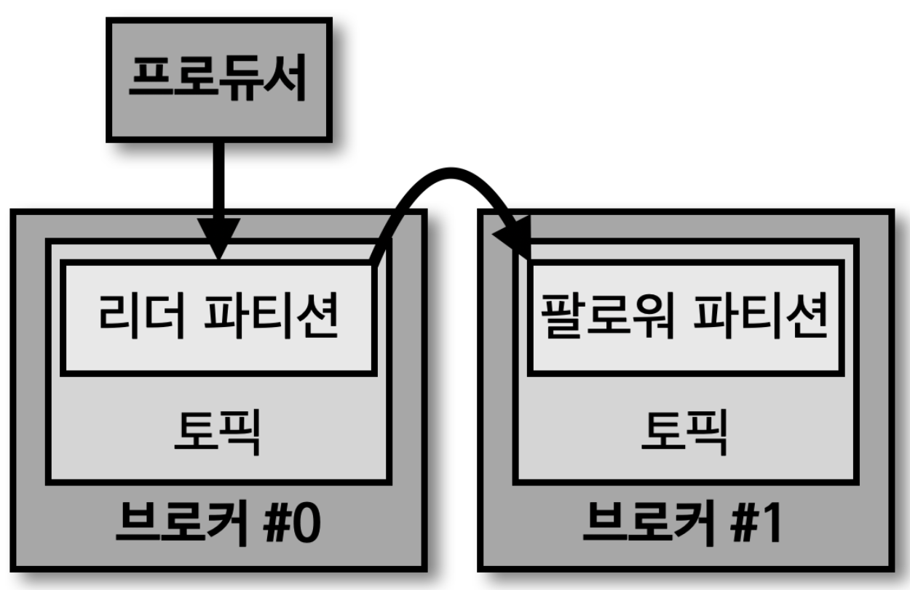

- 팔로워 파티션이 리더 파티션으로부터 데이터를 복제하는 데는 시간이 소요된다
- 특정 파티션에 데이터를 저장하는 작업은 리더 파티션을 통해 처리 (프로듀서 -> 브로커 - 리더 파티션)
  - 이때, 리더 파티션에 새로운 레코드가 추가되어 '오프셋이 증가'하면, 팔로워 파티션이 위치한 브로커는 리더 파티션의 데이터를 복제
  - 리더 파티션에 데이터가 적재된 이후 팔로워 파티션이 복제하는 시간차 때문에 '리더 파티션과 팔로워 파티션 간에 오프셋 차이가 발생'하기도 한다
    - Replication Lag

#### 2.3.2 acks

- acks 옵션은 0, 1, all (-1) 로 설정 가능
- 해당 옵션을 통해 프로듀서가 전송한 데이터가 카프카 클러스터에 얼마나 '신뢰성' 있게 저장될 지 지정
- acks 옵션에 따라 성능 차이 발생 가능
  - 복제 개수가 1인 경우, acks 옵션에 따른 성능 변화는 크지 않음
  - 하지만, 데이터를 안정적으로 운영하기 위해서는 복제 개수를 2 이상으로 운영하는 것이 좋음

#### 2.3.3 acks=0

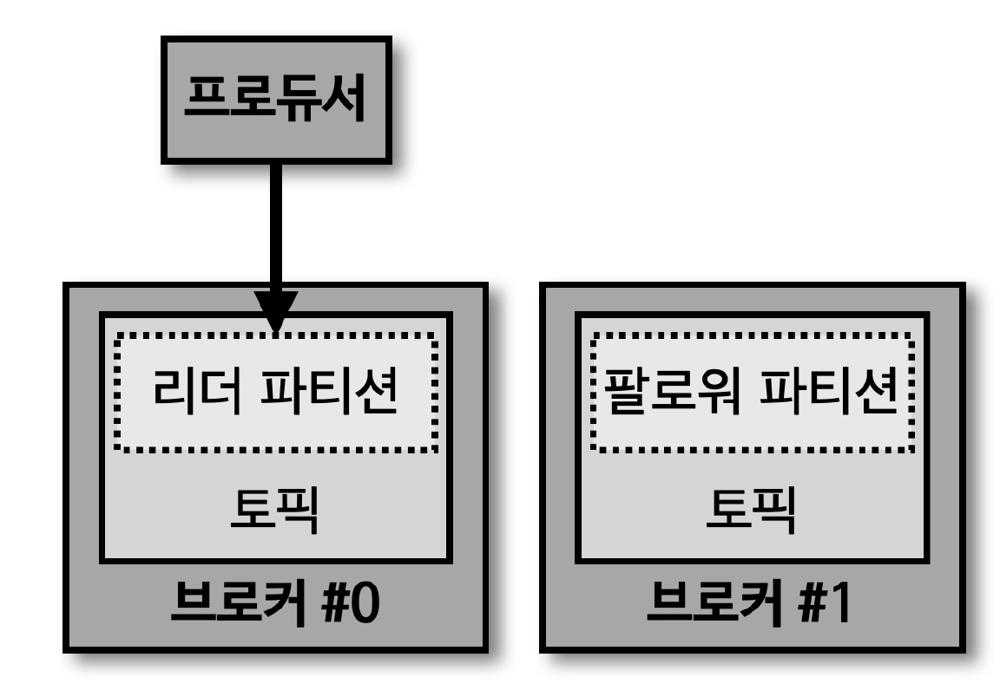

> 프로듀서가 리더 파티션으로 데이터를 전송했을 때, 리더 파티션에 데이터가 저장됐는지 확인하지 않음 (sender 만 수행)

- 리더 파티션은 데이터 저장 후 해당 데이터가 몇 번째 오프셋에 저장되었는지 리턴
- acks 가 0 인 경우, 프로듀서는 리더 파티션에 데이터가 저장되었는지에 대한 응답값을 받지 X
- 데이터 전송 속도는 acks 1 또는 all 보다 빠름
  - 데이터의 일부 유실이 발생하더라도 속도가 중요한 경우 해당 옵션 사용

#### 2.3.4 acks=1

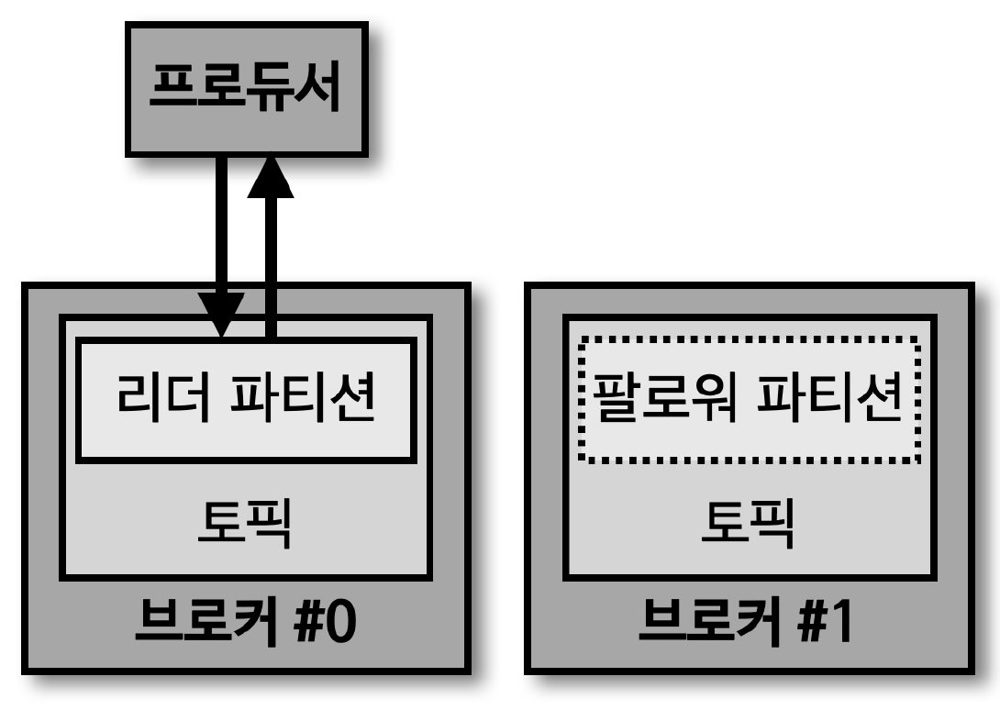

> 프로듀서가 리더 파티션으로 데이터를 전송했을 때, 리더 파티션에 데이터가 저장됐는지 확인 (팔로워 파티션 데이터 적재 여부는 미확인)

- 리더 파티션에 정상적으로 적재되지 않았다면, 리더 파티션에 적재될 때까지 재시도 가능
  - 하지만, 팔로워 파티션에 복제 되기 전 리더 파티션에 장애가 발생할 경우, 데이터 유실 가능

#### 2.3.5 acks=all

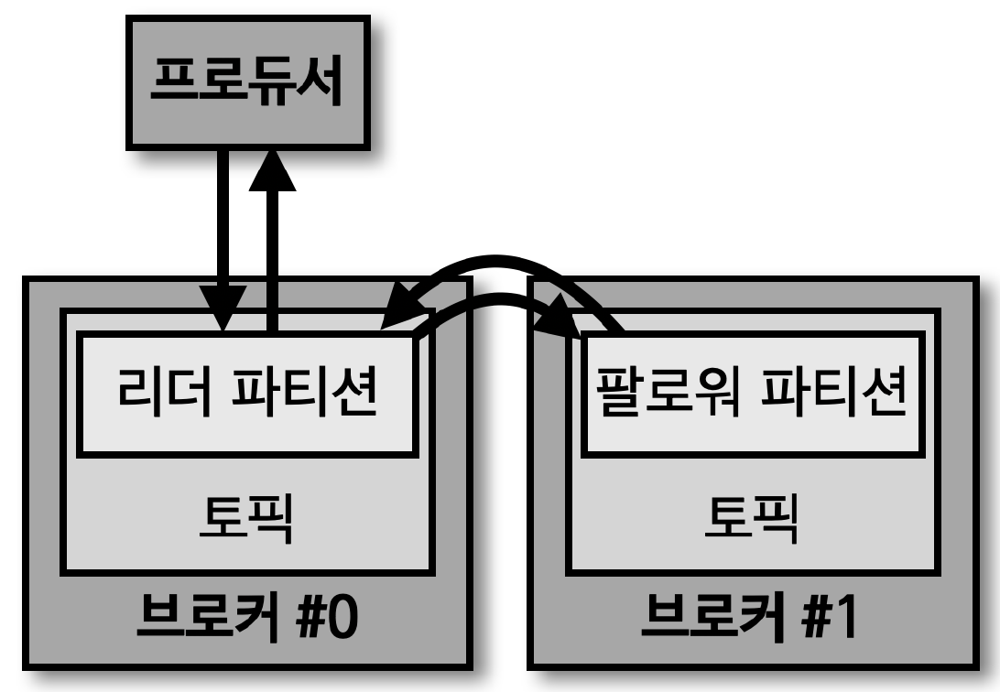

> 프로듀서가 리더 파티션으로 데이터를 전송했을 때, 리더 파티션, 팔로워 파티션 모두에 데이터가 저장됐는지 확인

- 리더 파티션, 팔로워 파티션 모두 데이터 적재 유무를 확인하기 때문에 0 또는 1 옵션 보다 속도가 느림
  - 하지만, 일부 브로커에 장애가 발생하더라도 프로듀서가 안전하게 데이터를 송수신 가능
  - 토픽 단위로 설정 가능한 'min.insync.replicas' 옵션값에 따라 데이터의 안정성이 달라진다
    - 브로커 3대가 있는 환경에서 acks=all, min.insync.replicas=2 로 설정 시, 리더 파티션이 있는 브로커와 팔로워 파티션이 있는 브로커 총 2개에 대해서만 acks 확인 (나머지 팔로워 파티션이 있는 브로커는 확인하지 않음)

#### 2.3.6 min.insync.replicas

> 프로듀서가 리더 파티션과 팔로워 파티션에 데이터가 적재되었는지 확인하기 위한 최소 ISR 그룹의 파티션 개수

- min.insync.replicas=1 인 경우, ISR 중 최소 1개 이상의 파티션에 데이터가 적재 되었음을 확인
  - acks=1 과 동일한 동작 (ISR 중 가장 처음 적재가 완료되는 파티션은 리더 파티션이기 때문)

#### 2.3.7 acks=-1(all) / min.insync.replicas=2

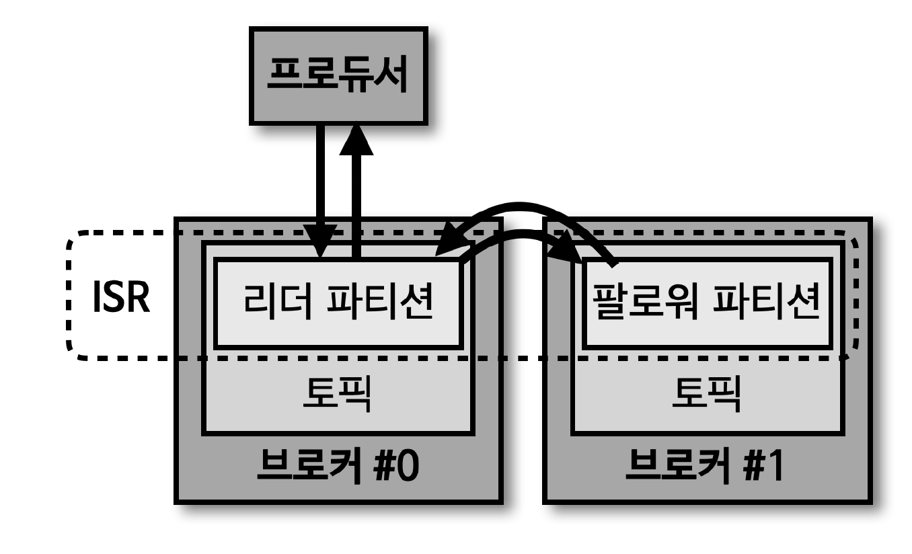

> min.insync.replicas 의 옵션값을 2로 설정했을 때부터 acks 를 all 로 설정하는 의미가 있다

- ISR 의 2개 이상의 파티션에 적재되었음을 확인한다는 뜻은 적어도 리더 파티션과 1개의 팔로워 파티션에 데이터가 정상적으로 적재되었음을 보장
- 카프카 클러스터를 운영하면서 브로커가 동시에 2개가 중단되는 일은 극히 드뭄

  - 리더 파티션과 팔로워 파티션 중 1개에 데이터가 적재 완료되었다면 데이터는 유실되지 않는다고 볼 수 있음

## 3. 프로듀서 전송 방법 예제

> 메시지를 보내고 응답값 확인하지 않기

````java
public class ProducerFireForgot {
    public static void main(String[] args) {
        // 필수 옵션
        Properties props = new Properties();
        props.put("bootstrap.servers", "peter-kafka01.foo.bar:9092, peter-kafka02.foo.bar:9092, peter-kafka03.foo.bar:9092");
        props.put("key.serializer", "org.apache.kafka.common.serialization.StringSerializer");
        props.put("value.serializer", "org.apache.kafka.common.serialization.StringSerializer");

        Producer<String, String> producer = new KafkaProducer<>(props);

        try {
            for (int i = 0; i < 3; i++) {
                // ProducerRecord 객체 생성 (레코드)
                ProducerRecord<String, String> record = new ProducerRecord<>("peter-basic01", "Apache Kafka is a distributed streaming platform - " + i);

                // send() 메소드를 통한 메시지 전송
                producer.send(record); // RecordMetadata 리턴을 받지 않기 때문에, 메시지 전송 성공 여부 파악 불가
            }
        } catch (Exception e) {
            e.printStackTrace();
        } finally {
            producer.close(); // 프로듀서 종료
        }
    }
}
````

> 동기 전송

````java
public class ProducerSync {
    public static void main(String[] args) {
        // 필수 옵션
        Properties props = new Properties();
        props.put("bootstrap.servers", "peter-kafka01.foo.bar:9092, peter-kafka02.foo.bar:9092, peter-kafka03.foo.bar:9092");
        props.put("key.serializer", "org.apache.kafka.common.serialization.StringSerializer");
        props.put("value.serializer", "org.apache.kafka.common.serialization.StringSerializer");

        Producer<String, String> producer = new KafkaProducer<>(props);

        try {
            for (int i = 0; i < 3; i++) {
                // ProducerRecord 객체 생성 (레코드)
                ProducerRecord<String, String> record = new ProducerRecord<>("peter-basic01", "Apache Kafka is a distributed streaming platform - " + i);

                // get() 메소드를 통하여 카프카 응답 대기
                // 1. 메시지 전송 성공 시 RecordMetadata 리턴
                // 2. 메시지 전송 실패 시 예외 발생
                RecordMetadata metadata = producer.send(record).get(); // send() 메소드를 통한 메시지 전송

                System.out.println("Topic : %s, Partition : %d, Offset : %d, Key : %s, Received Message : %s\n", metadata.topic(), metadata.partition(), metadata.offset(), record.key(), record.value());
            }
        } catch (Exception e) {
            e.printStackTrace();
        } finally {
            producer.close(); // 프로듀서 종료
        }
    }
}
````

> 비동기 전송

````java
// 콜백
public class PeterProducerCallback implements Callback { // 콜백을 위한 Callback 구현

    private ProducerRecord<String, String> record;

    public PeterProducerCallback(ProducerRecord<String, String> record) {
        this.record = record;
    }

    @Override
    public void onCompletion(RecordMetadata metadata, Exception e) {
        // 예외 발생 시 예외 처리 별도 구현 필요
        if (e != null) {
            e.printStackTrace();
        } else {
            System.out.println("Topic : %s, Partition : %d, Offset : %d, Key : %s, Received Message : %s\n", metadata.topic(), metadata.partition(), metadata.offset(), record.key(), record.value());
        }
    }
}
````

````java
public class ProducerAsync {
    public static void main(String[] args) {
        // 필수 옵션
        Properties props = new Properties();
        props.put("bootstrap.servers", "peter-kafka01.foo.bar:9092, peter-kafka02.foo.bar:9092, peter-kafka03.foo.bar:9092");
        props.put("key.serializer", "org.apache.kafka.common.serialization.StringSerializer");
        props.put("value.serializer", "org.apache.kafka.common.serialization.StringSerializer");

        Producer<String, String> producer = new KafkaProducer<>(props);

        try {
            for (int i = 0; i < 3; i++) {
                // ProducerRecord 객체 생성 (레코드)
                ProducerRecord<String, String> record = new ProducerRecord<>("peter-basic01", "Apache Kafka is a distributed streaming platform - " + i);

                // 프로듀서에 콜백 객체를 포함하여 메시지 전송
                producer.send(record, new PeterProducerCallback(record));
            }
        } catch (Exception e) {
            e.printStackTrace();
        } finally {
            producer.close(); // 프로듀서 종료
        }
    }
}
````

## 4. 파티셔너

### 4.1 프로듀서 기본 파티셔너

> 프로듀서 API 사용 시 'UniformStickyPartitioner' 와 'RoundRobinPartitioner' 2개의 파티셔너 제공

- 카프카 클라이언트 라이브러리 2.5.0 버전에서는 파티셔너 미지정 시 'UniformStickyPartitioner' 파티셔너로 기본 설정

> 메시지 키가 있을 경우 동작 방식

- 'UniformStickyPartitioner' 와 'RoundRobinPartitioner' 2가지 파티셔닝 전략 모두 메시지 키가 있는 경우, 메시지 키의 해시값과 파티션을 매칭하여 레코드 전송
- 동일한 메시지 키가 존재하는 레코드는 동일한 파티션 번호에 전달 (만약, 파티션 개수가 변경될 경우, 메시지 키와 파티션 번호 매칭이 달라짐)

  > 파티션 수 증가에 따른 해시 변경
  >

  

  - 메시지의 키를 이용해 카프카로 메시지를 전송하는 경우, 관리자의 의도와는 다른 방식으로 메시지 전송이 이뤄질 수 있으므로 되도록 파티션 수 변경을 하지 않는 것을 권장

> 메시지 키가 없을 경우 동작 방식

- \* 메시지 키가 없는 경우, 파티션에 최대한 동일하게 분배하는 로직으로 처리하며, UniformStickyPartitioner 는 RoundRobinPartitioner 의 단점을 개선한 방식

  > RoundRobinPartitioner
  >

  

  - ProducerRecord 가 '들어오는대로 파티션을 순회'하면서 전송
  - Accumulator 에서 레코드들이 배치로 묶이는 정도가 적기 때문에 '전송 성능이 낮음'
    - 레코드 단위별로 라운로 로빈 되기 때문에 묶이는 정도가 적음

  > UniformStickyPartitioner
  >

  

  - Accumulator 에서 레코드들이 '배치로 묶일 때까지 대기하였다가 전송'
  - 배치로 묶일 뿐, 라운드 로빈 방식으로 결국 파티션을 순회하며 보내기 때문에 모든 파티션에 분배되어 전송
  - RoundRobinPartitioner 방식에 비하여 성능 향상
    - \* 레코드를 묶어서 배치로 전송하기 때문에 성능 향상

### 4.2 프로듀서 커스텀 파티셔너

- 사용자 지정 파티셔너 생성을 위해 'Partitioner 인터페이스' 제공
- Partitioner 인터페이스를 상속 받은 사용자 정의 클래스에서 메시지 키 또는 메시지값에 따른 파티션 지정 로직 적용 가능
  - 파티셔너를 통해 파티션이 지정된 데이터는 Accumulator 에 버퍼로 쌓임
  - Sender 쓰레드는 Accumulator 에 쌓인 배치 데이터를 가져가서 카프카 브로커로 전송

````java
// 커스텀 파티셔너 설정
Properties configs = new Properties();
...
configs.put(ProducerConfig.PARTITIONER_CLASS_CONFIG, CustomPartitioner.class); // 커스텀 파티셔너 클래스 정보 추가

KafkaProducer<String, String> producer = new KafkaProducer<>(configs);
````

````java
// 커스텀 파티셔너 내부 로직 구현
public class CustomPartitioner implements Partitioner {

    @Override
    public int partition(String topic, Object key, byte[] keyBytes, Object value, byte[] valueBytes, Cluster cluster) {
        if (keyBytes == null) {
            throw new InvalidRecordException("Need message key");
        }

        // 메시지 키가 "Seoul" 인 경우, 0 리턴
        if (((String) key).equals("Pangyo")) {
            return 0;
        }

        // 해시값에 의한 파티션 분배 처리
        List<PartitionInfo> partitions = cluster.partitionsForTopic(topic);
        int numPartitions = partitions.size();
        return Utils.toPositive(Utils.murmur2(keyBytes)) % numPartitions;
    }

    ...
}
````

## 5. 프로듀서의 배치

- 프로듀서에서는 카프카로 메시지를 전송하기 전, 배치 전송을 위해 토픽의 파티션별로 레코드들을 잠시 보관
- 프로듀서의 배치 전송 방식은 단건의 메시지를 전송하는 것이 아니라 한 번에 다량의 메시지를 묶어서 전송하는 방법

### 5.1 프로듀서 배치 전송 옵션

> buffer.memory

- 카프카로 메시지들을 전송하기 위해 담아두는 프로듀서의 버퍼 메모리 옵션
- 기본값 : 32MB

> batch.size

- 배치 전송을 위해 메시지들을 묶는 단위를 설정하는 배치 크기 옵션
- 기본값 : 16KB

> linger.ms

- 배치 전송을 위해 버퍼 메모리에서 대기하는 메시지들의 최대 대기시간을 설정하는 옵션
- 단위 : ms
- 기본값 : 0
  - 기본값이 0인 경우, 배치 전송을 위해 기다리지 않고 메시지들이 즉시 전송

> 장점

- 불필요한 I/O를 줄일 수 있기 때문에 단건으로 메시지를 전송하는 방식 보다 효율적
- 카프카의 요청 수를 줄여주는 효과
  - 1,000개의 메시지를 단건으로 보낼 시 1,000번 요청 필요
  - 배치 전송 시 100개의 메시지를 10번 요청하여 처리 가능

> 카프카를 사용하는 목적에 따라 '처리량'을 높일지, '지연 없는 전송'을 해야 할지 선택 필요

- 높은 처리량이 필요한 경우, 효율적인 배치 전송을 위해 프로듀서 설정 변경 필요
  - batch.size, linger.ms 값을 크게 설정 필요
  - \* buffer.memory 설정 값이 batch.size 보다 커야함
- 지연 없는 전송이 필요한 경우, 프로듀서의 배치 전송 관련 설정 제거 필요
  - batch.size, linger.ms 값을 작게 설정 필요

## 6. 레코드 전송 방식

- 카프카는 사용자들의 개발 편의를 높이기 위해 중복 없이 메시지를 전송할 수 있는 기능 제공
- 메시지 시스템들의 메시지 전송 방식

> 최대 한 번 전송 (at-most-once)


1. 프로듀서가 브로커의 특정 토픽으로 메시지 A 전송
2. 브로커는 메시지 A 저장 후 ACK 를 프로듀서에게 응답
3. 프로듀서는 다음 메시지인 메시지 B 를 브로커에게 전송
4. 브로커는 메시지 B 를 저장하지 못하고, ACK 응답 실패
5. 프로듀서는 브로커가 메시지 B 를 받았다고 가정하고, 다음 메시지인 메시지 C 전송

- **\* 최대 한 번 전송은 프로듀서가 ACK 를 받지 못하더라도 메시지 중복 가능성을 회피하기 위해 재전송 하지 않음**
  - 대량 로그 수집, IoT 환경에서 사용

> 적어도 한 번 전송 방식 (at-least-once)

- 카프카의 기본 메시지 전송 방식


1. 프로듀서가 브로커의 특정 토픽으로 메시지 A 전송
2. 브로커는 메시지 A 를 기록하고, ACK 를 프로듀서에게 응답
3. 브로커의 ACK 를 받은 프로듀서는 다음 메시지인 메시지 B 를 브로커에게 전송
4. 브로커는 메시지 B 를 기록하고, ACK 를 프로듀서에게 전송하려 하는 시점에 네트워크 오류 또는 브로커 장애가 발생하여 ACK 응답 실패
5. 메시지 B 를 전송한 후 브로커로부터 ACK 를 받지 못한 프로듀서는 브로커가 메시지 B 를 받지 못했다고 판단하여 메시지 B 재전송

- **\* 해당 시점에서 프로듀서는 브로커가 메시지를 저장하고 ACK 만 응답하지 못한 것인지, 메시지를 저장하지 못해서 ACK 를 응답하지 못한 것인지 판단 불가**
- 하지만, '적어도 한 번 전송' 방식에 의하여 메시지 B 를 재전송하여 '최소한 하나의 메시지에 대하여 보장'
  - 브로커가 메시지 B 를 받지 못한 상황이라면, 브로커는 메시지 B 저장
  - 브로커가 메시지 B 를 저장하고, ACK 만 전송하지 못한 상황이라면, 메시지 B 는 중복 저장

> 정확히 한 번 전송 (exactly-once) - 멱등성 프로듀서


1. 프로듀서가 브로커의 특정 토픽으로 메시지 A 전송 (PID - Produce ID 와 메시지 번호 0을 헤더에 포함)
2. 브로커는 메시지 A 를 저장하고, PID와 메시지 번호 0을 메모리에 기록한 뒤 ACK 를 프로듀서에게 응답
3. 프로듀서는 다음 메시지인 메시지 B 를 브로커에 전송 (PID 는 동일하고 0이며, 메시지 번호는 1이 증가하여 1)
4. 브로커는 메시지 B를 저장하고, PID와 메시지 번호 1을 메모리에 기록하지만, 네트워크 오류 또는 브로커 장애로 인하여 ACK 응답 실패
5. **\* 브로커로부터 ACK 를 받지 못한 프로듀서는 브로커가 메시지 B를 받지 못했다고 판단해 메시지 B를 재전송**

- **'적어도 한 번 전송' 방식과 유사하지만, 프로듀서가 재전송한 메시지 B의 헤더에서 PID(0)와 메시지 번호(1)를 비교해서 메시지 B가 이미 브로커에 저장되어 있는 것을 확인한 브로커는 메시지를 중복 저장하지 않고, ACK 만 응답**

  - 'PID' 와 '메시지 번호'를 사용하기 때문에 메시지 중복 발생 X
    - 'PID' 와 '메시지 번호' 는 snapshot 파일에 저장하여 관리
  - 프로듀서가 보낸 메시지 번호가 브로커가 갖고 있는 메시지 번호보다 정확하게 하나가 큰 경우가 아니라면, 브로커는 프로듀서의 메시지 저장 X
    - 'OutOfOrderSequenceException' 발생
- **하지만, 중복을 피하기 위한 메시지 비교 동작에는 오버헤드 발생**

  - 메시지에 단순한 숫자 필드만 추가하는 방법으로 구현하였기 때문에 오버헤드가 높은 편은 아님
- 따라서, 중복 없는 메시지 전송 필요 시 해당 방식 적용 권장

> 중복 없는 전송을 위한 프로듀서 설정 (멱등성 프로듀서)


| 프로듀서 옵션                         | 값    | 설명                                                                                                                                                                      |
| --------------------------------------- | ------- | --------------------------------------------------------------------------------------------------------------------------------------------------------------------------- |
| enable.idempotence                    | true  | 프로듀서가 중복 없는 전송을 허용할지 결정하는 옵션, 기본값은 false 이며, true 로 사용할 경우, 나머지 옵션도 반드시 변경 필요 (나머지 옵션 미설정 시 ConfigException 발생) |
| max.in.flight.requests.per.connection | 1 ~ 5 | ACK 를 받지 않은 상태에서 하나의 커넥션에서 보낼 수 있는 최대 요청 수 (기본값은 5이며, 5 이하로 설정 필요)                                                                |
| acks                                  | all   | 프로듀서 acks 와 관련된 옵션으로, 기본값은 1이며, all 로 설정 필요                                                                                                        |
| retries                               | 5     | ACK 를 받지 못한 경우, 재시도를 해야 하므로 0보다 큰 값으로 설정 필요                                                                                                     |

## 7. 멱등성 프로듀서

> '멱등성'이란, 여러 번 연산을 수행하더라도 동일한 결과를 나타내는 것

- 이러한 의미에서 멱등성 프로듀서는 동일한 데이터를 여러 번 전송하더라도 카프카 클러스터에 단 1번만 저장됨을 의미
- 기본 프로듀서의 동작 방식은 '적어도 한번 (at least once)' 지원
- 적어도 한번 전달 방식은 프로듀서가 클러스터에 데이터를 전송하여 저장할 때, '적어도 한번 이상 데이터 적재 가능'하며, '데이터가 유실되지 않음'을 의미
  - \* 하지만, 2번 이상 적재될 가능성이 있으므로 '데이터 중복' 발생 가능

### 7.1 멱등성 프로듀서

> 프로듀서가 보내는 데이터의 중복 적재를 방지하기 위해 '0.11.0' 버전 이후부터 프로듀서에서 'enable.idempotence' 옵션을 사용하여 '정확히 한번 전달 (exactly once delivery)' 지원

- enable.idempotence 옵션 기본값은 false

  - 정확히 한번 전달 방식을 위해서는 해당 옵션을 true 설정하여 멱등성 프로듀서로 동작하도록 설정 필요
- \* 카프카 3.0.0 버전부터 enable.idempotence 옵션 기본값은 true 이며, acks=all 로 변경됨

  - acks=all 로 설정될 경우, 리더 파티션과 팔로우 파티션에 데이터 적재여부를 모두 파악하므로 응답 속도가 느려짐
  - 신규 버전에서 프로듀서 동작에 유의하여 사용 필요

> 멱등성 프로듀서 설정 방법

````java
Properties configs = new Properties();
configs.put(ProducerConfig.BOOTSTRAP_SERVERS_CONFIG, BOOTSTRAP_SERVERS);
configs.put(ProducerConfig.KEY_SERIALIZER_CLASS_CONFIG, StringSerializer.class.getName());
configs.put(ProducerConfig.VALUE_SERIALIZER_CLASS_CONFIG, StringSerializer.class.getName());
configs.put(ProducerConfig.ENABLE_IDEMPOTENCE_CONFIG, true); // 멱등성 프로듀서 설정

KafkaProducer<String, String> producer = new KafkaProducer<>(configs);
````

### 7.2 멱등성 프로듀서의 동작

> 멱등성 프로듀서는 기본 프로듀서와 다르게 데이터를 브로커로 전달할 때, 프로듀서 PID (Producer unique ID) 와 시퀀스 넘버 (sequence number) 를 함께 전달

- 브로커는 프로듀서의 PID 와 시퀀스 넘버를 확인하여 동일한 메시지의 적재 요청이 오더라도 단 1번만 데이터를 적재하므로 프로듀서의 데이터는 정확히 한번만 브로커에 적재되도록 동작
- PID (Producer unique ID) : 프로듀서의 고유한 ID
- SID (Sequence ID) : 레코드의 전달 번호 ID

### 7.3 멱등성 프로듀서가 아닌 경우

> 데이터 중복 발생 가능

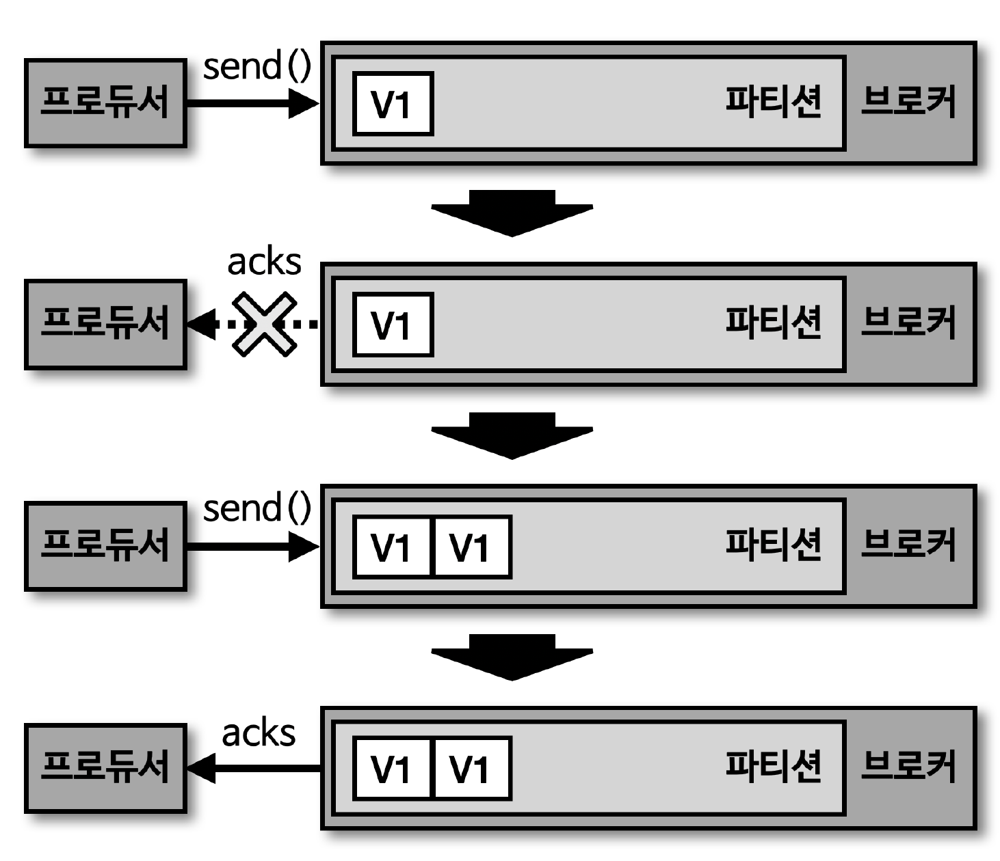

### 7.4 멱등성 프로듀서인 경우

> 데이터 중복 발생 불가


### 7.5 멱등성 프로듀서의 한계

> 멱등성 프로듀서는 동일한 세션에서만 정확히 한번 전달 보장

- 여기서 말하는 세션이란, PID 의 생명주기
- 만약 멱등성 프로듀서로 동작하는 프로듀서 어플리케이션에 이슈가 발생하여 종료 후 재시작 시 PID 가 달라짐
  - 동일한 데이터를 보내더라도 PID 가 달라지면, 브로커는 다른 프로듀서 어플리케이션에서 다른 데이터를 보냈다고 판단
  - 따라서, 멱등성 프로듀서는 장애가 발생하지 않을 경우에만 '정확히 한 번 적재' 하는 것을 보장한다는 점 고려

### 7.6 멱등성 프로듀서로 설정할 경우 옵션

> 멱등성 프로듀서 사용을 위해 enable.idempotence 옵션을 true 로 설정 시 정확히 한 번 적재하는 로직이 성립되기 때문에 프로듀서의 일부 옵션이 강제 설정됨

- retries

  - 프로듀서의 데이터 재전송 횟수 설정 옵션
  - Integer.MAX_VALUE 로 설정
- acks

  - 브로커의 데이터 수신 여부 확인
  - all 로 설정 (리더, 팔로워 파티션 적재 유무 모두 확인)
- 멱등성 프로듀서는 정확히 한번 브로커에 데이터를 적재하기 위해 한번만 전송하는 것이 아님

  - 상황에 따라 프로듀서가 여러 번 전송하되, 브로커가 여러 번 전송된 데이터를 확인하고 중복된 데이터는 적재하지 않는 것

### 7.7 멱등성 프로듀서 사용 시 오류 확인

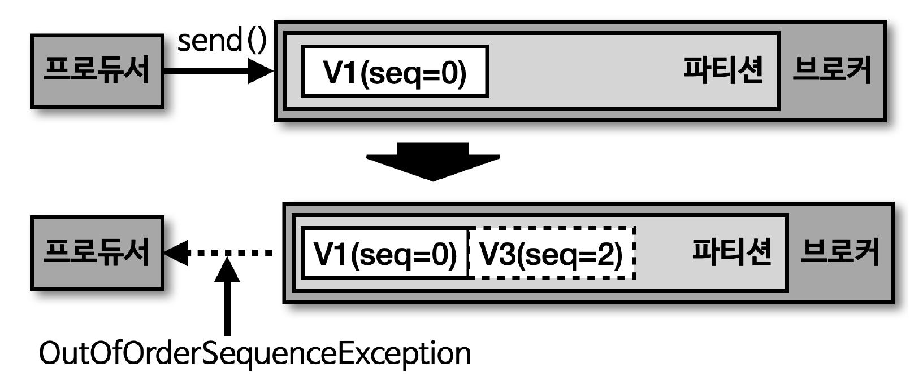

> OutOfOrderSequenceException

- 멱등성 프로듀서의 시퀀스 넘버는 0부터 시작하여 숫자를 1씩 더한 값이 브로커로 전달
- 브로커에서 멱등성 프로듀서가 전송한 데이터의 PID 와 시퀀스 넘버를 확인하는 과정에서 시퀀스 넘버가 일정하지 않은 경우, 'OutOfOrderSequenceException' 발생

  - 브로커가 예상한 시퀀스 넘버와 다른 번호의 데이터 적재 요청이 온 경우 발생
- OutOfOrderSequenceException 이 발생한 경우, '시퀀스 넘버의 역전 현상'이 발생 가능

  - 순서가 중요한 데이터를 전송하는 프로듀서는 해당 예외가 발생한 경우, 대응 방안 고려 필요
- 운영 환경 실적용 시 OutOfOrderSequenceException 에러 발생은 극히 드뭄
- 또한, 멱등성 프로듀서 사용 대신 컨슈머 어플리케이션에서 멱등성을 보장하도록 구현한다면, 멱등성 프로듀서를 굳이 사용하지 않아도 됨

## 8. 트랜잭션 프로듀서, 컨슈머

### 8.1 트랜잭션 프로듀서의 동작

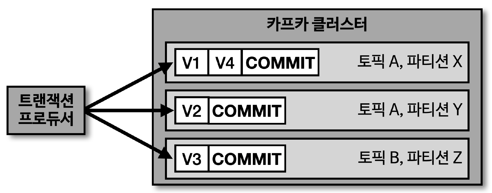

> 카프카에서 트랜잭션은 다수의 파티션에 데이터를 저장할 경우, 모든 데이터에 대해 동일한 원자성 (Atomic) 을 만족시키기 위해 사용

- 원자성을 만족시키는 의미는 다수의 데이터를 동일 트랜잭션으로 묶음으로써 전체 데이터를 처리하거나 처리하지 않도록 하는 것을 의미
- 트랜잭션 프로듀서는 사용자가 보낸 데이터를 레코드로 파티션에 저장할 뿐만 아니라 트랜잭션의 시작과 끝을 표현하기 위해 '트랜잭션 레코드'를 1개 더 보낸다

### 8.2 트랜잭션 컨슈머의 동작

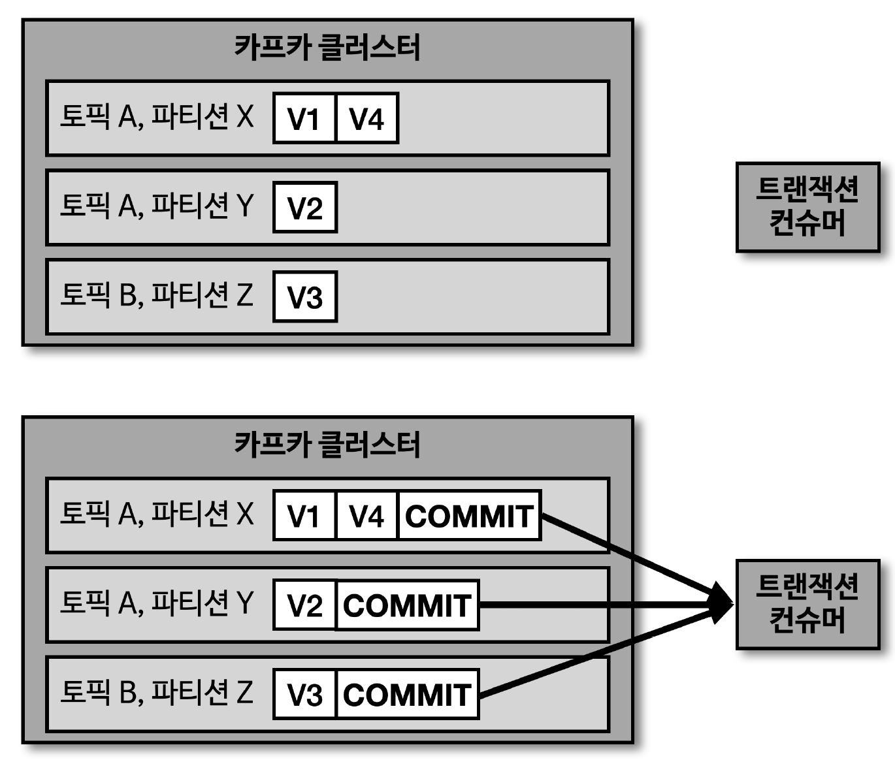

> 트랜잭션 컨슈머는 파티션에 저장된 트랜잭션 레코드를 보고 트랜잭션이 '완료 (commit)' 되었음을 확인 후 데이터를 가져감

- 트랜잭션 레코드는 실직적인 데이터는 가지고 있지 않으며, 트랜잭션이 끝난 상태를 표시하는 정보만 가지고 있음

### 8.3 트랜잭션 프로듀서 설정

> 트랜잭션 프로듀서로 동작하려면, 'transactional.id' 설정 필요

- 프로듀서별로 고유한 ID 값을 사용해야 함
- init, begin, commit 순서대로 수행 필요

````java
configs.put(ProducerConfig.TRANSACTIONAL_ID_CONFIG, UUID.randomUUID());

Producer<String, String> producer = new KafkaProducer<>(configs);

producer.initTransactions();

producer.beginTransaction();
// 복수의 레코드 전송 시 원자성으로 묶임
producer.send(new ProducerRecord<>(TOPIC, "전달하는 메시지 값"));
producer.commitTransaction();

producer.close();
````

### 8.4 트랜잭션 컨슈머 설정

> 트랜잭션 컨슈머는 커밋이 완료된 레코드들만 읽기 위해 'isolation.level' 옵션을 'read_committed' 로 설정 필요

- 기본값은 'read_uncommitted' 로서 트랜잭션 프로듀서가 레코드를 보낸 후 커밋 여부와 상관 없이 모두 읽음
- 'read_committed' 로 설정된 컨슈머는 커밋이 완료된 레코드들만 읽어서 처리

````java
configs.put(ConsumerConfig.ISOLATION_LEVEL_CONFIG, "read_committed");

KafkaConsumer<String, String> consumer = new KafkaConsumer<>(configs);
````
