## 컨슈머

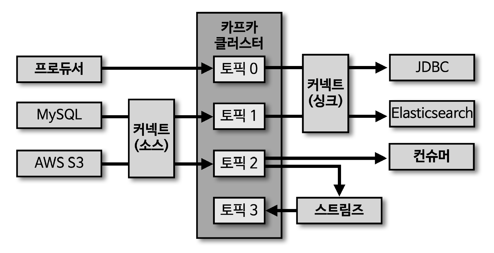

> 컨슈머는 적재된 데이터 사용을 위해 브로커로부터 데이터를 가져와 필요한 처리 진행

## 컨슈머 내부 구조

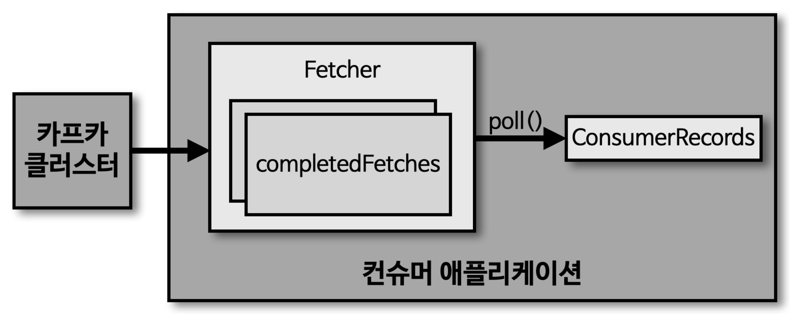

> Fetcher

- 리더 파티션으로부터 레코드들을 미리 가져와서 대기
- completedFetchers 를 통해 완료 데이터 확인
- poll() 메소드를 호출하기 전에 미리 레코드를 가져옴

> poll()

- Fetcher 에 있는 레코드들을 리턴

> ConsumerRecords

- 처리하고자 하는 레코드들의 모음 (오프셋 포함)
- 해당 단계 이후 offset commit 수행 (어느 오프셋까지 처리했는지에 대한 데이터)

## 컨슈머 그룹

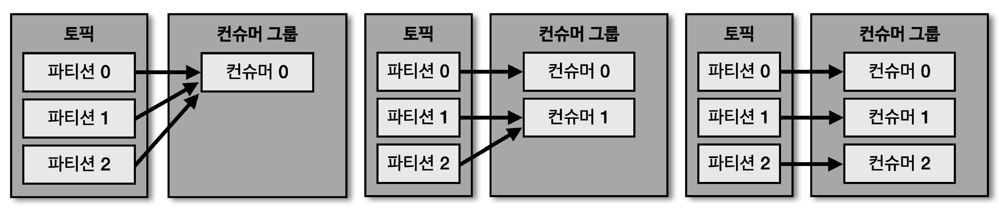

> 컨슈머를 각 컨슈머 그룹으로부터 격리된 환경에서 안전하게 운영할 수 있도록 하는 카프카의 독특한 방식

- 컨슈머 그룹으로 묶인 컨슈머들은 토픽의 1개 이상 파티션들에 할당되어 데이터를 가져갈 수 있음
- 1개의 파티션은 최대 1개의 컨슈머에 할당 가능
- 1개의 컨슈머는 여러 개의 파티션에 할당 가능
    - 파티션 (1) : 컨슈머 (1) 이 가장 효율적
    - 컨슈머 그룹의 컨슈머 개수는 토픽의 파티션 개수보다 같거나 작아야 함

## 컨슈머 그룹의 컨슈머가 파티션 개수보다 많을 경우

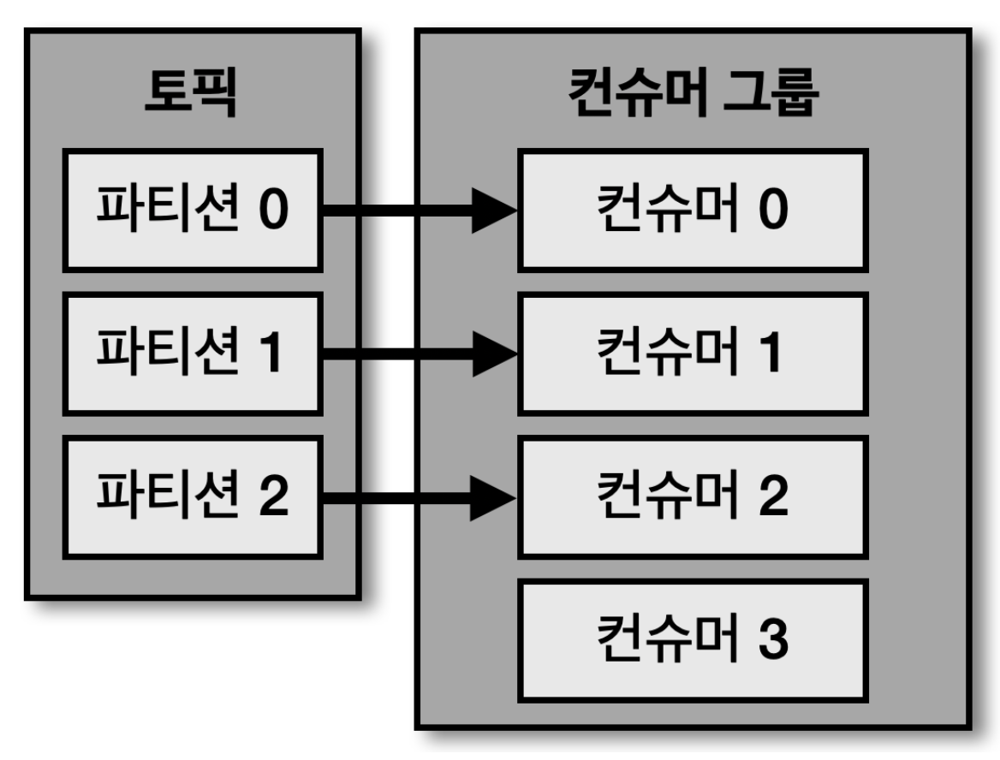

> 4개의 컨슈머로 이루어진 컨슈머 그룹이 3개의 파티션을 가진 토픽에서 데이터를 가져가기 위해 할당하는 경우, 1개의 컨슈머는 파티션을 할당 받지 못하고, '유휴 상태' 로 남게 됨

- 파티션이 미할당된 컨슈머는 쓰레드만 차지하고, 실질적으로 데이터 처리는 하지 못하므로 어플리케이션 실행에 있어 '불필요 쓰레드'로 남게 됨

## 어플리케이션 간 결합도를 낮춘 유연한 구조

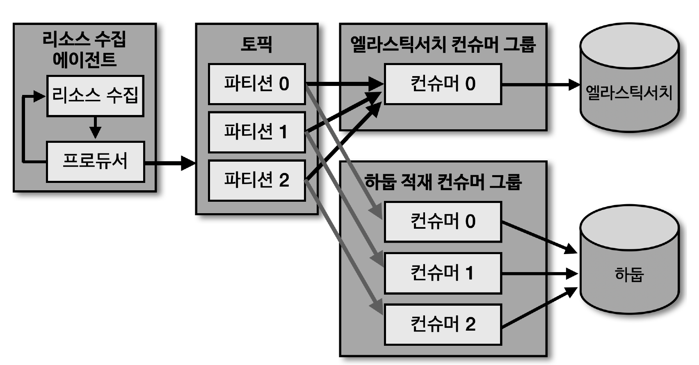

- 각기 다른 저장소에 데이터를 저장하는 컨슈머를 각각의 컨슈머 그룹으로 묶어 각 저장소를 장애에 격리되게 운영 가능
- 가령, '엘라스틱서치' 장애 발생 시 장애 영향도는 '엘라스틱서치' 에만 해당
    - '엘라스틱서치' 장애 해소 시, 해당 컨슈머 그룹은 마지막으로 적재 완료된 데이터 이후부터 재적재하고 최종적으로는 정상화 가능

## 리밸런싱

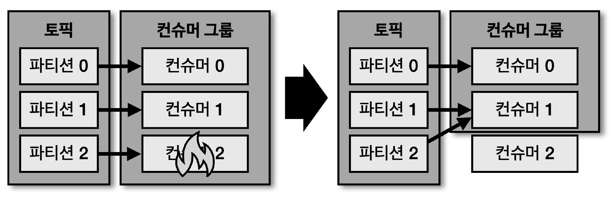

> 컨슈머 그룹으로 이루어진 컨슈머들 중 일부 컨슈머에 장애 발생 시, 장애가 발생한 컨슈머에 할당된 파티션은 장애가 발생하지 않은 컨슈머에게 재할당 됨 (리밸런싱)

- 리밸런싱은 크게 2가지 경우에 발생

1. 컨슈머 추가 시
2. 컨슈머 제외 시

- 이슈가 발생한 컨슈머를 컨슈머 그룹에서 제외하여 모든 파티션이 지속적으로 데이터를 처리할 수 있도록 '가용성'을 높여줌
    - 토픽의 개수가 많을수록 리밸런싱 소요 시간은 길어짐
    - 되도록 리밸런싱이 발생할 상황이 생기지 않는 것이 좋음

- \* 리밸런싱은 컨슈머가 데이터를 처리하는 도중에 언제든지 발생 가능하므로 '데이터 처리 중 발생한 리밸런싱에 대응하는 코드 작성 필요'
    - 리밸런싱 수행을 감지하는 리밸런싱 리스너인 'ConsumerRebalanceListener' 인터페이스 구현
        - onPartitionAssigned : 리밸런싱이 끝나고 파티션이 할당될 때 호출되는 메서드
        - onPartitionRevoked : 리밸런싱 수행 직전 호출되는 메서드 (해당 메서드에서 커밋 필요)

## 커밋

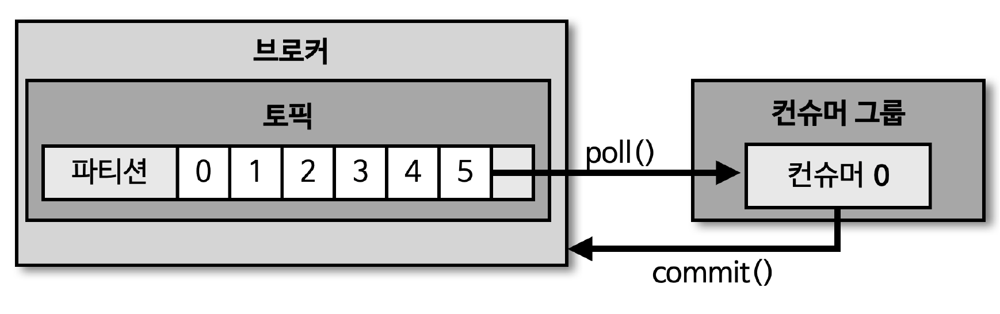

> 컨슈머는 카프카 브로커로부터 데이터를 어디까지 가져갔는지 Commit 을 통해 기록

- 특정 토픽의 파티션을 어떤 컨슈머 그룹이 몇 번째까지 가져갔는지, 카프카 브로커 내부에서 사용되는 내부 토픽 (__consumer_offsets) 에 기록

- \* 컨슈머에서 데이터 처리중 장애 발생 시 특정 토픽의 어느 레코드까지 가져갔는지 '__consumer_offsets' 에 오프셋 커밋이 기록되지 못했다면, 데이터 처리의 중복 발생 가능
    - 중복 데이터가 발생하지 않게 하기 위해서는, 컨슈머 어플리케이션이 '오프셋 커밋' 을 정상적으로 처리했는지 검증 필요

## Assignor

> 컨슈머와 파티션 할당 정책은 컨슈머의 Assignor 에 의해 결정

- 카프카에서는 아래 3가지 Assignor 제공 (2.5.0 버전에서는 기본값 : RangeAssignor)

> RangeAssignor

- 각 토픽에서 파티션을 숫자로 정렬, 컨슈머를 사전 순서로 정렬하여 할당

> RoundRobinAssignor

- 모든 파티션을 컨슈머에서 번갈아가며 할당

> StickyAssignor

- 최대한 파티션을 균등하게 배분하면서 할당

## 컨슈머 주요 옵션 (필수 옵션)

> bootstrap.servers

- 프로듀서가 데이터를 전송할 카프카 클러스터에 속한 브로커의 호스트 이름:포트를 1개 이상 작성
  - 2개 이상의 브로커 정보를 입력하여 일부 브로커에 이슈가 발생하더라도 접속하는 데 이슈가 없도록 설정 가능

> key.deserializer

- 레코드의 메시지 키를 역직렬화하는 클래스 지정

> value.deserializer

- 레코드의 메시지 값을 역직렬화하는 클래스 지정

## 컨슈머 주요 옵션 (선택 옵션)

> group.id

- 컨슈머 그룹 아이디 지정
- subscribe() 메소드로 토픽을 구독하여 사용 시 해당 옵션 필수 입력 (기본값 : null)

> auto.offset.reset

- 컨슈머 그룹이 특정 파티션을 읽을 때, 저장된 컨슈머 오프셋이 없는 경우 어느 오프셋부터 읽을지 선택하는 옵션 (기본값 : latest)
- 이미 컨슈머 오프셋이 있는 경우, 해당 옵션값 무시 (보통 새로운 컨슈머 그룹을 추가하여 운영하고자 하는 시점에서만 사용)
- latest
    - 가장 최근에 넣은 오프셋부터 처리
- earliest
    - 가장 오래 전에 넣은 오프셋부터 처리
- none
    - 컨슈머 그룹이 커밋한 기록이 있는지 확인
    - 만약, 컨슈머 그룹이 커밋한 기록이 없다면 오류 반환
    - 만약, 컨슈머 그룹이 커밋한 기록이 있다면 기존 커밋 기록 이후 오프셋부터 처리

> enable.auto.commit

- 자동 커밋으로 할지 수동 커밋으로 할지 선택 (기본값 : true)

> auto.commit.interval.ms

- 자동 커밋일 경우, 오프셋 커밋 간격 지정 (기본값 : 5000 - 5초)

> max.poll.records

- poll() 메소드를 통해 반환되는 레코드 개수 지정 (기본값 : 500)
- 배치를 사용할 경우, 해당 값을 조금 더 늘려서 튜닝하는 것도 좋은 선택

> session.timeout.ms

- 컨슈머가 브로커와 연결이 끊기는 최대 시간 (기본값 : 10000 - 10초)
  - 브로커가 하트비트를 수신한 지 10초가 지날 경우, 리밸런싱 수행

> heartbeat.interval.ms

- 하트비트를 전송하는 시간 간격 (기본값 : 3000 - 3초)

> max.poll.interval.ms

- 컨슈머가 poll() 메소드 호출 간격의 최대 시간 (기본값 : 300000 (300초 = 5분))
  - 5분 간 poll() 메소드 미호출 시 리밸런싱 수행

> isolation.level

- 트랜잭션 프로듀서가 레코드를 트랜잭션 단위로 보낼 경우 사용

## 컨슈머 어플리케이션 개발

````java
public class SimpleConsumer {
    private final static Logger logger = LoggerFactory.getLogger(SimpleConsumer.class);
    private final static String TOPIC_NAME = "test"; // 토픽명
    private final static String BOOTSTRAP_SERVERS = "localhost:9092"; // 카프카 브로커
    private final static String GROUP_ID = "test-group"; // 그룹ID

    public static void main(String[] args) {
        Properties configs = new Properties();
        configs.put(ConsumerConfig.BOOTSTRAP_SERVERS_CONFIG, BOOTSTRAP_SERVERS);
        configs.put(ConsumerConfig.GROUP_ID_CONFIG, GROUP_ID);
        configs.put(ConsumerConfig.KEY_DESERIALIZER_CLASS_CONFIG, StringDeserializer.class.getName());
        configs.put(ConsumerConfig.VALUE_DESERIALIZER_CLASS_CONFIG, StringDeserializer.class.getName());

        KafkaConsumer<String, String> consumer = new KafkaConsumer<>(configs);

        // subscribe
        consumer.subscribe(Arrays.asList(TOPIC_NAME)); // subscribe 로 특정 토픽을 구독하기 때문에 반드시 GROUP ID 필요

        // 무한 루프를 통한 토픽 Poll
        while (true) {
            // * poll 을 호출하는 시간이 길어지면, 리밸런싱 발생 가능 (옵션 설정 확인 필요)
            ConsumerRecords<String, String> records = consumer.poll(Duration.ofSeconds(1));

            for (ConsumerRecord<String, String> record : records) {
                logger.info("record:{}", record);
                // kafka-console.producer.sh - CLI 를 통한 메시지 발행
                // key : null, value : hello
                // [main] INFO SimpleConsumer - record:ConsumerRecord(topic = test, partition = 2, leaderEpoch = 0, offset = 0, CreateTime = 1673626096065, serialized key size = -1, serialized value size = 5, headers = RecordHeaders(headers = [], isReadOnly = false), key = null, value = hello)
            }
        }
    }
}
````

## 수동 오프셋 커밋의 종류

### 동기 오프셋 커밋 컨슈머

> poll() 메소드 호출 이후 commitSync() 메소드 호출을 통해 '오프셋 커밋'을 '명시적'으로 수행 가능

- commitSync() 는 poll() 메소드로 받은 가장 마지막 레코드의 오프셋 기준으로 커밋
- 동기 오프셋을 사용할 경우, poll() 메소드로 받은 모든 레코드의 처리가 끝난 이후 commitSync() 메소드를 호출해야 함

````java
KafkaConsumer<String, String> consumer = new KafkaConsumer<>(configs);
consumer.subscribe(Arrays.asList(TOPIC_NAME));

while (true) {
    ConsumerRecords<String, String> records = consumer.poll(Duration.ofSeconds(1));

    for (ConsumerRecord<String, String> record : records) {
        // 레코드 처리
        logger.info("record:{}", record);
    }

    // 모든 레코드의 처리 이후 commitSync() 호출
    consumer.commitSync();
}
````

### 비동기 오프셋 커밋 컨슈머

> 동기 오프셋을 사용할 경우, 응답을 기다리는 동안 데이터 처리가 일시적으로 중단 되기 때문에 더 많은 데이터 처리를 위해 비동기 오프셋 커밋 사용 가능

- 비동기 오프셋 커밋은 commitAsync() 메소드를 호출하여 사용

````java
KafkaConsumer<String, String> consumer = new KafkaConsumer<>(configs);
consumer.subscribe(Arrays.asList(TOPIC_NAME));

while (true) {
    ConsumerRecords<String, String> records = consumer.poll(Duration.ofSeconds(1));

    for (ConsumerRecord<String, String> record : records) {
        logger.info("record:{}", record);
    }

    consumer.commitAsync();
}
````

### 비동기 오프셋 커밋 콜백

````java
while (true) {
    ConsumerRecords<String, String> records = consumer.poll(Duration.ofSeconds(1));

    for (ConsumerRecord<String, String> record : records) {
        logger.info("record:{}", record);
    }

    // 브로커와의 통신을 통해 커밋 완료 여부에 대한 응답값을 리턴 받아 처리
    consumer.commitAsync(new OffsetCommitCallback() {
        public void onComplete(Map<TopicPartition, OffsetAndMetadata> offsets, Exception e) {
            if (e != null) {
                logger.error("Commit failed for offsets {}", offsets, e);
            } else {
                logger.info("Commit succeeded");
            }
        }
    });
}
````

## 리밸런스 리스너를 가진 컨슈머

> 리밸런스 발생 감지를 위해 카프카 라이브러리는 'ConsumerRebalanceListener' 인터페이스 지원

- ConsumerRebalanceListener 인터페이스로 구현된 클래스는 'onPartitionAssigned()', 'onPartitionRevoked()' 메소드로 이루어짐

> onPartitionAssigned()

- 리밸런스가 끝난 뒤 파티션이 할당 완료되면 호출되는 메소드

> onPartitionRevoked()

- 리밸런스가 시작되기 직전에 호출되는 메소드
- 마지막으로 처리한 레코드를 기준으로 커밋을 하기 위해서는 리밸런스가 시작되기 직전에 커밋을 하면되므로 onPartitionRevoked() 메소드에 커밋을 구현하여 처리 가능

````java
public class RebalanceListener implements ConsumerRebalanceListener {

    private final static Logger logger = LoggerFactory.getLogger(RebalanceListener.class);

    public void onPartitionsAssigned(Collection<TopicPartition> partitions) {
        logger.warn("Partitions are assigned");
    }

    public void onPartitionsRevoked(Collection<TopicPartition> partitions) {
        logger.warn("Partitions are revoked");
    }
}
````

## 파티션 할당 컨슈머

````java
private final static int PARTITION_NUMBER = 0;
private final static String BOOTSTRAP_SERVERS = "localhost:9092";

public static void main(String[] args) {
    ...
    KafkaConsumer<String, String> consumer = new KafkaConsumer<>(configs);
    // 특정 파티션 할당
    consumer.assign(Collections.singleton(new TopicPartition(TOPIC_NAME, PARTITION_NUMBER)));

    while (true) {
        ConsumerRecords<String, String> records = consumer.poll(Duration.ofSeconds(1));

        for (ConsumerRecord<String, String> record : records) {
            logger.info("record:{}", record);
        }
    }
}
````

## 컨슈머의 안전한 종료

> 정상적으로 종료되지 않은 컨슈머는 세션 타임아웃이 발생할 때까지 컨슈머 그룹에 남게 된다 (리밸런싱이 늦게 수행되는 원인)

- 컨슈머를 안전하게 종료하기 위해 KafkaConsumer 클래스는 'wakeup()' 메소드 지원
- 'wakeup()' 메소드 실행 이후 poll() 메소드 실행 시 poll() 안에서 'WakeupException' 발생
  - WakeupException 예외를 받은 뒤 데이터 처리를 위해 사용한 자원들 해제

````java
public class ConsumerWithSyncOffsetCommitShutdownHook {
    private final static Logger logger = LoggerFactory.getLogger(SimpleConsumer.class);
    private final static String TOPIC_NAME = "test"; // 토픽명
    private final static String BOOTSTRAP_SERVERS = "localhost:9092"; // 카프카 브로커
    private final static String GROUP_ID = "test-group"; // 그룹ID
    private static KafkaConsumer<String, String> consumer;

    public static void main(String[] args) {
        // * Runtime 에 ShutdownHook 추가
        Runtime.getRuntime().addShutdownHook(new ShutdownThread());

        Properties configs = new Properties();
        configs.put(ConsumerConfig.BOOTSTRAP_SERVERS_CONFIG, BOOTSTRAP_SERVERS);
        configs.put(ConsumerConfig.GROUP_ID_CONFIG, GROUP_ID);
        configs.put(ConsumerConfig.KEY_DESERIALIZER_CLASS_CONFIG, StringDeserializer.class.getName());
        configs.put(ConsumerConfig.VALUE_DESERIALIZER_CLASS_CONFIG, StringDeserializer.class.getName());
        configs.put(ConsumerConfig.ENABLE_AUTO_COMMIT_CONFIG, false); // Auto Commit 비활성화 (기본값 : true)

        consumer = new KafkaConsumer<>(configs);
        consumer.subscribe(Arrays.asList(TOPIC_NAME));

        // 무한 루프를 통한 토픽 Poll
        try {
            while (true) {
                ConsumerRecords<String, String> records = consumer.poll(Duration.ofSeconds(1));

                for (ConsumerRecord<String, String> record : records) {
                    logger.info("record:{}", record);
                }

                consumer.commitSync();
            }
        } catch (WakeupException e) {
            logger.warn("Wakeup consumer");
        } finally {
            logger.info("Consumer close");
            consumer.close(); // 컨슈머 리소스 해제
        }
    }

    // 인텔리제이 터미널을 통해 Shutdown
    /*
     * 1. 해당 Java Application 프로세스 확인 (PID)
     *    ps -ef | grep ConsumerWithSyncOffsetCommitShutdownHook
     * 2. 해당 Java Application 프로세스 종료
     *    kill -term 50585
     * 3. 콘솔 확인
     *    [Thread-0] INFO SimpleConsumer - Shutdown Hook
     *    [main] WARN SimpleConsumer - Wakeup consumer
     *    [main] INFO SimpleConsumer - Consumer close
     */
    static class ShutdownThread extends Thread {
        public void run() {
            logger.info("Shutdown Hook");
            consumer.wakeup(); // Shutdown 시 wakeup 실행
        }
    }
}
````

## 멀티쓰레드 컨슈머

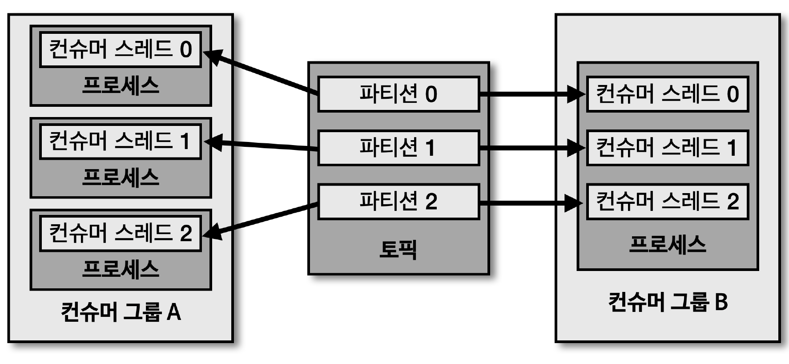

> 카프카는 처리량을 늘리기 위해 '파티션'과 '컨슈머' 개수를 늘려서 운영 가능

- 파티션을 여러 개로 운영하는 경우, 데이터를 병렬 처리하기 위해 파티션 개수와 컨슈머 개수를 동일하게 맞추는 것이 가장 좋은 방법
- 토픽의 파티션은 1개 이상으로 이루어져 있으며, 1개의 파티션은 1개의 컨슈머가 할당되어 데이터 처리 가능
- 파티션 개수가 N개인 경우, 동일 컨슈머 그룹으로 묶인 컨슈머 쓰레드를 최대 N개 운영 가능
  - 운영 방법
  1. 1개의 쓰레드를 가진 N개의 프로세스 운영
  2. N개의 쓰레드를 가진 1개의 프로세스 운영

## 컨슈머 랙

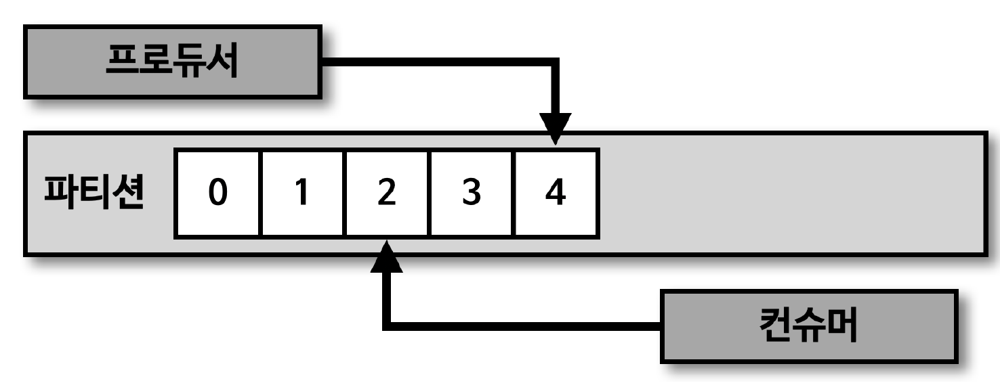

> 컨슈머 랙(LAG) 은 파티션의 최신 오프셋 (LOG-END-OFFSET) 과 컨슈머 오프셋 (CURRENT-OFFSET) 간의 차이

- 프로듀서는 계속해서 새로운 데이터를 파티션에 저장하고, 컨슈머는 자신이 처리할 수 있는 만큼 데이터를 가져가서 처리
- \* 컨슈머 랙은 컨슈머가 정상 동작하는지에 대한 여부를 확인할 수 있기 때문에 컨슈머 어플리케이션 운영 시 필수적으로 모니터링해야 하는 지표

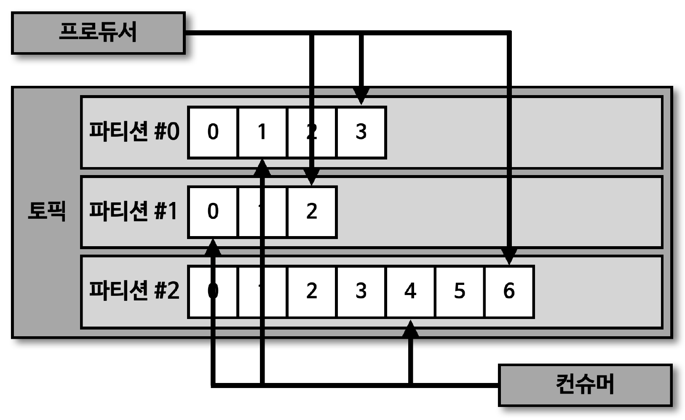

> 컨슈머 랙은 컨슈머 그룹, 토픽, 파티션별로 생성

- 1개의 토픽에 3개의 파티션이 있고, 1개의 컨슈머 그룹이 토픽을 구독하여 데이터를 가져가면 컨슈머 랙은 총 3개가 됨
  - 위 상황에서 컨슈머 그룹을 2개 운영중인 경우, 컨슈머 랙의 개수는 6개

## 프로듀서와 컨슈머의 데이터 처리량

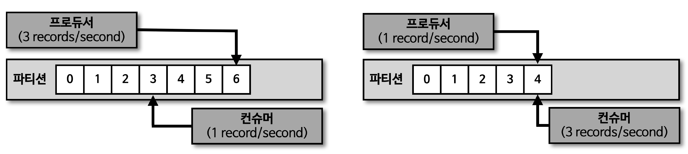

> 프로듀서가 보내는 데이터양이 컨슈머의 데이터 처리량보다 크다면, 컨슈머 랙은 늘어남

- 프로듀서가 보내는 데이터양이 컨슈머의 데이터 처리량보다 적으면, 컨슈머 랙은 줄어들고 최솟값은 0으로 지연이 없음을 의미

## 컨슈머 랙 모니터링

> 컨슈머 랙을 모니터링함으로써 컨슈머의 장애 확인 및 파티션 개수를 정하는 데 참고 가능

- 네비게이션 사용자 데이터를 전송하는 프로듀서가 있다고 가정
  - 설, 추석과 같이 네비게이션 사용량이 많을 때, 프로듀서가 카프카 클러스터로 전송하는 데이터양은 급증
  - 반면, 컨슈머는 프로듀서가 전송하는 데이터양이 늘어나더라도 최대 처리량은 한정되어 있기 때문에 컨슈머 랙 발생 가능
  - \* 이러한 경우, 지연을 줄이기 위해 일시적으로 파티션 개수와 컨슈머 개수를 늘려서 병렬처리량을 늘려 해소 가능

## 컨슈머 랙 모니터링 - 처리량 이슈

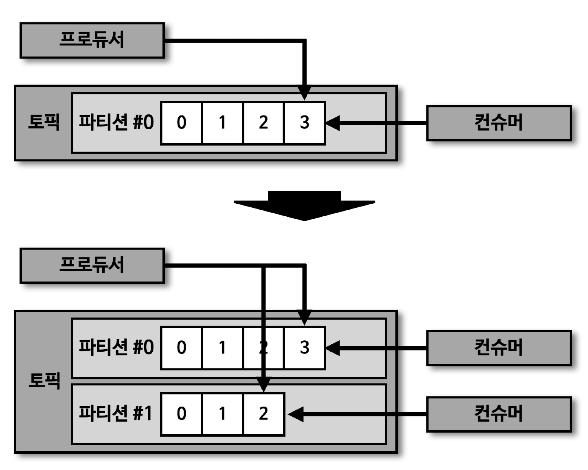

> 프로듀서의 데이터양이 늘어날 경우, 컨슈머 랙 증가 가능

- 이러한 경우, 파티션 개수와 컨슈머 개수를 늘려 병렬처리량을 늘려서 컨슈머 랙을 줄일 수 있음
  - 컨슈머 개수를 2개로 늘림으로써 컨슈머의 데이터 처리량을 2배로 늘릴 수 있음

## 컨슈머 랙 모니터링 - 파티션 이슈

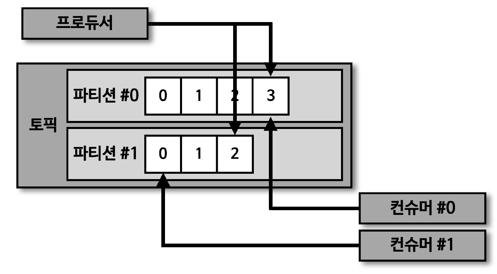

> 1. 컨슈머 이슈 발생 (프로듀서의 데이터양이 일정함에도 불구하고 컨슈머의 장애로 인해 컨슈머 랙 증가 가능)

- 프로듀서가 보내는 데이터양은 동일한데, 파티션 1번의 컨슈머 랙이 늘어나는 상황 발생 시 1번 파티션에 할당된 컨슈머에 이슈 발생 유추 가능

> 2. 파티션 자체 이슈 발생 (리더 파티션 장애)

- 컨슈머 동작은 정상적이지만, 리더 파티션 동작이 안 되는 경우
  - 오프셋 커밋이 비정상이거나, 새로운 레코드가 쌓이지 않는 경우 리더 파티션 이슈 확인 가능

## 컨슈머 랙을 모니터링하는 방법 3가지 - 1. 카프카 명령어 사용

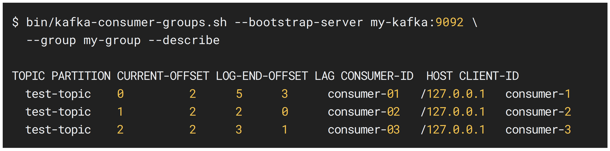

> kafka-consumer-groups.sh 명령어를 사용하여 컨슈머 랙을 포함한 특정 컨슈머 그룹의 상태 확인 가능

- 하지만, 카프카 명령어를 통해 컨슈머 랙을 확인하는 방법은 1회성에 그치기 때문에 지표를 지속적으로 기록하고 모니터링하기는 부족
- 따라서, kafka-consumer-groups.sh 명령어를 통해 컨슈머 랙을 확인하는 것은 테스트용 카프카에서 주로 사용

## 컨슈머 랙을 모니터링하는 방법 3가지 - 2. metrics() 메소드 사용

> 컨슈머 어플리케이션에서 KafkaConsumer 인스턴스의 'metrics()' 메소드를 활용하여 컨슈머 랙 지표 확인 가능

- 컨슈머 인스턴스가 제공하는 컨슈머 랙 관련 모니터링 지표 3가지
  1. records-lag-max
  2. records-lag
  3. records-lag-avg

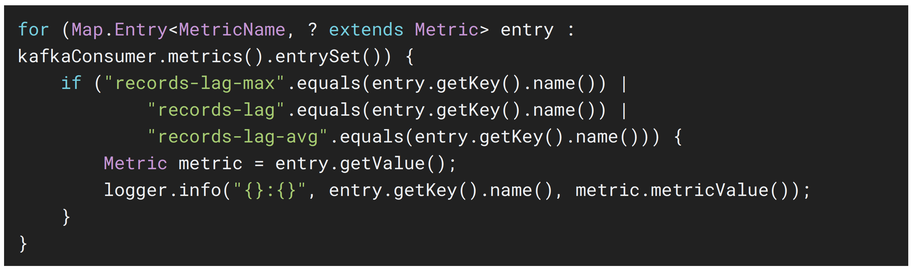

## 컨슈머 랙을 모니터링하는 방법 3가지 - metrics() 메소드 사용 사용 이슈

> 컨슈머 정상 동작중에만 사용 가능

- metrics() 메소드는 컨슈머가 정상 실행중인 경우에만 호출 가능
  - 컨슈머 어플리케이션 내부에서 metrics() 메소드를 호출하여 사용하기 때문
- 따라서, 컨슈머 어플리케이션 비정상 종료 시 컨슈머 랙 모니터링 불가

> 모든 컨슈머 어플리케이션에서 컨슈머 랙 모니터링 관련 코드를 중복해서 작성

- 각기 다른 컨슈머 어플리케이션에서 metrics() 메소드를 호출하여 컨슈머 랙을 수집하는 로직을 중복해서 작성 필요
  - 특정 컨슈머 그룹에 해당하는 어플리케이션이 수집하는 컨슈머 랙은 자기 자신 컨슈머 그룹에 대한 컨슈머 랙만 한정되기 때문

> 컨슈머 랙을 모니터링하는 코드를 추가할 수 없는 카프커 3th Party 어플리케이션의 컨슈머 랙은 모니터링 불가능

- metrics() 메소드는 공식 라이브러리에서만 지원하기 때문

## 컨슈머 랙을 모니터링하는 방법 3가지 - 외부 모니터링 툴 사용

> Datadog, Confluent Control Center 와 같은 카프카 클러스터 종합 모니터링 툴을 사용하면, 카프카 운영에 필요한 다양한 지표 모니터링 가능

- 모니터링 지표에는 컨슈머 랙도 포함되어 있기 때문에 클러스터 모니터링과 더불어 컨슈머 랙을 함께 모니터링하기에 적합
  - 카프카 클러스터의 모든 컨슈머 그룹, 모든 토픽에 대한 컨슈머 랙 모니터링 가능
- \* 컨슈머 랙 모니터링만을 위한 툴로는 오픈소스인 '버로우 (Burrow)' 가 있음

## 카프카 버로우

> 버로우는 링크드인에서 개발하여 오픈소스로 공개한 컨슈머 랙 체크 툴로서 REST API 를 통해 컨슈머 그룹별로 컨슈머 랙 확인 가능

- 외부 모니터링 툴을 사용 시 장점
  1. 카프카 클러스터에 연결된 모든 컨슈머, 토픽들의 랙 정보를 한번에 모니터링 할 수 있다는 장점이 있음
  2. 클러스터와 연동되어 컨슈머의 데이터 처리와는 별개로 지표를 수집하기 때문에 데이터를 활용하는 프로듀서나 컨슈머의 동작에 영향을 미치지 않는 장점이 있음

> 버로우는 다수의 카프카 클러스터를 동시에 연결하여 컨슈머 랙 확인 가능

- 기업 환경에서는 카프카 클러스터를 2개 이상으로 구축하고 운영하는 경우가 많음
  - DEV, QA, STG, PROD 등
  - 따라서, 한 번의 설정으로 다수의 카프카 클러스터 컨슈머 랙 확인 가능

## 카프카 버로우 - REST API

> 버로우를 카프카 클러스터와 연동하면, REST API 를 통해 컨슈머 그룹별 컨슈머 랙 조회 가능

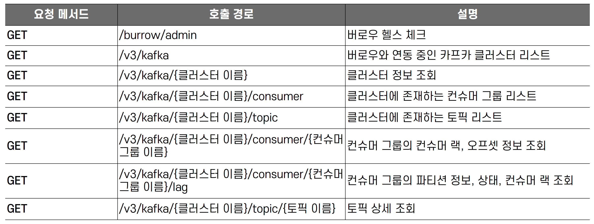

## 카프카 버로우 - 컨슈머 랙 이슈 판별

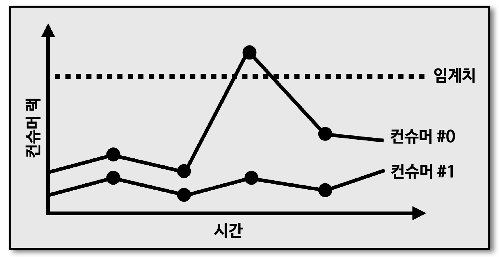

> 버로우의 가장 큰 특징은 컨슈머와 파티션의 상태를 단순히 컨슈머 랙의 임계치 (threshold) 로 나타내지 않은 점

- 특정 파티션의 컨슈머 랙이 특정 시점에 100만이 넘었다고 해서 컨슈머 또는 파티션에 이슈가 있다고 단정 짓기는 어려움
  - 프로듀서가 데이터를 많이 보내면 일시적으로 임계치가 넘어가는 현상이 발생할 수도 있기 때문
  - \* 따라서, 컨슈머 어플리케이션 운영 시 컨슈머 랙이 임계치에 도달할 때마다 알람을 설정하는 것은 무의미

## 카프카 버로우 - 컨슈머 랙 평가 (Evaluation)

> 버로우에서는 임계치가 아닌 시간의 순서대로 '슬라이딩 윈도우 (Sliding Window)' 계산을 통해 문제가 생긴 파티션과 컨슈머의 상태를 표현

- 위와 같이 버로우에서 컨슈머 랙의 상태를 표현하는 것을 '컨슈머 랙 평가 (Evaluation)' 이라고 부름
  - 컨슈머 랙과 파티션의 오프셋을 슬라이딩 윈도우로 계산 시 상태가 정해짐
- 파티션의 상태를 OK, STALLED, STOPPED 로 표현
- 컨슈머의 상태를 OK, WARNING, ERROR 로 표현

## 카프카 버로우 - 정상적인 경우

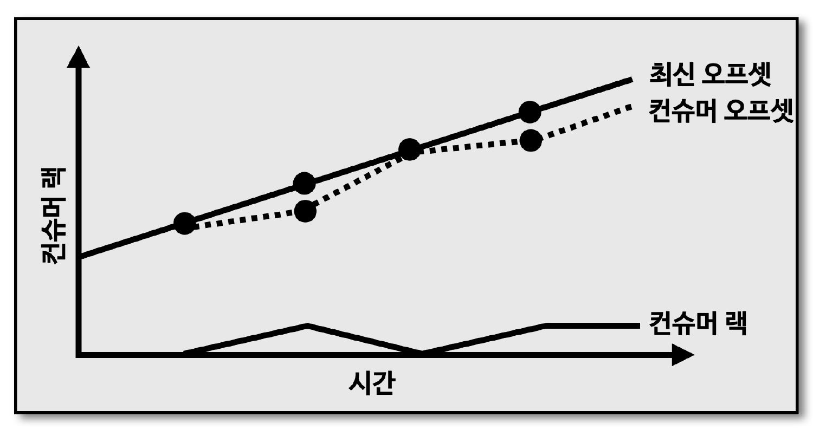

> 프로듀서가 지속적으로 데이터를 추가하기 때문에 최신 오프셋은 계속해서 증가

- 컨슈머는 데이터를 처리하며 때때로 컨슈머 랙이 증가하지만, 다시 컨슈머 랙이 0으로 줄어드는 추이 확인 가능
- 이러한 경우, 컨슈머가 정상적으로 동작하고 있다고 볼 수 있음
- 버로우 상태
  - 파티션 : OK
  - 컨슈머 : OK

## 카프카 버로우 - 컨슈머 처리량 이슈

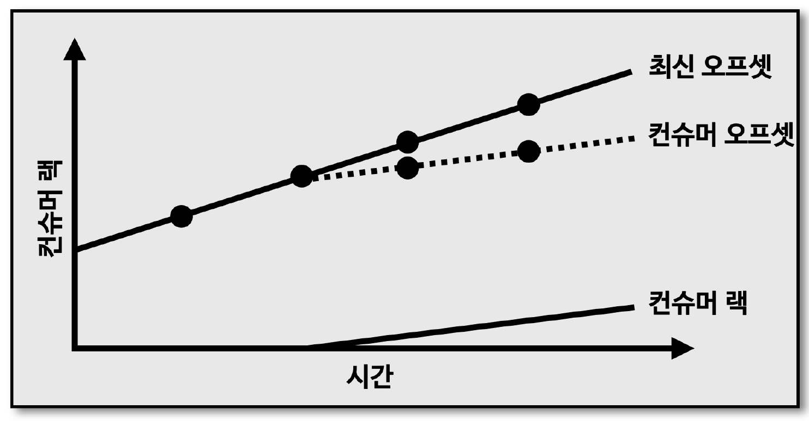

> 프로듀서가 추가하는 최신 오프셋에 비해 컨슈머 오프셋이 따라가지 못하는 추이

- 최신 오프셋과 컨슈머 오프셋의 거리가 계속 벌어지며 컨슈머 랙이 지속적으로 증가
- 이러한 그래프가 나오는 이유는 컨슈머의 데이터 처리량이 프로듀서가 보내는 데이터양에 비해 적기 때문
- 해결 방안
  - 파티션, 컨슈머 개수 추가
- 버로우 상태
  - 파티션 : OK
  - 컨슈머 : WARNING

## 카프카 버로우 - 컨슈머 이슈

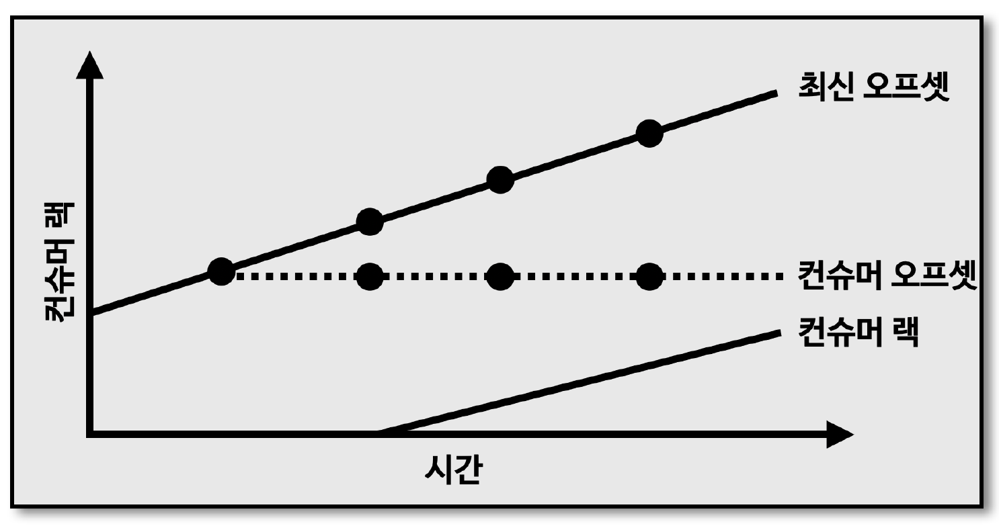

> 최신 오프셋이 지속적으로 증가하고 있지만, 컨슈머 오프셋이 멈춘 그래프로 컨슈머 랙 급증

- 컨슈머가 어떠한 이유로 데이터를 처리하지 못하는 현상
- 컨슈머 상태가 ERROR 인 경우, 컨슈머가 확실히 비정상 동작하고 있으므로 이메일, SMS 등의 알람을 통해 즉각 조치 필요
  - 컨슈머 어플리케이션 자체 이슈, 휴먼 에러, 데이터 파이프라인 자체 이슈 등
- 버로우 상태
  - 파티션 : STALLED
  - 컨슈머 : ERROR

## 컨슈머 랙 모니터링 아키텍처

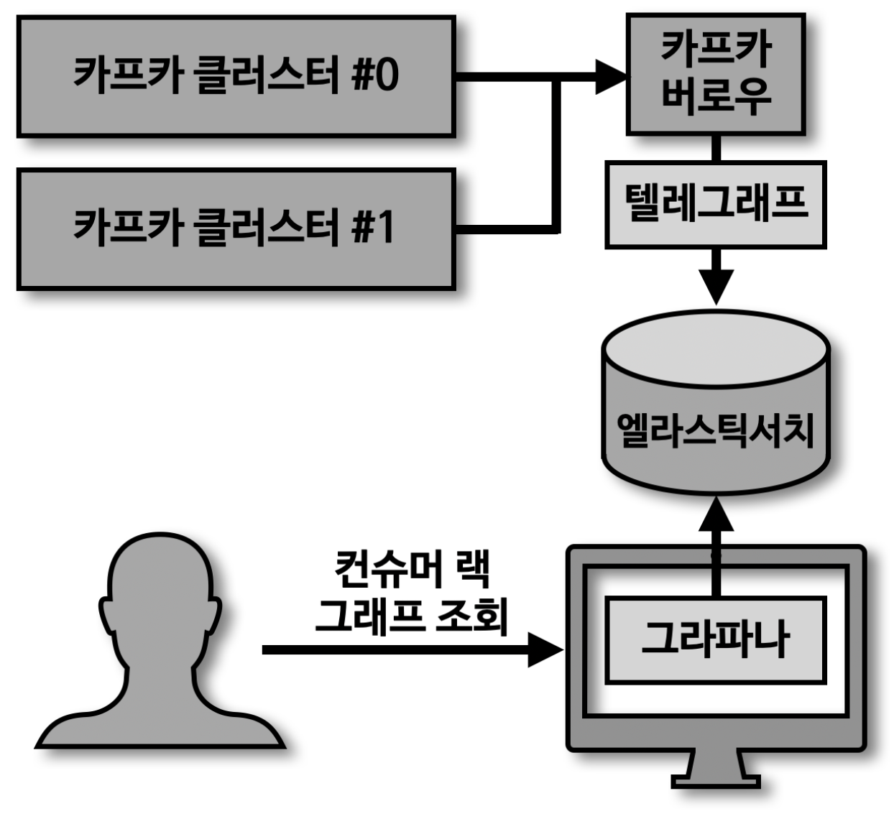

> 버로우를 통한 컨슈머 랙 모니터링 시 과거 컨슈머 랙을 개별적으로 모니터링 하기 위해 별개의 저장소와 대시보드를 사용하는 것이 효과적
