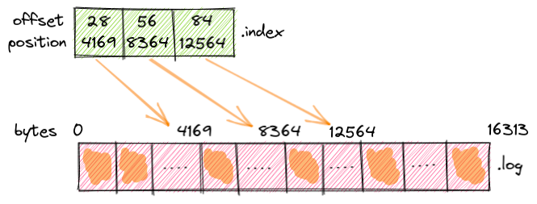
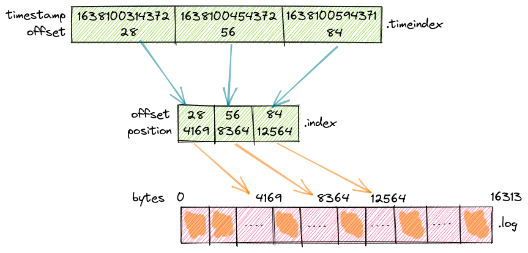

## segment, rolling, retention

### 디스크의 토픽 파티션 구조

- 토픽은 파티션으로 분할

  - 파티션은 디스크의 실제 파일인 '세그먼트'라는 단위로 세분화 되어 나뉨
- 파티션을 '세그먼트'로 분할하면 성능 향상에 도움

  - 디스크에서 레코드를 삭제하거나 컨슈머가 특정 오프셋에서부터 컨슈밍하게 되면, 크기가 크고 분할되지 않은 파일이 느려지고 오류 발생 가능
- 브로커의 디스크에는 각 토픽의 파티션별로 세그먼트 파일과 기타 파일로 구성

````shell
// __strimzi_canary 토픽의 0번 파티션
   
├── __strimzi_canary-0
│   ├── 00000000000000000000.index
│   ├── 00000000000000000000.log
│   ├── 00000000000000000000.timeindex
│   ├── 00000000000000000109.index
│   ├── 00000000000000000109.log
│   ├── 00000000000000000109.snapshot
│   ├── 00000000000000000109.timeindex
````

> .log

- 특정 오프셋까지 레코드를 포함하는 실제 세그먼트
- 파일 이름은 해당 로그에 있는 레코드의 시작 오프셋으로 정의

> .index

- 논리 오프셋 (사실상 레코드의 ID) 을 .log 파일 내 레코드의 바이트 오프셋에 매핑하는 인덱스 포함
- 전체 .log 파일을 스캔하지 않고, 지정된 오프셋에서 레코드에 엑세스하는 데 사용

> .timeindex

- 로그의 타임스탬프로 레코드에 엑세스하는 데 사용되는 또 다른 인덱스

> .snapshot

- 중복 레코드를 방지하는 데 사용되는 시퀀스 ID 와 관련된 프로듀서 상태의 스냅샷 포함

### 보다 자세한 구조

````shell
drwxrwxr-x.  2 ppatiern ppatiern      200 Nov 14 16:33 .
drwxrwxr-x. 55 ppatiern ppatiern     1220 Nov 14 16:33 ..
-rw-rw-r--.  1 ppatiern ppatiern       24 Nov 14 16:33 00000000000000000000.index
-rw-rw-r--.  1 ppatiern ppatiern    16314 Nov 14 16:33 00000000000000000000.log
-rw-rw-r--.  1 ppatiern ppatiern       48 Nov 14 16:33 00000000000000000000.timeindex
-rw-rw-r--.  1 ppatiern ppatiern 10485760 Nov 14 16:33 00000000000000000109.index
-rw-rw-r--.  1 ppatiern ppatiern      450 Nov 14 16:33 00000000000000000109.log
-rw-rw-r--.  1 ppatiern ppatiern       10 Nov 14 16:33 00000000000000000109.snapshot
-rw-rw-r--.  1 ppatiern ppatiern 10485756 Nov 14 16:33 00000000000000000109.timeindex
````

> 로그 세그먼트

- 첫 번째 로그 세그먼트(00000000000000000000.log)에 오프셋 0에서 오프셋 108까지의 레코드가 포함
- 두 번째 세그먼트에는 오프셋 109에서부터 시작하는 레코드 포함되며, '활성 세그먼트' 라고 함
  - 활성 세그먼트 : 현재 쓰기가 일어나고 있는 세그먼트 (새로 추가되는 레코드가 추가되는 세그먼트)
  - 비활성 세그먼트 : 읽기 전용이며, 컨슈머가 이전 레코드를 읽을 때 엑세스
- 활성 세그먼트가 가득 차게 되면, '롤링' 하게 됨
  - 즉, 가득 찬 활성 세그먼트는 닫혔다가 읽기 전용 모드로 전환
  - 새로운 세그먼트 파일이 생성되고, '읽기-쓰기' 모드로 열리게 되며, 해당 세그먼트 파일이 '활성 세그먼트'가 됨

> 세그먼트 크기

- 위 예제에서 16314 바이트에 도달하여 이전 세그먼트가 롤링된 것 확인
  - 이는 해당 토픽이 'log.segment.bytes=16314' 로 설정되었기 때문
  - '__strimzi_canary' 토픽의 단일 레코드 크기는 150 바이트
  - 따라서 각 세그먼트에는 109개의 레코드까지 포함 (150 * 109 = 16,350 으로 최대 세그먼트 크기에 가까움)


> DumpLogSegments

- 아래 명령어를 통해 로그 세그먼트에서 레코드 덤프 가능

````shell
./bin/kafka-run-class.sh kafka.tools.DumpLogSegments --deep-iteration --print-data-log --files /tmp/kafka-logs-0/__strimzi_canary-0/00000000000000000000.log

Dumping /tmp/kafka-logs-0/__strimzi_canary-0/00000000000000000000.log
Starting offset: 0
baseOffset: 0 lastOffset: 0 count: 1 baseSequence: 0 lastSequence: 0 producerId: -1 producerEpoch: -1 partitionLeaderEpoch: 0 isTransactional: false isControl: false position: 0 CreateTime: 1639132508991 size: 148 magic: 2 compresscodec: NONE crc: 2142666254 isvalid: true
| offset: 0 CreateTime: 1639132508991 keysize: -1 valuesize: 78 sequence: 0 headerKeys: [] payload: {"producerId":"strimzi-canary-client","messageId":1,"timestamp":1639132508991}
baseOffset: 1 lastOffset: 1 count: 1 baseSequence: 0 lastSequence: 0 producerId: -1 producerEpoch: -1 partitionLeaderEpoch: 0 isTransactional: false isControl: false position: 148 CreateTime: 1639132514555 size: 148 magic: 2 compresscodec: NONE crc: 1895373344 isvalid: true
| offset: 1 CreateTime: 1639132514555 keysize: -1 valuesize: 78 sequence: 0 headerKeys: [] payload: {"producerId":"strimzi-canary-client","messageId":4,"timestamp":1639132514555}
baseOffset: 2 lastOffset: 2 count: 1 baseSequence: 0 lastSequence: 0 producerId: -1 producerEpoch: -1 partitionLeaderEpoch: 0 isTransactional: false isControl: false position: 296 CreateTime: 1639132519561 size: 148 magic: 2 compresscodec: NONE crc: 1097825866 isvalid: true
..
..
..
..
| offset: 107 CreateTime: 1639133044553 keysize: -1 valuesize: 80 sequence: 0 headerKeys: [] payload: {"producerId":"strimzi-canary-client","messageId":322,"timestamp":1639133044553}
baseOffset: 108 lastOffset: 108 count: 1 baseSequence: 0 lastSequence: 0 producerId: -1 producerEpoch: -1 partitionLeaderEpoch: 0 isTransactional: false isControl: false position: 16164 CreateTime: 1639133049552 size: 150 magic: 2 compresscodec: NONE crc: 1749984078 isvalid: true
| offset: 108 CreateTime: 1639133049552 keysize: -1 valuesize: 80 sequence: 0 headerKeys: [] payload: {"producerId":"strimzi-canary-client","messageId":325,"timestamp":1639133049552}
````

### 파티션 내 인덱싱 작동 방법

- '.index' 파일에는 논리 오프셋을 '.log' 파일 내 레코드의 바이트 오프셋에 매핑하는 인덱스가 포함
- '.log' 파일 내 레코드들을 해당 인덱스를 각각 매핑하여 사용하지 않음
  - 아래 그림은 로그 파일에 저장된 85개의 레코드에 대해 해당 인덱스에 3개의 항목만 존재



- 로그 파일에서 '오프셋-28'이 있는 레코드는 '바이트 오프셋-4169'에 존재하며, '오프셋-56'이 있는 레코드는 '바이트 오프셋-8364'에 존재

> .index 파일 덤프를 통한 확인

````shell
bin/kafka-run-class.sh kafka.tools.DumpLogSegments --deep-iteration --print-data-log --files /tmp/kafka-logs-0/__strimzi_canary-0/00000000000000000000.index
Dumping /tmp/kafka-logs-0/__strimzi_canary-0/00000000000000000000.index
offset: 28 position: 4169
offset: 56 position: 8364
offset: 84 position: 12564
````

- 인덱스 파일 내 추가되는 방법은 'log.index.interval' 설정값에 의하여 정의 (기본값: 4096)
  - 로그 파일에 추가된 레코드의 크기를 4096 바이트 단위마다 해당 인덱스 파일에 추가
  - 28 * 150 = 4200 로 28개의 레코드마다 새로운 인덱스 항목 추가

> .index 를 사용한 레코드 검색

1. '.log' 파일과 동일한 패턴을 따르는 '.index' 파일 검색

   - 해당 '.index' 파일에는 인덱싱된 레코드의 시작 오프셋 존재
2. '.index' 파일에서 요청한 오프셋이 있는 항목 검색
3. 해당 바이트 오프셋을 사용하여 '.log' 파일을 엑세스하고, 컨슈머가 컨슈밍을 시작하려는 오프셋 검색

> log.index.interval 설정 트레이드 오프

- 기본값인 4096 바이트 미만으로 설정 시, 더욱 세분화된 검색을 위해 색인 항목 추가
  - 하지만, '.index' 파일 크기 증가
- 기본값인 4096 바이트 이상으로 설정 시, 색인에 항목이 줄어들어 검색 속도는 느려짐
  - 하지만, '.index' 파일 크기는 천천히 증가

> .timeindex 를 사용한 레코드 검색



- '.timeindex' 의 각 항목은 '.index' 파일 항목을 가리키는 타임스탬프 및 오프셋 쌍으로 구성
- '.timeindex' 의 레코드는 '1638100314372-28', '1638100454372-56' 와 같이 구성
- '.timeindex' 의 각 항목 크기는 12 바이트
  - 타임스탬프 : 8 바이트
  - 오프셋 : 4 바이트

> .timeindex 파일 덤프를 통한 확인

````shell
bin/kafka-run-class.sh kafka.tools.DumpLogSegments --deep-iteration --print-data-log --files /tmp/kafka-logs-0/__strimzi_canary-0/00000000000000000000.timeindex
Dumping /tmp/kafka-logs-0/__strimzi_canary-0/00000000000000000000.timeindex
timestamp: 1638100314372 offset: 28
timestamp: 1638100454372 offset: 56
timestamp: 1638100594371 offset: 84
````

### 롤링 세그먼트

- 특정 조건 만족 시 새로운 세그먼트로 롤링

> log.segment.bytes

- 바이트 단위의 최대 세그먼트 크기 지정 (기본값 : 1GB)

> log.roll.ms

- ms 단위의 최대 세그먼트 크기 지정 (기본값 : 7일)
- 활성 세그먼트 내 첫 번째 레코드의 'CreateTime' 기준

> log.roll.hours

- hour 단위의 최대 세그먼트 크기 지정 (기본값 : 7일)
- 활성 세그먼트 내 첫 번째 레코드의 'CreateTime' 기준

> log.roll.jitter.ms

- 세그먼트 롤링 시 최대 지터를 설정
- 많은 세그먼트가 동시에 롤링되어 디스크에서 높은 경합을 일으키는 것을 방지하기 위한 시간 간격

> 롤링 사용 시 주의점

- \* 로그 세그먼트 롤링은 '.index' 또는 '.timeindex' 가 가득차도 발생
- '.index' 와 '.timeindex' 는 'log.index.size.max.bytes' 옵션값을 공유 (기본값 : 10MB)
- 'log.segment.bytes (기본 로그 세그먼트 최대 크기)' (기본값 : 1GB)
- 'log.index.interval.bytes (새로운 항목이 오프셋 인덱스에 추가되는 주기)' (기본값 : 4,096 byte)
  - 즉, 1GB 크기의 로그 세그먼트인 경우, 인덱스 생성 가능 크기는 (1GB / 4,096 byte = 262,144 이며, 인덱스의 각 항목 크기인 8byte 를 곱한 값인 2,097,152 = 2MB)

    - 새로운 항목이 오프셋 인덱스에 추가되는 주기 설정값인 'log.index.size.max.bytes' 의 기본값인 10MB 는 'log.segment.bytes' 5GB 처리 가능한 설정
  - \* 'log.index.size.max.bytes' 크기를 줄이거나 'log.segment.bytes' 크기를 늘리는 경우, 요청된 세그먼트 크기에 도달할 때가 아니라 '인덱스가 가득 차면 새로운 세그먼트로 롤링 발생'

    - 따라서, 'log.index.size.max.bytes' 크기를 늘리지 않고, 'log.segment.bytes' 크기를 5GB 보다 크게 설정하는 것은 무의미
    - 결과적으로, 'log.segment.bytes' 크기를 5GB 이상으로 늘릴 경우, 'log.index.size.max.bytes' 크기도 늘려야 함
  - \* '.timeindex' 파일 크기의 경우, 각 항목의 크기가 12 byte 로 '.index' 파일 크기인 8 byte 보다 크기 때문에 더 빨리 파일이 가득 차기 때문에 주의

> '.index' 및 '.timeindex' 파일 크기가 로그 세그먼트 롤링에 미치는 영향

- log.index.size.max.bytes=300, retention.ms=600000, segment.bytes=16384 설정
    - 인덱스 파일은 2개의 레코드마다 생성
    - '.index' - 300 / 8 = 37
    - '.timeindex' - 300 / 12 = 25
- 활성 세그먼트가 7314 byte 인 시점에 새로운 세그먼트로 롤링 ('.log' 파일 크기 16384 미도달)
    - 해당 시점, '.index' 파일 크기는 192 로 192 / 8 = 24개 로 기대했던 37개가 아니지만 롤링
    - \* 롤링된 이유는 '.timeindex' 크기가 288 / 12 = 24개로 도달했기 때문에 롤링 발생

````shell
-rw-rw-r--.  1 ppatiern ppatiern  192 Dec 10 16:23 00000000000000000000.index
-rw-rw-r--.  1 ppatiern ppatiern 7314 Dec 10 16:23 00000000000000000000.log
-rw-rw-r--.  1 ppatiern ppatiern  288 Dec 10 16:23 00000000000000000000.timeindex
-rw-rw-r--.  1 ppatiern ppatiern  296 Dec 10 16:23 00000000000000000049.index
-rw-rw-r--.  1 ppatiern ppatiern 4500 Dec 10 16:26 00000000000000000049.log
-rw-rw-r--.  1 ppatiern ppatiern   10 Dec 10 16:23 00000000000000000049.snapshot
-rw-rw-r--.  1 ppatiern ppatiern  300 Dec 10 16:23 00000000000000000049.timeindex
````
