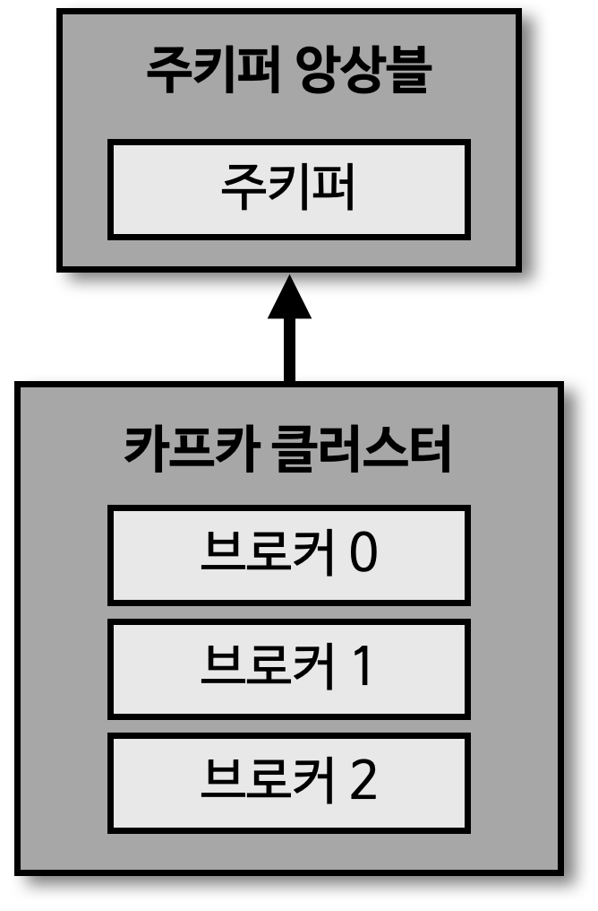
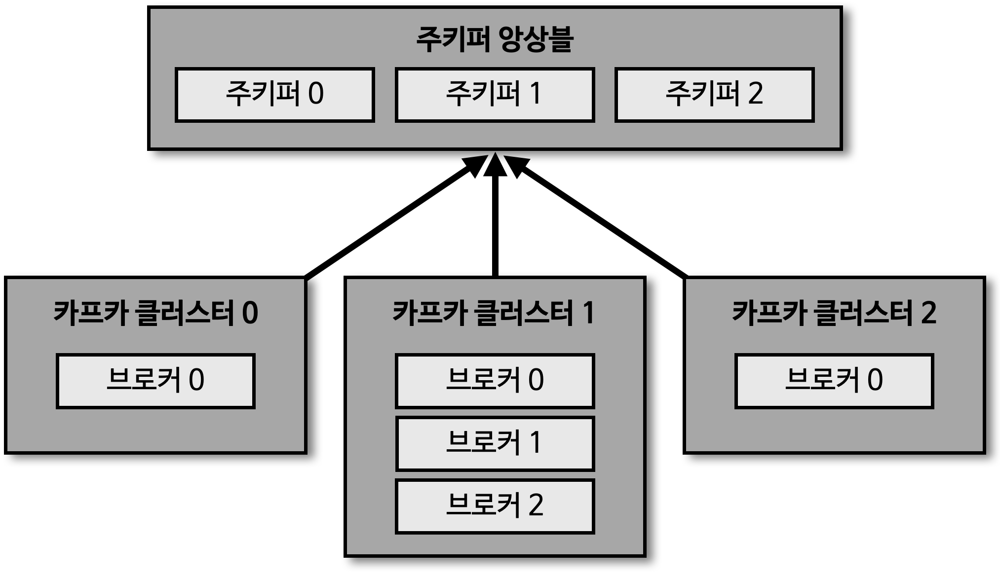
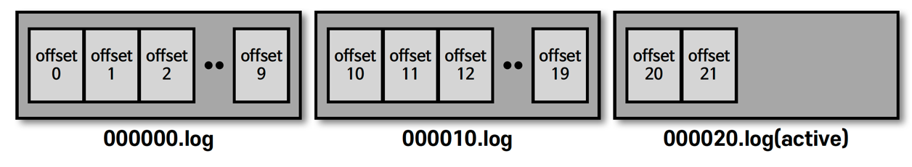
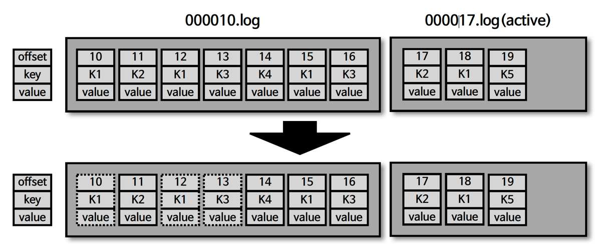
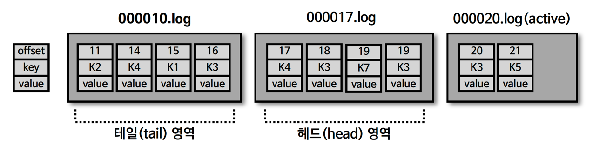
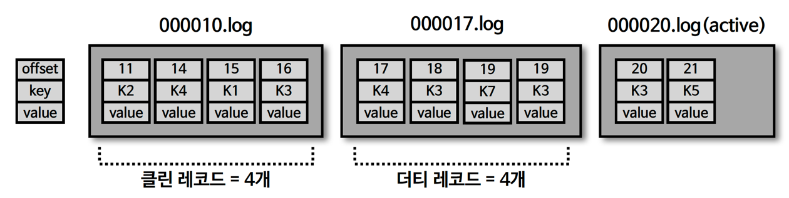
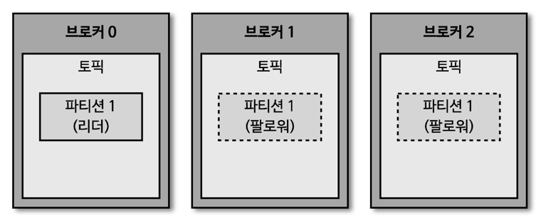
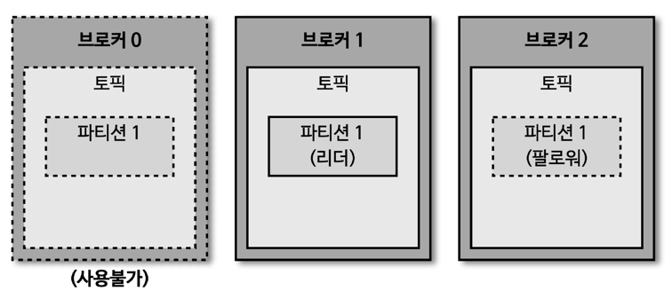
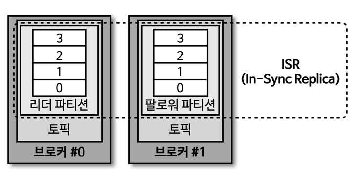
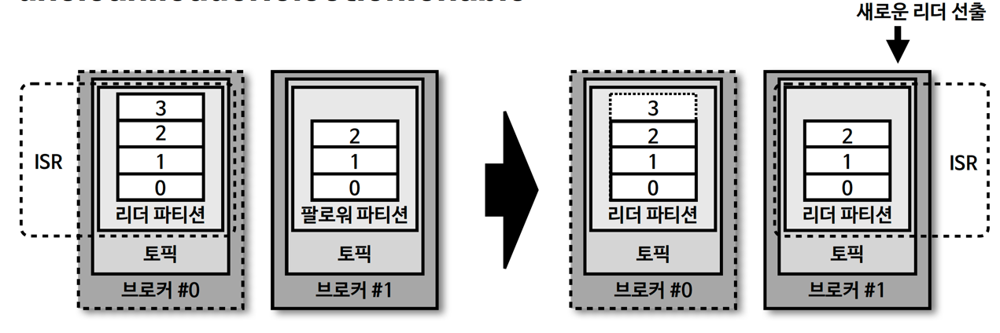

## 브로커

> 주키퍼



- 카프카 클러스터를 사용하기 위해 반드시 필요한 어플리케이션
  - 2.x 버전까지는 필수
  - 3.x 버전부터는 선택
  - 하지만, 아직까지는 주키퍼를 대체할 수 없는 부분도 있기 때문에 사용 권장

> 카프카 브로커

- 카프카 클라이언트 (프로듀서, 컨슈머) 와 데이터를 주고 받기 위해 사용하는 주체
- 데이터를 분산 저장하여 장애가 발생하더라도 안전하게 사용할 수 있도록 도와주는 어플리케이션
- 1대의 서버에는 1개의 카프카 브로커 프로세스가 실행

  - 카프카 브로커 서버 1대로도 기본 기능 실행 가능
  - 하지만, 데이터를 안전하게 보관 및 처리하기 위해 최소 3대 이상의 브로커 서버를 1개의 클러스터로 묶어서 운영
- 카프카 클러스터로 묶인 브로커들은 프로듀서로부터 수신한 데이터를 안전하게 분산 저장하고 복제

## 카프카 클러스터와 주키퍼



> 여러 개의 카프카 클러스터가 연결된 주키퍼

- 카프카 클러스터를 실행하기 위해서는 주키퍼 필요
- 주키퍼의 서로 다른 znode 에 클러스터를 지정하면 됨
- root znode 에 각 클러스터별 znode 를 생성하고, 클러스터 실행 시 root 가 아닌 하위 znode 로 설정
  - 주키퍼 클러스터 하나로 여러 개의 카프카 클러스터 운영 가능

## 카프카 브로커의 역할들

> 브로커의 역할 : 컨트롤러, 데이터 삭제, 컨슈머 오프셋 저장, 그룹 코디네이터

> 컨트롤러

- 클러스터의 다수 브로커 중 1대가 컨트롤러 역할 수행
- 컨트롤러는 다른 브로커들의 상태를 체크하고, 특정 브로커가 클러스터에서 빠지는 경우, 해당 브로커에 존재하는 '리더 파티션'을 재분배
  - 카프카는 지속적으로 데이터를 처리하는 것이 중요하므로 브로커의 상태가 비정상인 경우, 빠르게 클러스터에서 제거하는 것이 중요
- 만약, 컨트롤러 역할을 수행하는 브로커에 장애 발생 시 다른 브로커가 컨트롤러 역할 수행

> 데이터 삭제

- 카프카는 다른 메시징 플랫폼과는 다르게 컨슈머가 데이터를 가져가더라도 토픽의 데이터가 삭제되지 않음
  - 컨슈머나 프로듀서가 데이터 삭제를 요청하는 것도 불가능
  - 오직, 브로커만이 데이터 삭제 가능
- 데이터 삭제는 브로커에서 파일 단위로 이루어지는데, 이 단위를 '로그 세그먼트(log segment)' 라고 함
  - 로그 세그먼트에는 다수의 데이터가 들어있기 때문에 일반적인 DB처럼 특정 데이터를 선별해서 삭제 불가능
  - delete : 일정 시간, 용량에 따라 삭제 수행 가능
  - compact : key 를 기준으로 가장 최근의 메시지를 제외한 나머지 메시지 삭제 가능

> 컨슈머 오프셋 저장

- 컨슈머 그룹은 토픽의 특정 파티션으로부터 데이터를 가져가서 처리하고, 해당 파티션의 어느 레코드까지 가져갔는지 확인하기 위해 '오프셋' 을 '커밋'
- 커밋한 오프셋은 '__consumer_offsets' 토픽에 저장
  - 카프카 운영 시 자동 생성
  - '__consumer_offsets' 토픽에 저장된 오프셋을 기준으로 컨슈머 그룹은 다음 레코드를 가져가서 처리
  - 컨슈머의 장애나 컨슈머 restart 를 통해 재기동 될 때, '__consumer_offsets' 에 저장된 컨슈머 오프셋을 기준으로 이어서 처리 가능

> 그룹 코디네이터

- 코디네이터는 컨슈머 그룹의 상태를 체크하고, 파티션을 컨슈머와 매칭되도록 분배하는 역할 수행
- 특정 컨슈머가 컨슈머 그룹에서 빠지게 되면, 매칭되지 않은 파티션을 정상 동작하는 컨슈머로 할당하여 끊임없이 데이터가 처리되도록 지원
  - 파티션을 컨슈머로 재할당하는 과정을 '리밸런스(rebalance)' 라고 함

## 브로커의 역할 - 데이터 저장

- 카프카 실행 시, 'config/server.properties' 의 log.dir 옵션에 정의한 디렉토리에 데이터 저장
  - 토픽 이름과 파티션 번호의 조합으로 하위 디렉토리를 생성하여 데이터 저장
- log
  - 메시지와 메타데이터 저장
- index
  - 메시지의 오프셋을 인덱싱한 정보
- timeindex
  - 메시지에 포함된 timestamp 값을 기준으로 인덱싱한 정보

> hello.kafka 토픽 0번 파티션에 존재하는 데이터 확인

````shell
// 데이터 저장 경로
$ ls /tmp/kafka-logs
__consumer_offsets-0 __consumer_offsets-21
...

// 토픽 이름 : hello.kafka, 파티션 번호 : 0
$ ls /tmp/kafka-logs/hello.kafka-0
00000000000000000000.index 00000000000000000000.log
00000000000000000000.timeindex leader-epoch-checkpoint
````

## 로그와 세그먼트

- 프로듀서에서 보낸 메시지를 세그먼트 단위로 저장

````shell
$ ls /tmp/kafka-logs/hello.kafka-0
00000000000000000000.log
00000000000000000010.log
00000000000000000020.log
````



- log.segment.bytes

  - 바이트 단위의 최대 세그먼트 크기 지정 (기본값 : 1GB)
- log.roll.ms(hour)

  - 세그먼트가 신규 생성된 이후 다음 파일로 넘어가는 시간 주기 (기본값 : 7일)
  - 많은 양의 세그먼트를 가질 수도 있고, 적은 양의 세그먼트를 가질 수 있음
  - 설정한 세그먼트 단위 보다 적은 양의 세그먼트를 가질 경우, 롤링에 의한 생성으로 볼 수 있음
- active segment

  - 가장 마지막 세그먼트 파일 (즉, 쓰기가 일어나고 있는 segment)
  - active segment 는 브로커의 삭제 대상에 포함되지 않음
  - active segment 가 아닌 segment 들은 'retention' 옵션에 따라 삭제 대상으로 지정

## 브로커의 역할 - 데이터 삭제

> cleanup.policy=delete

````shell
$ ls /tmp/kafka-logs/hello.kafka-0
00000000000000000000.log
00000000000000000010.log
00000000000000000020.log
````


- retention.ms(minutes, hours)

  - segment 를 보유할 최대 기간 (기본값 : 7일)
  - 일반적으로 3일로 설정 (토/일 주말 간 발생한 이슈에 대해 월요일에 대응 가능)
- retention.bytes

  - 파티션당 로그 적재 바이트 값 (기본값 : -1 (저장X))
- log.retention.check.interval.ms

  - segment 가 삭제 영역에 들어왔는지 (최대 기간, 최대 적재 byte) 확인하는 간격 (기본값 : 5분)
- 카프카에서 데이터는 세그먼트 단위로 삭제 발생

  - 로그 단위 (레코드 단위) 로 개별 삭제 불가능
- 로그 (레코드)의 메시지 키, 메시지 값, 오프셋, 헤더 등 이미 적재된 데이터에 대해 수정 불가능

  - 데이터 적재 시 (프로듀서) 또는 데이터 사용 시 (컨슈머) 데이터 검증 필요

> cleanup.policy.compact



- 토픽 압축 정책은 일반적으로 생각하는 zip 과 같은 압축 (compression) 과는 다른 개념
  - 카프카에서의 압축이란, 메시지 키 별로 해당 메시지 키의 레코드 중 오래된 데이터를 삭제하는 정책 의미
  - 따라서, 삭제 (delete) 정책과는 다르게 일부 레코드만 삭제 가능
  - 압축은 active segment 를 제외한 데이터가 대상

> 테일/헤드 영역, 클린/ 더티 로그



- 테일 영역

  - 압축 정책에 의해 압축이 완료된 레코드들
  - 클린 로그라고도 부르며, 중복 메시지 키 미존재
- 헤드 영역

  - 압축 정책이 적용되기 전 레코드들
  - 더티 로그라고도 부르며, 중복 메시지 키 존재

> min.cleanable.dirty.ratio



- 데이터 압축 시작 시점은 min.cleanable.dirty.ratio 옵션값을 따름
- min.cleanable.dirty.ratio 옵션값은 active segment 를 제외한 세그먼트에 남아 있는 '테일 영역'과 '헤드 영역'의 레코드 개수의 비율을 의미
  - 0.5 로 설정 시 테일 영역의 레코드 개수가 헤드 영역의 레코드 개수와 동일할 경우 압축 실행
  - 0.9 와 같이 크게 설정 시 한번 압축 할 때, 많은 데이터가 줄어들기 때문에 압축 효과가 좋음
    - 그러나, 0.9 의 비율이 될 때까지 용량을 차지하므로 용량 효율은 좋지 않음 (더티 레코드의 비율이 더 큼)
    - 하지만, 0.1 과 같이 작게 설정하는 경우, 압축이 자주 일어나서 최신 데이터만 유지할 수 있지만 압축이 자주 발생하기 때문에 브로커 부담 발생 (클린 레코드의 비율이 더 큼)

> 브로커의 역할 - 복제 (replication)



- replication factor : 3
  - 데이터 복제 (replication) 은 카프카를 '장애 허용 시스템' 으로 동작하도록 하는 원동력
  - 복제의 이유는 클러스터로 묶인 브로커 중 일부에 장애가 발생하더라도 데이터를 유실하지 않고, 안전하게 사용하기 위함
    - 카프카의 데이터 복제는 '파티션' 단위
  - 토픽 생성 시 파티션의 복제 개수 (replication factor) 를 설정하게 되는데, 직접 옵션을 선택하지 않으면 브로커에 설정된 기본 옵션값 적용
    - 복제 개수의 최솟값은 1 (복제 없음) 이며, 최댓값은 브로커 개수만큼 설정 가능
    - 상용 환경에서는 보통 복제 개수 (replication factor) 를 2 ~ 3 으로 사용하는 것이 일반적
  - 복제된 파티션은 리더 (leader) 와 팔로워 (follower) 로 구성
    - 리더 : 프로듀서, 컨슈머와 직접 통신하는 파티션 (리더 파티션이 프로듀서의 메시지를 적재)
    - 팔로워 : 복제 데이터를 가지고 있는 파티션
      - 팔로워들은 리더의 '오프셋'을 확인하여 현재 자신이 가지고 있는 오프셋과 차이가 나는 경우, 리더로부터 데이터를 가져와서 자신의 파티션에 저장하는데, 이 과정을 '복제(replication)' 이라고 함
  - 파티션 복제로 인하여 팔로워 브로커에도 리더 파티션의 데이터가 복제되기 때문에 복제 개수만큼의 저장 용량이 증가한다는 단점 발생
    - 하지만, 복제를 통해 데이터를 안전하게 사용할 수 있다는 강력한 장점 때문에 카프카 운영 시 2개 이상으로 복제 개수를 설정하는 것이 매우 중요

> 브로커에 장애가 발생한 경우



- 브로커가 다운 되는 경우, 해당 브로커에 있는 리더 파티션은 사용할 수 없기 때문에 팔로워 파티션 중 하나가 리더 파티션의 지위를 넘겨 받음 (승격)
  - 이를 통해 데이터가 유실되지 않고, 컨슈머나 프로듀서와 데이터를 주고 받도록 동작 가능
- 운영 시에는 데이터 종류마다 다른 복제 개수를 설정하고, 상황에 따라서는 토픽마다 복제 개수를 다르게 설정하여 운영
  1. 데이터 일부가 유실되더라도 데이터 처리 속도가 중요한 경우
     - replication factor : 1 또는 2 로 설정
  2. 데이터 유실을 허용하지 않는 경우
     - replication factor : 3 설정

> ISR (In-Sync-Replicas)



- 리더 파티션과 팔로워 파티션이 모두 싱크가 된 상태 의미
  - 동기화가 완료됐다는 의미는 리더 파티션의 모든 데이터가 팔로워 파티션에 복제된 상태를 의미
  - 리더 파티션의 0부터 3까지의 오프셋이 팔로워 파티션에도 동일하게 0부터 3까지 존재

> unclean.leader.election.enable



- 리더 파티션의 데이터를 모두 복제하지 못한 상태에서 팔로워 파티션이 리더 파티션으로 선출되면 데이터 유실 가능
  - 유실이 발생하더라도 서비스 중단 없이 지속적으로 토픽을 사용하고자 한다면, ISR 이 아닌 팔로워 파티션을 리더로 선출하도록 설정 가능
  - unclean.leader.election.enable=true
    - 유실 허용 (복제가 안 된 팔로워 파티션을 리더로 승격)
  - unclean.leader.election.enable=false
    - 유실 미허용 (해당 브로커가 복구될 때까지 중단)
