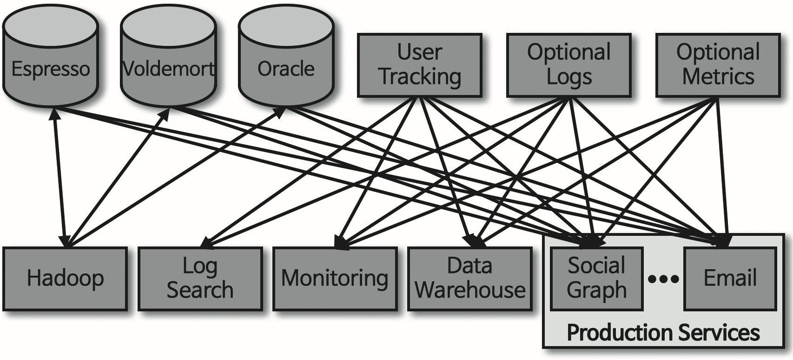
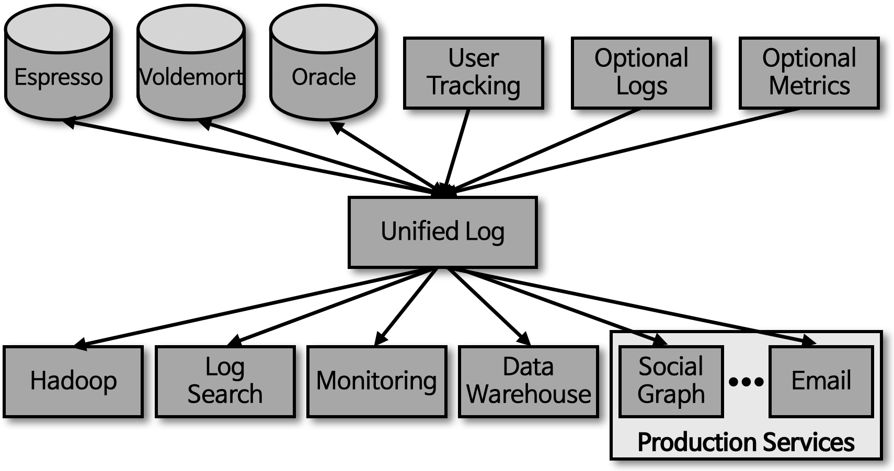
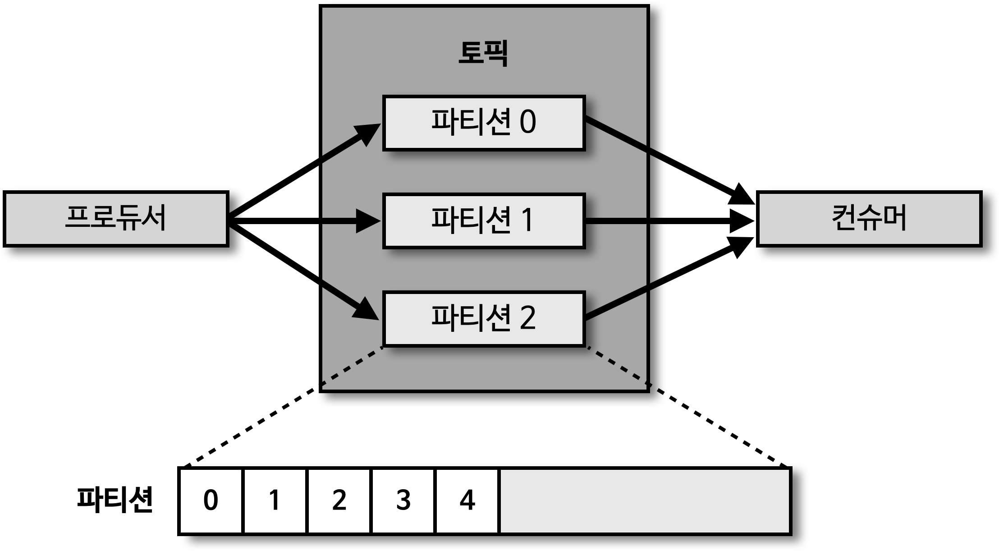

## 카프카의 탄생
- 2011년 미국 링크드인에서 출발하였으며, 링크드인 웹사이트에서 생성되는 로그를 처리하여 웹사이트 활동을 추적하는 것을 목적으로 개발 

- '파편화된 데이터 수집 및 분배 아키텍처를 운영하는데 어려움'을 느낌
- 최초 소스 어플리케이션에서 타깃 어플리케이션으로 연동하는 소스 코드를 작성하여 사용하였고, '아키텍쳐가 복잡하지 않아 운영이 힘들지 않았음'
- 이후 시간이 지날수록 소스 어플리케이션과 타깃 어플리케이션이 증가하면서 아키텍처가 복잡해졌고, '데이터를 전송하는 코드 라인이 급격히 증가하며 복잡'해지기 시작

- 이를 해결하기 위해 링크드인의 데이터팀에서 상용 데이터 프레임워크와 오픈소스들을 결합하여 아키텍처에 적용하며, '데이터 파이프라인의 파편화를 개선하고자 노력'
- 하지만, 파편화된 데이터 파이프라인의 복잡도를 낮춰주는 '아키텍쳐 구성에 실패'

- 결국, '신규 시스템 (Apache Kafka)을 만들기로 결정'
- 카프카는 각각의 어플리케이션끼리 연결하여 데이터를 처리하는 것이 아니라 한 곳으로 모아서 처리할 수 있도록 '중앙집중화' 시킴

## 메시지 큐 구조를 그대로 살린 카프카 내부 구조

- 기존, 1:1 매칭으로 개발/운영하던 데이터 파이프라인은 '커플링'으로 인해 한쪽의 이슈가 다른 한쪽의 어플리케이션에 영향을 미치는 구조
- 신규 시스템 (Apache Kafka) 개발을 통해 의존도 해결
  - '소스 어플리케이션 -> 타겟 어플리케이션' (X)
  - '소스 어플리케이션 -> 카프카' (O)
- 카프카 내부에 데이터가 저장되는 '파티션'의 동작은 'FIFO' 방식의 큐 자료구조와 유사 
  - 큐에 데이터를 보내는 것 : 프로듀서
  - 큐에서 데이터를 가져가는 것 : 컨슈머