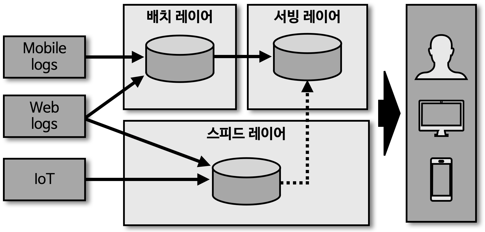
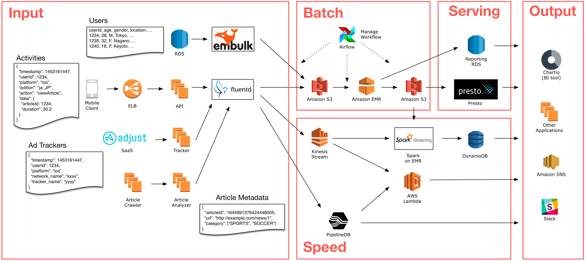
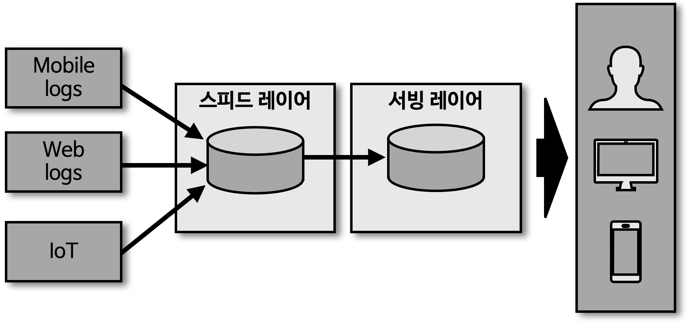
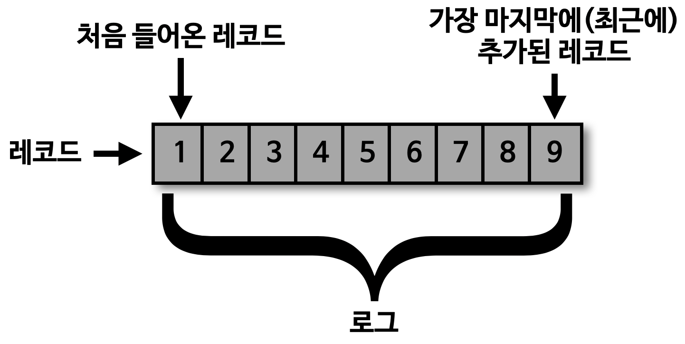
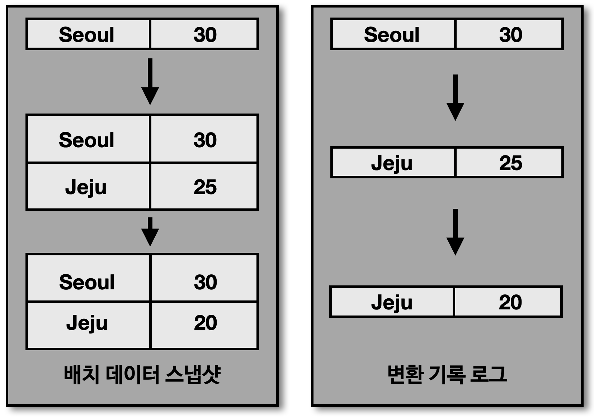
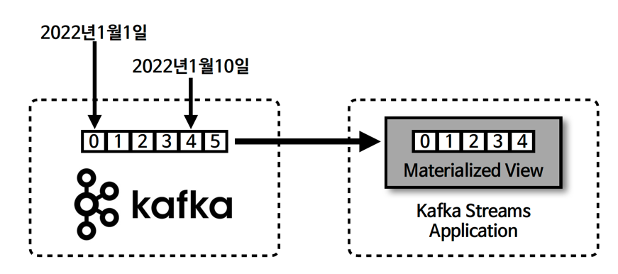
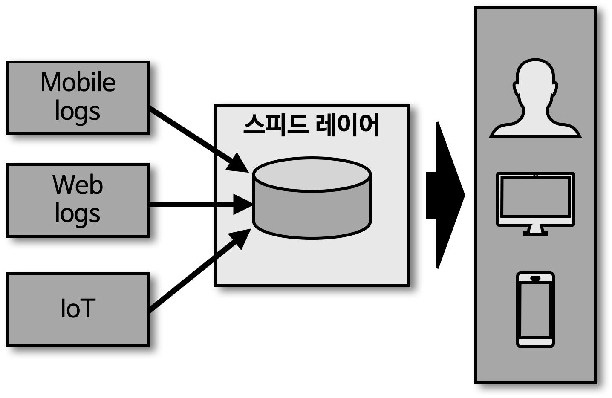
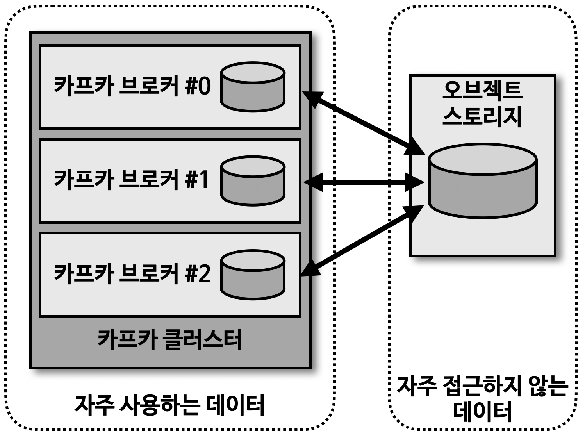

## 데이터 레이크 아키텍처와 카프카의 미래 

> 초기 빅데이터 플랫폼

- 초기 빅데이터 플랫폼은 각 서비스 어플리케이션으로부터 데이터를 배치를 통해 집중 
  - 데이터를 배치로 모으는 구조가 유연하지 못함
  - 실시간으로 생성되는 데이터들에 대한 인사이트를 서비스 애플리케이션으로 전달하지 못함
  - 원천 데이터로부터 파생된 데이터의 히스토리 파악이 힘듦
  - 계속되는 데이터의 가공으로 인한 데이터 파편화로 데이터 거버넌스 (표준/정책) 유지 힘듦

> 람다 아키텍처

- 배치 레이어
  - 배치 데이터를 모아서 특정 시간, 타이밍마다 일괄 처리
  - \* 예 : 하둡
- 서빙 레이어
  - 가공된 데이터를 데이터 사용자, 서비스 어플리케이션에서 사용하는 용도 
- 스피드 레이어 
  - 서비스에서 생성되는 원천 데이터를 실시간으로 분석하는 용도
  - \* 예 : 카프카

> 람다 아키텍처의 한계

- 데이터를 분석, 처리하는 데 필요한 로직이 2벌 (배치 레이어, 스피드 레이어) 로 각각의 레이어에 존재해야 하는 단점
- 배치 데이터와 실시간 데이터를 융합하여 처리할 떄는 다소 유연하지 못한 파이프라인을 생성해야 하는 단점

> 카파 아키텍처 

- 람다 아키텍처의 단점을 해소하기 위해 고안 
- 람다 아키텍처의 단점인 로직의 파편화, 디버깅, 배포, 운영 분리에 대한 이슈를 해결하기 위한 '배치 레이어 제거'
  - 스피드 레이어에서 데이터 처리

> 카파 아키텍처의 활용

 

- 일반적으로 데이터 플랫폼에서 배치 데이터를 표현할 때는 각 시점 (시간별, 일자별)의 전체 데이터를 백업한 스냅샷 데이터를 의미

- 배치 데이터를 로그로 표현할 때, 각 시점의 배치 데이터의 변환 기록 (change log) 을 순서대로 기록
  - 각 시점의 모든 스냅샷 데이터를 저장하지 않고도 배치 데이터 표현 가능

> 배치 데이터와 스트림 데이터

- 배치 데이터
  - 한정된 (bounded) 데이터 처리
  - 대규모 배치 데이터를 위한 분산 처리 수행 
  - 분, 시간, 일 단위 처리를 위한 지연 발생 
  - 복잡한 키 조인 수행 
- 스트림 데이터 
  - 무한 (unbounded) 데이터 처리
  - 지속적으로 들어오는 데이터를 위한 분산 처리 수행
  - 분 단위 이하 지연 발생
  - 단순한 키 조인 수행

> 스트림 데이터를 배치로 사용하는 방법

- 로그에 '시간 (timestamp)'을 남겨서 스트림 데이터를 배치 데이터로 사용
  - 로그에 기록한 시간을 기준으로 데이터를 처리하면, 스트림으로 적재된 데이터도 배치 처리 가능

> 스트리밍 데이터 레이크 

- 2020년, 카파 아키텍처에서 서빙 레이어를 제거한 스트리밍 데이터 레이크 제안
  - 스피드 레이어로 사용되는 카프카에 분석과 프로세싱을 완료한 거대한 용량의 데이터를 오랜 기간 저장하고 사용 가능하다면, 서빙 레이어는 제거 가능
  - 서빙 레이어와 스피드 레이어가 이중으로 관리되는 운영 리소스 감소 가능
  - 자주 사용되는 데이터, 자주 사용되지 않는 데이터의 분리가 필요한 한계점 존재

- 카프카를 스트리밍 데이터 레이크로 사용하기 위한 방향 (* 현재 카프카에서는 미지원 - 카프카 클러스터 영역까지만 제공)
  - 자주 접근하지 않는 데이터를 굳이 비싼 자원 (브로커의 메모리, 디스크) 에 유지할 필요 없음
  - 자주 접근하지 않는 데이터는 '오브젝트 스토리지' 와 같은 저렴하면서도 안전한 저장소에 옮겨 저장 
  - 자주 사용하는 데이터만 브로커를 통해 사용하는 구분 작업 필요
