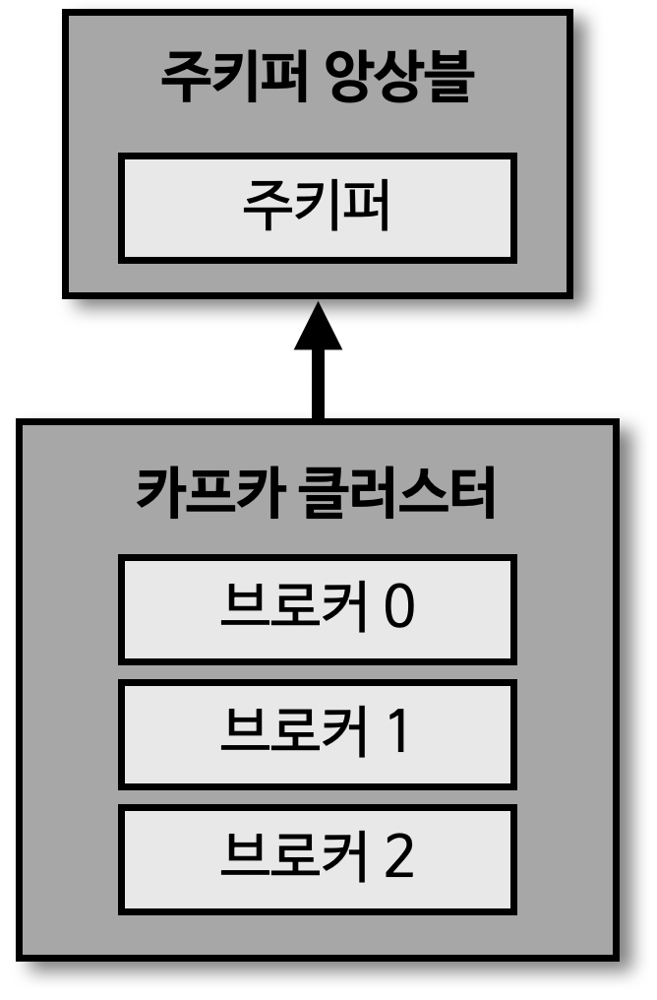

## 카프카 브로커와 클러스터

> 주키퍼

- 카프카 클러스터를 사용하기 위해 반드시 필요한 어플리케이션
  - 2.x 버전까지는 필수
  - 3.x 버전부터는 선택
  - 하지만, 아직까지는 주키퍼를 대체할 수 없는 부분도 있기 때문에 사용 권장

> 카프카 브로커 

- 카프카 클라이언트와 데이터를 주고 받기 위해 사용하는 주체
- 데이터를 분산 저장하여 장애가 발생하더라도 안전하게 사용할 수 있도록 도와주는 어플리케이션

- 1개의 서버에는 1개의 카프카 브로커 프로세스가 실행
  - 카프카 브로커 서버 1대로도 기본 기능이 실행 가능
  - 하지만, 데이터를 안전하게 보관 및 처리하기 위해 최소 3대 이상의 브로커 서버를 1개의 클러스터로 묶어서 운영

- 카프카 클러스터로 묶인 브로커들은 프로듀서로부터 수신한 데이터를 안전하게 분산 저장하고 복제
