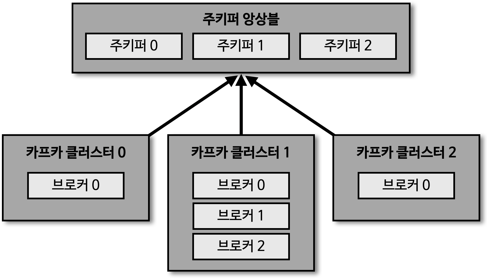

## 카프카 클러스터와 주키퍼

> 여러 개의 카프카 클러스터가 연결된 주키퍼 

- 카프카 클러스터를 실행하기 위해서는 주키퍼가 필요함
- 주키퍼의 서로 다른 znode 에 클러스터를 지정하면 됨
- root znode 에 각 클러스터별 znode 를 생성하고, 클러스터 실행 시 root 가 아닌 하위 znode 로 설정
  - 주키퍼 클러스터 하나로 여러 개의 카프카 클러스터 운영 가능
- 카프카 3.0 부터는 주키퍼가 없어도 클러스터 동작 가능
