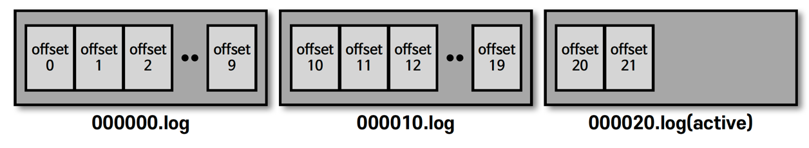

## 브로커의 역할 - 데이터 저장

- 카프카 실행 시, 'config/server.properties' 의 log.dir 옵션에 정의한 디렉토리에 데이터를 저장한다
  - 토픽 이름과 파티션 번호의 조합으로 하위 디렉토리를 생성하여 데이터 저장

- log 
  - 메시지와 메타데이터 저장
- index 
  - 메시지의 오프셋을 인덱싱한 정보
- timeindex
  - 메시지에 포함된 timestamp 값을 기준으로 인덱싱한 정보 

> hello.kafka 토픽의 0번 파티션에 존재하는 데이터 확인 
````shell
// 데이터 저장 경로
$ ls /tmp/kafka-logs
__consumer_offsets-0 __consumer_offsets-21
...

// 토픽 이름 : hello.kafka, 파티션 번호 : 0
$ ls /tmp/kafka-logs/hello.kafka-0
00000000000000000000.index 00000000000000000000.log
00000000000000000000.timeindex leader-epoch-checkpoint
````

## 로그와 세그먼트 

- 프로듀서에서 보낸 메시지를 세그먼트 단위로 저장

````shell
$ ls /tmp/kafka-logs/hello.kafka-0
00000000000000000000.log
00000000000000000010.log
00000000000000000020.log
````



- log.segment.bytes : 바이트 단위의 최대 세그먼트 크기 지정 (기본값 : 1GB)
- log.roll.ms(hour) : 세그먼트가 신규 생성된 이후 다음 파일로 넘어가는 시간 주기 (기본값 : 7일) 
  - 많은 양의 세그먼트를 가질 수도 있고, 적은 양의 세그먼트를 가질 수 있음 
  - 설정한 세그먼트 단위 보다 적은 양의 세그먼트를 가질 경우, 롤링에 의한 생성으로 볼 수 있음 
- active segment
  - 가장 마지막 세그먼트 파일 (즉, 쓰기가 일어나고 있는 세그먼트)
  - active segment 는 브로커의 삭제 대상에 포함되지 않음
  - active segment 가 아닌 세그먼트들은 'Retension' 옵션에 따라 삭제 대상으로 지정
