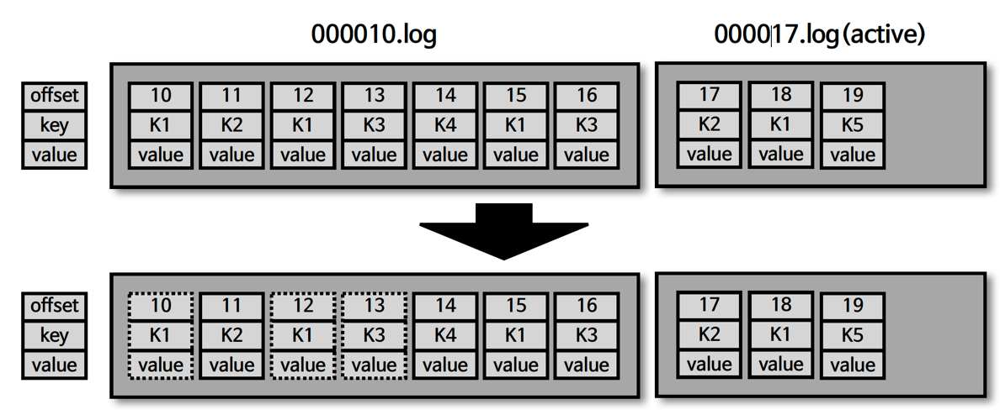
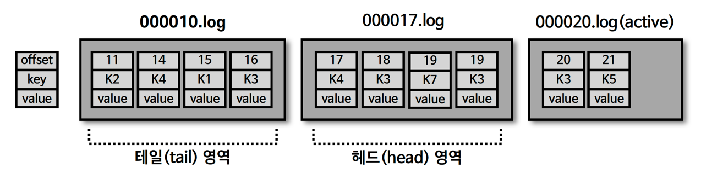
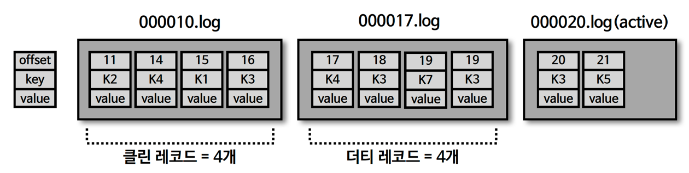

## cleanup.policy=delete

````shell
$ ls /tmp/kafka-logs/hello.kafka-0
00000000000000000000.log
00000000000000000010.log
00000000000000000020.log
````


- retension.ms(minutes, hours) :세그먼트를 보유할 최대 기간 (기본값 : 7일)

  - 일반적으로 3일로 설정 (토/일 주말 간 발생한 이슈에 대해 월요일에 대응 가능)
- retention.bytes : 파티션당 로그 적재 바이트 값 (기본값 : -1 (저장 X))
- log.retention.check.interval.ms : 세그먼트가 삭제 영역에 들어왔는지 (최대 기간, 최대 적재 바이트) 확인하는 간격 (기본값 : 5분)
- 카프카에서 데이터는 세그먼트 단위로 삭제가 발생

  - 로그 단위 (레코드 단위) 로 개별 삭제 불가능
- 로그(레코드)의 메시지 키, 메시지 값, 오프셋, 헤더 등 이미 적재된 데이터에 대해 수정 불가능

  - 데이터 적재 시 (프로듀서) 또는 데이터 사용 시 (컨슈머) 데이터 검증을 하는 것이 좋다

## cleanup.policy.compact



- 토픽 압축 정책은 일반적으로 생각하는 zip 과 같은 압축 (compression) 과는 다른 개념
  - 카프카에서의 압축이란, 메시지 키 별로 해당 메시지 키의 레코드 중 오래된 데이터를 삭제하는 정책을 의미
  - \* 그렇기 때문에 삭제 (delete) 정책과 다르게 일부 레코드만 삭제 가능
  - 압축은 active segment 를 제외한 데이터가 대상

## 테일/헤드 영역, 클린/더티 로그



- 테일 영역
  - 압축 정책에 의해 압축이 완료된 레코드들
  - 클린 로그라고도 부르며, 중복 메시지 키가 없음
- 헤드 영역
  - 압축 정책이 적용되기 전 레코드들
  - 더티 로그라고도 부르며, 중복된 메시지 키가 있음

## min.cleanable.dirty.ratio



- 데이터 압축 시작 시점은 min.cleanable.dirty.ratio 옵션값을 따름
- min.cleanable.dirty.ratio 옵션값은 active segment 를 제외한 세그먼트에 남아 있는 '테일 영역' 과 '헤드 영역' 의 레코드 개수의 비율을 의미
  - 0.5 로 설정 시 테일 영역의 레코드 개수가 헤드 영역의 레코드 개수와 동일할 경우 압축 실행
  - 0.9 와 같이 크게 설정 시 한번 압축을 할 때, 많은 데이터가 줄어들기 때문에 압축 효과가 좋음
    - 그러나, 0.9 의 비율이 될 때까지 용량을 차지하므로 용량 효율은 좋지 않음 (더티 레코드의 비율이 더 큼)
    - 반면, 0.1 과 같이 작게 설정하는 경우, 압축이 자주 일어나서 최신 데이터만 유지할 수 있지만 압축이 자주 발생하기 때문에 브로커에 부담 발생 (클린 레코드의 비율이 더 큼)
