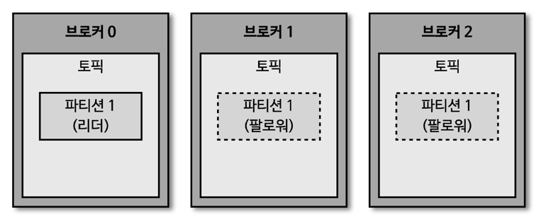
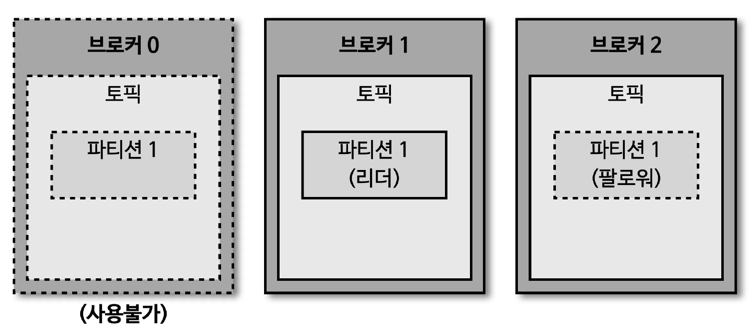

## 브로커의 역할 - 복제(replication)

> replication factor : 3

- 데이터 복제 (replication) 은 카프카를 장애 허용 시스템 (fault tolerant system) 으로 동작하도록 하는 원동력
- 복제의 이유는 클러스터로 묶인 브로커 중 일부에 장애가 발생하더라도 데이터를 유실하지 않고, 안전하게 사용하기 위함
  - 카프카의 데이터 복제는 '파티션' 단위
- 토픽 생성 시 파티션의 복제 개수 (replication factor) 를 설정하게 되는데, 직접 옵션을 선택하지 않으면 브로커에 설정된 옵션 값을 따라감
  - 복제 개수의 최솟값은 1(복제 없음) 이며, 최댓값은 브로커 개수만큼 설정 가능
  - 상용 환경에서는 보통 복제 개수 (replication factor) 를 2 ~ 3 으로 사용하는 것이 일반적
  
    
- 복제된 파티션은 리더 (leader) 와 팔로워 (follower) 로 구성
  - 리더 : 프로듀서, 컨슈머와 직접 통신하는 파티션 (리더 파티션이 프로듀서의 메시지를 적재) 
  - 팔로워 : 복제 데이터를 가지고 있는 파티션
    - 팔로워들은 리더의 '오프셋'을 확인하여 현재 자신이 가지고 있는 오프셋과 차이가 나는 경우, 리더로부터 데이터를 가져와서 자신의 파티션에 저장하는데, 이 과정을 '복제(replication)' 이라고 함
    

- 파티션 복제로 인해 팔로워 브로커에도 리더 파티션의 데이터가 복제되기 때문에 복제 개수만큼의 저장 용량이 증가한다는 단점 발생
  - \* 하지만, '복제를 통해 데이터를 안전하게 사용할 수 있다는 강력한 장점 때문에 카프카 운영 시 2개 이상의 복제 개수를 정하는 것이 매우 중요'

## 브로커에 장애가 발생한 경우

- 브로커가 다운 되는 경우, 해당 브로커에 있는 리더 파티션은 사용할 수 없기 때문에 팔로워 파티션 중에 하나가 리더 파티션의 지위를 넘겨 받음 (승격)
  - 이를 통해 데이터가 유실되지 않고, 컨슈머나 프로듀서와 데이터를 주고 받도록 동작 가능
- 운영 시에는 데이터 종류마다 다른 복제 개수를 설정하고, 상황에 따라서는 토픽마다 복제 개수를 다르게 설정하여 운영하기도 함
  1. 데이터 일부가 유실되더라도 데이터 처리 속도가 중요한 경우 
     - replication factor : 1 또는 2 설정
  2. 데이터 유실을 허용하지 않는 경우
     - Replication factor : 3 설정
