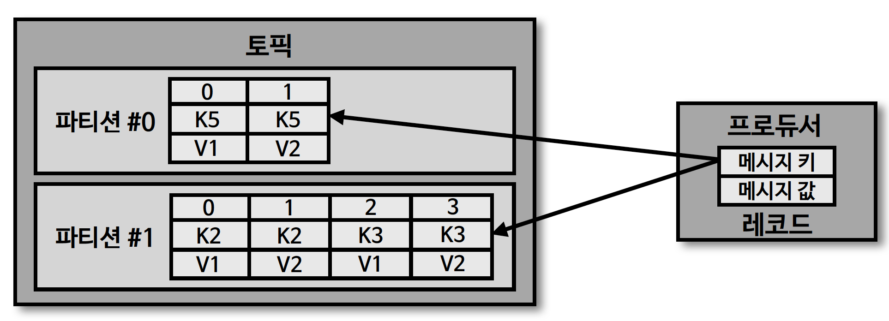

## 토픽과 파티션

- 토픽은 카프카에서 데이터를 구분하기 위해 사용하는 단위
  - 토픽은 1개 이상의 파티션을 소유
- 파티션에는 프로듀서가 보낸 데이터들이 저장되는데, 이 데이터를 '레코드(record)' 라고 부름
  - 파티션은 큐(queue) 와 비슷한 구조로 FIFO 구조
  - 다만, 카프카에서는 데이터를 가져가더라도 삭제되지 않음
- 파티션의 레코드는 컨슈머가 가져가는 것과 별개로 관리
  - 이러한 특징 때문에 토픽의 레코드는 다양한 목적을 가진 여러 컨슈머 그룹들이 토픽의 데이터를 여러 번 가져갈 수 있음

## 토픽 생성 시 파티션이 배치되는 방법

- \* 파티션이 5개인 토픽 생성 시 위 그림과 같이 0번 브로커에서부터 시작하여 'round-robin' 방식으로 '리더 파티션'들이 생성
- 카프카 클라이언트는 리더 파티션이 있는 브로커와 통신하여 데이터를 주고 받으므로 여러 브로커에 골고루 네트워크 통신하게 됨
  - 데이터가 특정 서버 (여기서는 브로커) 와 통신이 집중되는 (hot spot) 현상 방지 가능
  - 선형 확장 (linear scale out) 하여 데이터가 많아지더라도 자연스러운 대응 가능

- 브로커 0부터 'round-robin' 방식으로 리더 파티션을 할당

## 특정 브로커에 리더 파티션이 집중된 현상

- 브로커 0번의 리소스 과부하 (프로듀서, 컨슈머가 모두 브로커 0번과 통신)
- \* 특정 브로커에 파티션이 몰리는 경우, 'kafka-reassign-partitions.sh' 명령으로 파티션 재분배 가능

## 파티션 개수와 컨슈머 개수의 처리량

- 파티션은 카프카 병렬 처리의 핵심으로 그룹으로 묶인 컨슈머들이 레코드를 병렬로 처리할 수 있도록 매칭 됨 (파티션-컨슈머 - 1:1)
  - 컨슈머의 처리량이 한정된 상황에서 많은 레코드를 병렬로 처리하는 가장 좋은 방법은 컨슈머의 개수를 늘려 스케일 아웃 하는 것
  - 컨슈머 개수를 늘림과 동시에 파티션 개수도 늘리면 처리량이 증가하는 효과

## 파티션 개수를 줄이는 것은 불가능

- 카프카에서 파티션 개수를 줄이는 것은 지원하지 않음
  - 따라서, 파티션을 늘리는 작업은 신중하게 결정
  - \* 파티션을 줄이기 위해서는 토픽을 삭제하고, 재생성하는 방법뿐
