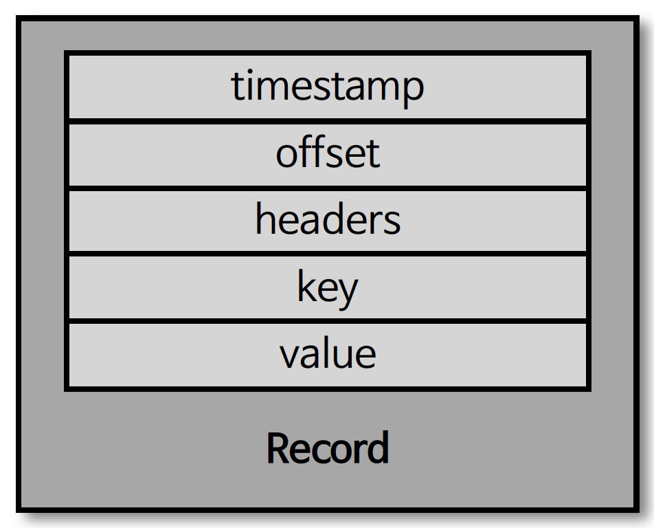

## 레코드

- 레코드 구성
  - timestamp, 헤더, 메시지 키 , 메시지 값, 오프셋
- 프로듀서가 생성한 레코드가 브로커로 전송되면 '오프셋'과 '타임스탬프'가 지정되어 저장
- 브로커에 한번 적재된 레코드는 수정이 불가능하며, 로그 리텐션 기간 또는 용량에 따라서만 삭제 가능

## 타임스탬프

- 레코드의 타임스탬프는 스트림 프로세싱에서 활용하기 위한 시간을 저장하는 용도로 사용
  - 카프카 0.10.0.0 이후 버전부터 추가된 타임스탬프는 Unix timestamp 포함
  - 프로듀서에서 따로 미설정 시 기본값으로 ProducerRecord 생성 시간 (CreateTime) 으로 기록
  - 브로커 적재 시간 (LogAppendTime)으로 설정도 가능
- 해당 옵션은 토픽 단위로 설정 가능
  - message.timestamp.type

## 오프셋

- 레코드의 오프셋은 프로듀서가 생성한 레코드에는 존재하지 않음
  - 프로듀서가 전송한 레코드가 브로커에 적재될 때 오프셋이 지정
- 오프셋은 0부터 시작되며, 1씩 증가
- 컨슈머는 오프셋을 기반으로 처리가 완료된 데이터와 앞으로 처리해야 할 데이터를 구분
  - 각 메시지는 파티션별로 고유한 오프셋을 가지므로 컨슈머에서 중복 처리를 방지하기 위한 목적으로도 사용

## 헤더

- 카프카 0.11 부터 제공
- key/value 데이터를 추가활 수 있으며, 레코드의 스키마 버전이나 포맷과 같이 데이터 프로세싱에 참고할만한 정보를 담아 사용 가능
  - http - header 와 유사한 목적

## 메시지 키

- 메시지 키는 처리하고자 하는 메시지 값을 분류하기 위한 용도로 사용 (파티셔닝에 사용)
- 파티셔닝
  - 파티셔닝에 사용하는 메시지 키는 파티셔너(Partitioner)에 따라 토픽의 파티션 번호가 정해짐
- 메시지 키는 비필수이며, 지정하지 않을 경우 'null' 로 설정
  - 메시지 키가 null 인 레코드는 특정 토픽의 파티션에 라운드 로빈으로 전달
  - 메시지 키가 null 이 아닌 레코드는 해시값에 의해 특정 파티션에 매핑되어 전달 (기본 파티셔너인 경우)

## 메시지 값

- 레코드의 메시지 값은 실질적으로 처리할 데이터가 담기는 공간
- 메시지 값의 포맷은 제네릭으로, 사용자에 의해 지정
  - Float, Byte[], String 등 다양한 형태로 지정 가능
    - 일반적으로 String 으로 직렬화/역직렬화 하여 사용하며, JSON 포맷으로 사용
  - 직렬화/역직렬화 클래스를 만들어 사용도 가능
    - 다만, 브로커에 저장된 레코드의 메시지 값은 어떤 포맷으로 직렬화되어 저장됐는지 알 수 없기 때문에 컨슈머는 미리 역직렬화 포맷을 알고 있어야 함
