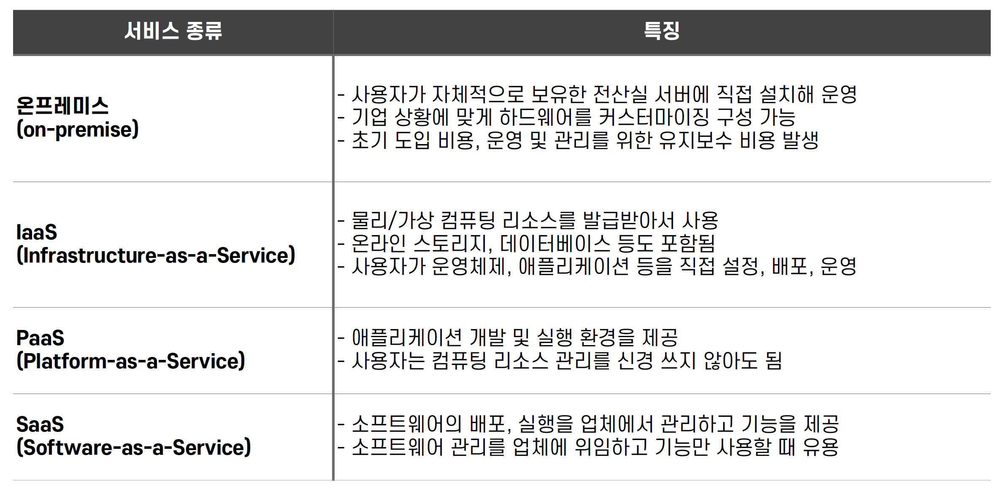

## 카프카 클러스터를 운영하는 여러가지 방법

- 아파치 카프카 클러스터를 서버에 직접 설치하고, 운영하는 것은 가장 전통적인 기본 방법
  - 직접 설치 및 운영 시 각종 설정을 직접 컨트롤하여 세부 서버 설정을 통해 최고의 성능으로 최적의 클러스터 운영 가능
- 하지만, 최적화된 카프카 클러스터 운영을 위해서는 노하우가 필요하기 때문에 수많은 시행착오 필요
  - 특히 각종 보안 설정, 모니터링 도구 등의 설치 및 운영 시 수많은 선택지로 인해 어려움
- 운영상 시행착오를 줄이고, 최고의 카프카 클러스터를 빠르게 설치하여 안전하게 운영하기 위해 SaaS 도입 가능

## 운영 방법에 따른 서비스 형태들

- SaaS
    - 클라우드 서비스 제공업체가 소프트웨어와 인프라를 관리하면서 플랫폼을 제공하는 것
    - 사용자는 웹 대시보드나 CLI 를 통해 간편하게 플랫폼 세부 설정 가능
    - 네트워크, 스토리지, 가상화 등 다양한 종류의 운영상 이슈는 업쳉에서 관리하기 때문에 편리

## 설치 방법별 서비스 형태 종류

## 서비스 형태별 카프카 운영 방법

## 오픈 소스 카프카를 직접 설치하여 운영하는 경우

- IaaS 또는 온프레미스 환경에서 카프카 클러스터를 설치하여 운영하는 것이 가장 흔한 운영 방식
- 카프카는 전송된 데이터를 모두 파일 시스템에 저장하고, 대규모 데이터 통신이 일어나기 때문에 고성능의 하드웨어 사용이 필요
- 컨플루언트 추천 카프카 클러스터 하드웨어 스펙
    - 메모리
        - 32GB 머신 (힙 메모리 6GB 설정), 나머지는 OS의 페이지 캐시 영역으로 활용
    - CPU
        - 24Core
        - SSL 과 같은 보안 설정 사용 시 더 높은 코어 사용 필요
    - 디스크
        - RAID 10 으로 설정된 디스크 사용 (NSA 사용 안 됨 - 데이터 처리량에서 이슈 발생)
        - Redundant Array of Independent Disks
        - 여러 개의 디스크를 하나로 묶어 하나의 논리적 디스크로 작동
    - 네트워크
        - 사용하는 데이터 통신량에 따라 다름
    - 파일시스템
        - XFS 또는 ext4

## 오픈 소스 카프카를 직접 설치하여 운영하는 경우

