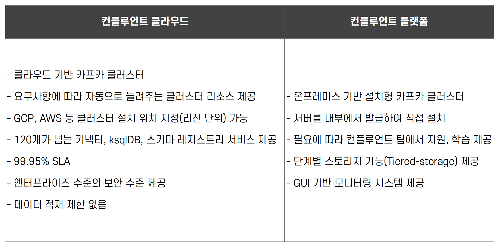

## 클라우드 서비스 - 컨플루언트

- 컨플루언트는 카프카에 대한 개념을 최초로 고안하고 아키텍처를 제안, 개발한 인물인 제이 크랩스와 그의 동료들이 설립한 회사
- 컨플루언트는 아파치 카프카의 생태계를 발전시켜 나가는 데 선구적인 역할중
    - 스키마 레지스트리, ksqlDB 등과 같은 오픈 소스를 공개

## 컨플루언트 클라우드, 컨플루언트 플랫폼

## AWS MSK

- MSK (Managed Streaming for Apache Kafka) 는 AWS 에서 제공하는 SaaS형 아파치 카프카 서비스
- AWS 인프라에서 카프카 클러스터 생성, 업데이트, 삭제 등과 같은 운영 요소를 대시보드를 통해 제공
    - TLS (Transport Layer Security) 인증 보안 설정 가능
- 아파치 카프카 버전 직접 선택 가능
