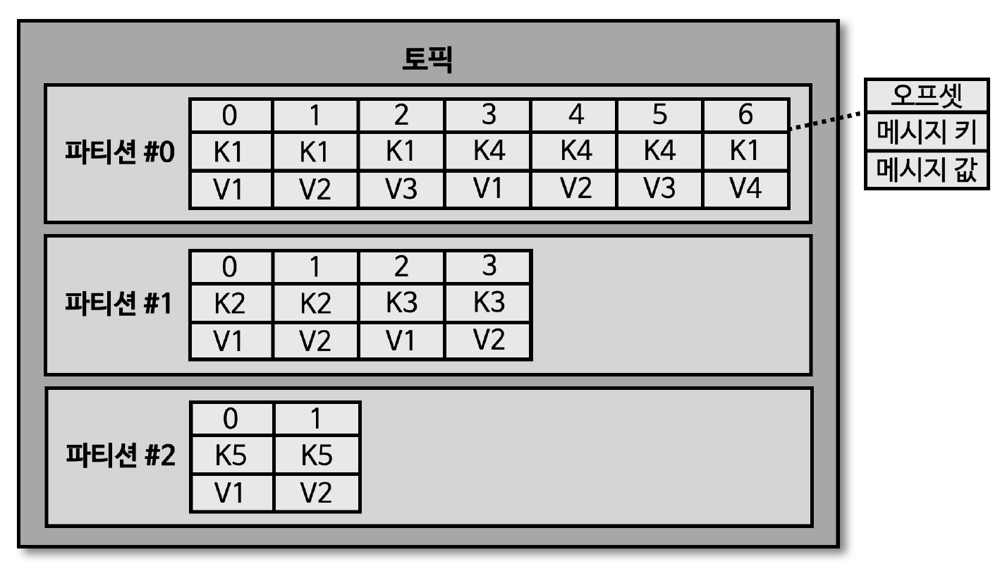

## kafka-console-producer.sh

> hello.kafka 토픽에 데이터를 넣을 수 있는 kafka-console-producer.sh 명령어 실행

- 키보드로 문자 작성 후 엔터 키 입력 시 별다른 응답 없이 메시지값 전송 완료

````shell
# 메시지 키는 null 로 설정되었기 때문에 '라운드 로빈' 방식으로 파티션에 저장

$bin/kafka-console-producer.sh --bootstrap-server localhost:9092 --topic hello.kafka
>hello
>kafka
>0
>1
>2
````

> 메시지 키를 가지는 레코드 전송 방법

- 메시지 키를 가지는 레코드 전송을 위해서는 추가 옵션 작성 필요
- key.separator 미선언 시 기본 설정은 'Tab delimiter(\t)'
    - key.separator 를 선언하지 않고, 메시지를 보내려면 메시지 키 작성 후 탭키를 누른 뒤 메시지 값을 입력하고 엔터키 입력
- 아래에서는 명시적으로 확인하기 위해 콜론(:) 으로 key.separator를 선언

````shell
# 메시지 키가 설정되었으므로 해시값에 의한 파티셔닝 된 파티션에 저장
# --property "parse.key=true" -- property "key.separator=:"

$bin/kafka-console-producer.sh --bootstrap-server localhost:9092 --topic hello.kafka --property "parse.key=true" --property "key.separator=:"
 >key1:no1
 >key2:no2
 >key3:no3
````

## 메시지 키와 메시지 값이 포함된 레코드가 파티션에 전송됨



- 메시지 키와 메시지 값을 함께 전송한 레코드는 토픽의 파티션에 저장된다
- 메시지 키가 null 인 경우, 프로듀서가 파티션으로 전송할 때, 레코드 배치 단위 (레코드 전송 묶음)로 라운드 로빈 방식에 의해 전송
- 메시지 키가 존재하는 경우, 키의 해시값을 작성하여 존재하는 파티션 중 1개에 할당
    - 메시지 키가 동일할 경우, 동일한 파티션으로 전송
    - 동일한 메시지 키인 경우, 동일한 파티션에 메시지가 저장되기 때문에 '순서 보장'이 가능 (* 프로듀서에서 메시지 키 지정 필요)
