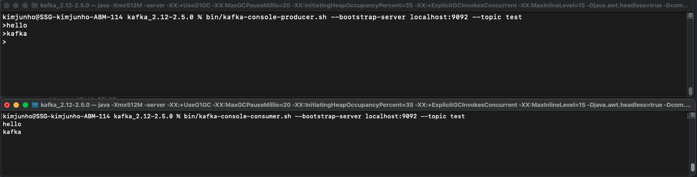

## kafka-console-consumer.sh

> hello.kafka 토픽으로 전송한 데이터는 kafka-console-consumer.sh 명령어로 확인 가능

- 필수 옵션으로 --bootstrap-server 에 카프카 클러스터 정보, --topic 에 토픽 이름 필요
- --from-beginning 옵션 사용 시 토픽에 저장된 가장 처음 데이터부터 출력

````shell
$bin/kafka-console-consumer.sh --bootstrap-server localhost:9092 --topic hello.kafka --from-beginning

hello
kafka test
1
2
123789
no1
no2
````

> 레코드의 메시지 키와 메시지 값을 확인하고자 하는 경우, --property 옵션 사용

````shell
# key 가 없는 경우, null 로 출력
# - 옵션 설정값에 의해 key-value 포맷으로 출력

$bin/kafka-console-consumer.sh --bootstrap-server localhost:9092 --topic hello.kafka --property print.key=true --property key.separator="-" --from-beginning

null-hello
null-kafka test
null-1
null-2
null-123789
key1-no1
key2-no2
````

> --max-messages 옵션 사용 시 '최대 컨슘 메시지 개수' 설정 가능 (해당 옵션 미설정 시 계속해서 쌓이는 레코드가 끊임없이 출력)

````shell
# 최대 1개의 레코드까지만 컨슘하여 처음부터 출력

$bin/kafka-console-consumer.sh --bootstrap-server localhost:9092 --topic hello.kafka --from-beginning --max-messages 1

hello
Processed a total of 1 messages
````

> --partition 옵션 사용 시 특정 파티션만 컨슘 가능

````shell
# 0번 파티션의 레코드만 컨슘하여 처음부터 출력

$bin/kafka-console-consumer.sh --bootstrap-server localhost:9092 --topic hello.kafka --partition 0 --from-beginning

hello
kafka test
1
2
123789
no1
no2
````

> --group 옵션 사용 시 컨슈머 그룹을 기반으로 kafka-console.consumer 동작
>
> - 컨슈머 그룹이란 특정 목적을 가진 컨슈머들을 묶음으로 사용하는 것을 의미
> - \* 컨슈머 그룹으로 토픽의 레코드를 가져갈 경우, 어느 레코드까지 읽었는지에 대한 데이터가 카프카 브로커에 저장된다
> - __consumer_offsets 토픽에 저장

````shell
$bin/kafka-console-consumer.sh --bootstrap-server localhost:9092 --topic hello.kafka --group hello-group --from-beginning

hello
kafka test
1
2
123789
no1
no2

````

````shell
# 컨슈머 오프셋 확인 방법 (직접 생성한 토픽 외 __consumer_offsets 가 있는 것을 확인 가능)

$bin/kafka-topics.sh --bootstrap-server localhost:9092 --list

__consumer_offsets
hello.kafka
hello.kafka2
test

````

## 프로듀서 / 컨슈머 메시지 송수신 확인



````shell
# 프로듀서 실행 (송신)
$bin/kafka-console-producer.sh --bootstrap-server localhost:9092 --topic test

> hello
> kafka
````

````shell
# 컨슈머 실행 (수신)
$bin/kafka-console-consumer.sh --bootstrap-server localhost:9092 --topic test

hello
kafka
````
