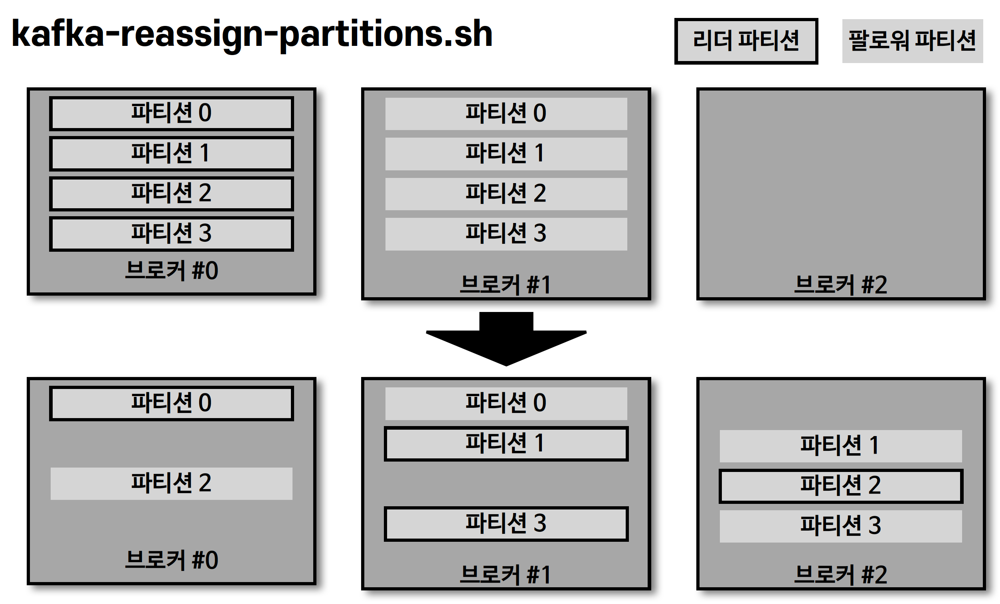

## kafka-producer-perf-test.sh

> 카프카 프로듀서로 퍼포먼스를 측정할 때 사용

````shell
$bin/kafka-producer-perf-test.sh \
    --producer-props bootstrap.server=localhost:9092 \
    --topic hello.kafka \
    --num-records 10 \
    --throughput 1 \
    --record-size 100 \
    --print-metric

7 records sent, 1.3 records/sec (0.00 MB/sec), 28.9 ms avg latency, 184.0 ms max
latency.
10 records sent, 1.087666 records/sec (0.00 MB/sec), 20.60 ms avg latency, 184.00
ms max latency, 2 ms 50th, 184 ms 95th, 184 ms 99th, 184 ms 99.9th.
...
````

## kafka-consumer-perf-test.sh

> 카프카 컨슈머로 퍼포먼스를 측정할 떄 사용

- 카프카 브로커와 컨슈머 간의 네트워크를 체크할 때 사용

````shell
$bin/kafka-consumer-perf-test.sh \
    --producer-props bootstrap.server=localhost:9092 \
    --topic hello.kafka \
    --messages 10 \
    --show-detailed-stats

time, threadId, data.consumed.in.MB, MB.sec, data.consumed.in.nMsg, nMsg.sec,
rebalance.time.ms, fetch.time.ms, fetch.MB.sec, fetch.nMsg.sec
2022-01-16 22:19:49:410, 0, 0.0000, 0.0000, 1, 4.6729, 1642339189386,
-1642339189172, 0.0000, 0.0000
````

## kafka-reassign-partitions.sh



- 리더 파티션과 팔로워 파티션의 위치 변경 가능

````shell
$ cat partitions.json
{
    "partitions":
        [ { "topic": "hello.kafka", "partition": 0, "replicas": [ 0 ] } ]
    ,"version": 1
}

$ bin/kafka-reassign-partitions.sh --zookeeper my-kafka:2181 --reassignment-json-file partitions.json --execute
````

- 카프카 브로커에는 'auto.leader.rebalance.enable' 옵션이 있는데, 기본값은 true 로 클러스터 단위에서 '리더 파티션'을 '자동 리밸런싱'하도록 도와준다
  - 브로커의 백그라운드 쓰레드가 일정 간격으로 리더의 위치를 파악하고 필요 시 리더 파티션 리밸런싱을 통해 리더의 위치가 알맞게 배분

## kafka-delete-record.sh

````shell
$ cat delete.json
{
    "partitions": [
        {
            "topic": "hello.kafka", "partition": 0, "offset": 5
        }
    ], "version": 1
}

$ bin/kafka-delete-records.sh --bootstrap-server my-kafka:9092 --offset-json-file delete.json

Executing records delete operation
Records delete operation completed:
partition: hello.kafka-0 low_watermark: 5
````

- 0번 파티션의 레코드를 처음부터 5번 오프셋까지 삭제 (* 파티션 0의 오프셋 5를 제거하는 것이 아님)


## kafka-dump-log.sh

````shell
$ ls data/hello.kafka-0
00000000000000000000.index 00000000000000000000.timeindex
00000000000000000000.log leader-epoch-checkpoint

$ bin/kafka-dump-log.sh \
    --files data/hello.kafka-0/00000000000000000000.log \
    --deep-iteration

Dumping data/hello.kafka-0/00000000000000000000.log
Starting offset: 0
baseOffset: 0 lastOffset: 2 count: 3 baseSequence: -1 lastSequence: -1
producerId: -1 producerEpoch: -1 partitionLeaderEpoch: 0 isTransactional: false
isControl: false position: 0 CreateTime: 1642337213446 size: 87 magic: 2
compresscodec: NONE crc: 23690631 isvalid: true
...
````
