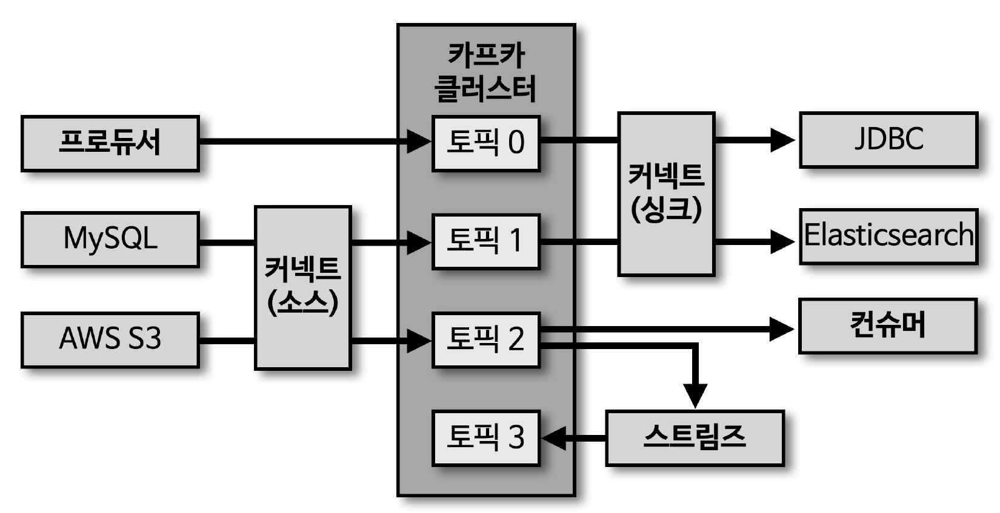
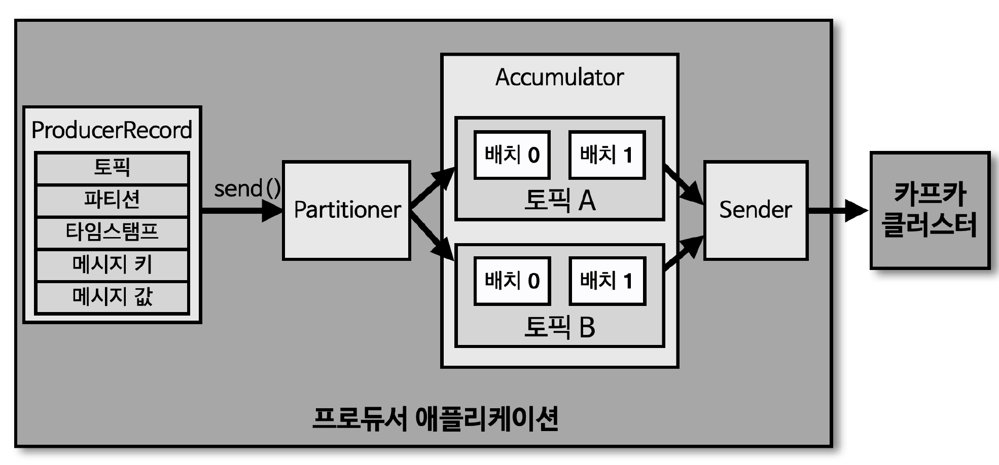

## 프로듀서

- 카프카에서 데이터의 시작점은 프로듀서
- 프로듀서 어플리케이션은 카프카에 필요한 데이터를 선언하고, 브로커의 특정 토픽의 파티션에 데이터를 전송
- 프로듀서는 데이터 전송 시 '리더 파티션'을 가지고 있는 카프카 '브로커'와 직접 통신
- 프로듀서는 카프카 브로커로 데이터를 전송할 때, 내부적으로 '파티셔너', '배치 생성' 단계를 거침

## 프로듀서 내부 구조

> ProducerRecord

- 프로듀서에서 생성하는 레코드. 오프셋은 미포함 (오프셋은 카프카 브로커에 저장되고 난 뒤 생성)

> send()

- 레코드 전송 요청 메소드

> Partitioner

- 어느 파티션으로 전송할 지 지정하는 파티셔너 (기본값 : DefaultPartitioner)

> Accumulator

- 배치로 묶어 전송할 데이터를 모으는 버퍼
