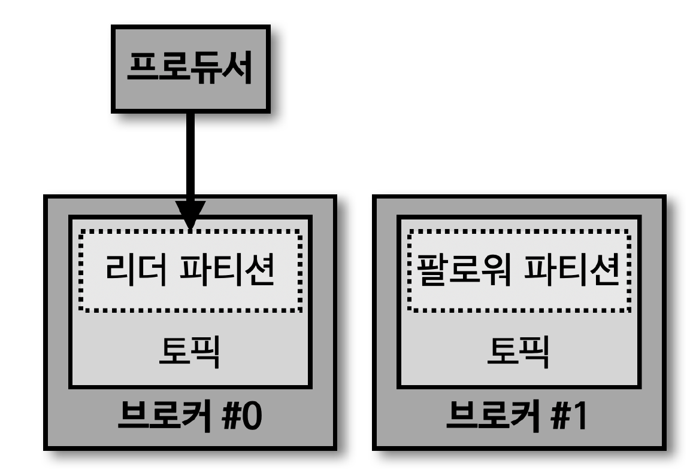

## ISR (In-Sync-Replicas)

> ISR 은 리더 파티션과 팔로워 파티션이 모두 동기화된 상태를 의미

- 동기화가 완료됐다는 의미는 리더 파티션의 모든 데이터가 팔로워 파티션에 복제된 상태 의미

- 팔로워 파티션이 리더 파티션으로부터 데이터를 복제하는 데는 시간이 소요된다
- 특정 파티션에 데이터를 저장하는 작업은 리더 파티션을 통해 처리 (프로듀서 -> 리더 파티션)
  - 이때, 리더 파티션에 새로운 레코드가 추가되어 '오프셋이 증가'하면, 팔로워 파티션이 위치한 브로커는 리더 파티션의 데이터를 복제
  - 리더 파티션에 데이터가 적재된 이후 팔로워 파티션이 복제하는 시간차 때문에 '리더 파티션과 팔로워 파티션 간에 오프셋 차이가 발생'하기도 한다
    - Replication Lag

## acks

- acks 옵션은 0, 1, all (-1) 로 설정 가능
- 해당 옵션을 통해 프로듀서가 전송한 데이터가 카프카 클러스터에 얼마나 신뢰성 있게 저장될 지 지정
- acks 옵션에 따라 성능 차이 발생 가능
  - 복제 개수가 1인 경우, acks 옵션에 따른 성능 변화는 크지 않음
  - 하지만, 데이터를 안정적으로 운영하기 위해서는 복제 개수를 2 이상으로 운영하는 것이 좋음

## acks=0

> 프로듀서가 리더 파티션으로 데이터를 전송했을 때, 리더 파티션에 데이터가 저장됐는지 확인하지 않음 (sender 만 수행)

- 리더 파티션은 데이터 저장 후 해당 데이터가 몇 번째 오프셋에 저장되었는지 리턴
- acks 가 0 인 경우, 프로듀서는 리더 파티션에 데이터가 저장되었는지에 대한 응답값을 받지 X
- 데이터 전송 속도는 acks 1 또는 all 보다 빠름
  - 데이터의 일부 유실이 발생하더라도 속도가 중요한 경우 해당 옵션 사용

## acks=1

> 프로듀서가 리더 파티션으로 데이터를 전송했을 때, 리더 파티션에 데이터가 저장됐는지 확인 (팔로워 파티션 데이터 적재 여부는 미확인)

- 리더 파티션에 정상적으로 적재되지 않았다면, 리더 파티션에 적재될 때까지 재시도 가능
  - 하지만, 팔로워 파티션에 복제 되기 전 리더 파티션에 장애가 발생할 경우, 데이터 유실 가능

## acks=all

> 프로듀서가 리더 파티션으로 데이터를 전송했을 때, 리더 파티션, 팔로워 파티션 모두에 데이터가 저장됐는지 확인

- 리더 파티션, 팔로워 파티션 모두 데이터 적재 유무를 확인하기 때문에 0 또는 1 옵션 보다 속도가 느림
  - 하지만, 일부 브로커에 장애가 발생하더라도 프로듀서가 안전하게 데이터를 송수신 가능
  - 토픽 단위로 설정 가능한 'min.insync.replicas' 옵션값에 따라 데이터의 안정성이 달라진다
    - 브로커 3대가 있는 환경에서 acks=all, min.insync.replicas=2 로 설정 시, 리더 파티션이 있는 브로커와 팔로워 파티션이 있는 브로커 총 2개에 대해서만 acks 확인 (나머지 팔로워 파티션이 있는 브로커는 확인하지 않음)

## min.insync.replicas

> 프로듀서가 리더 파티션과 팔로워 파티션에 데이터가 적재되었는지 확인하기 위한 최소 ISR 그룹의 파티션 개수

- min.insync.replicas=1 인 경우, ISR 중 최소 1개 이상의 파티션에 데이터가 적재 되었음을 확인
  - acks=1 과 동일한 동작 (ISR 중 가장 처음 적재가 완료되는 파티션은 리더 파티션이기 때문)

## akcs=-1(all) / min.insync.replicas=2

> min.insync.replicas 의 옵션값을 2로 설정했을 때부터 acks 를 all 로 설정하는 의미가 있다

- ISR 의 2개 이상의 파티션에 적재되었음을 확인한다는 뜻은 적어도 리더 파티션과 1개의 팔로워 파티션에 데이터가 정상적으로 적재되었음을 보장
- 카프카 클러스터를 운영하면서 브로커가 동시에 2개가 중단되는 일은 극히 드뭄

  - 리더 파티션과 팔로워 파티션 중 1개에 데이터가 적재 완료되었다면 데이터는 유실되지 않는다고 볼 수 있음
