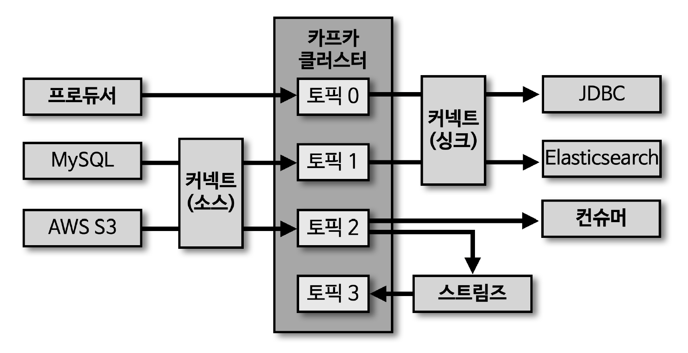
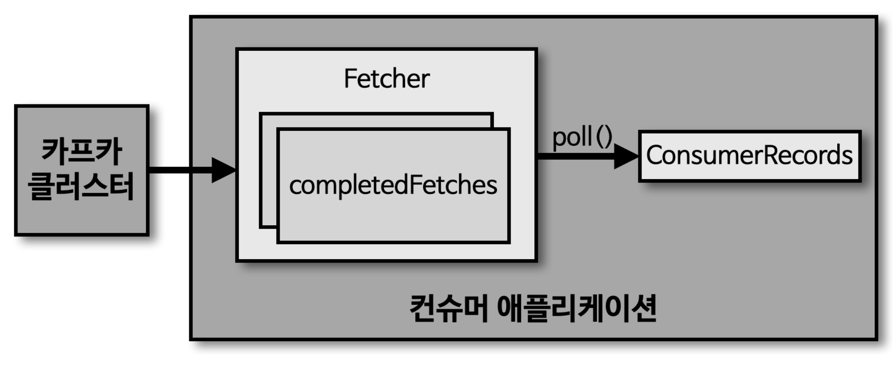

## 컨슈머

- 프로듀서가 전송한 데이터는 카프카 브로커에 적재
- 컨슈머는 적재된 데이터 사용을 위해 브로커로부터 데이터를 가져와 필요한 처리 진행

## 컨슈머 내부 구조

> Fetcher

- 리더 파티션으로부터 레코드들을 미리 가져와서 대기
- completedFetches 를 통해 완료 데이터 확인
- poll() 메소드를 호출하기 전에 미리 레코드를 가져옴

> poll()

- Fetcher 에 있는 레코드들을 리턴

> ConsumerRecords

- 처리하고자 하는 레코드들의 모음 (오프셋 포함)
- 해당 단계 이후 offset commit 수행 (어느 오프셋까지 처리했는지에 대한 데이터)
