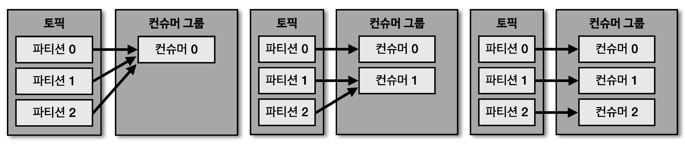
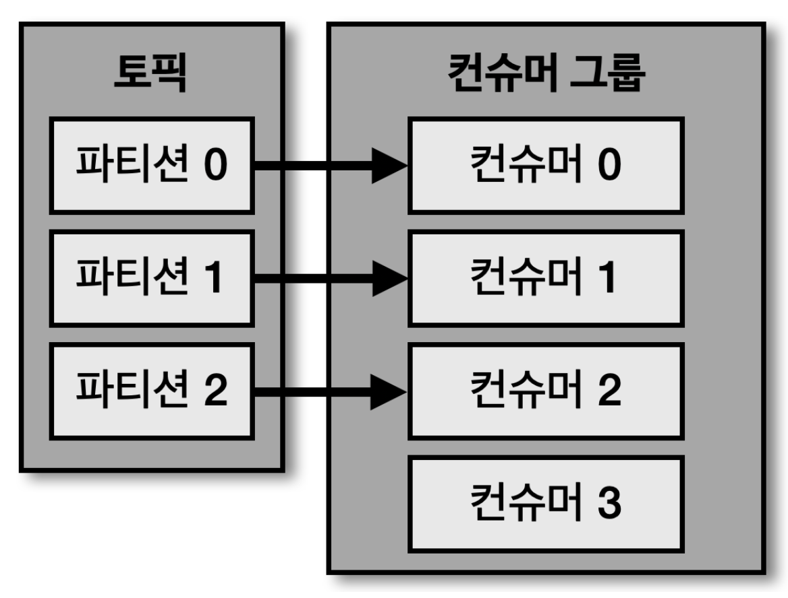
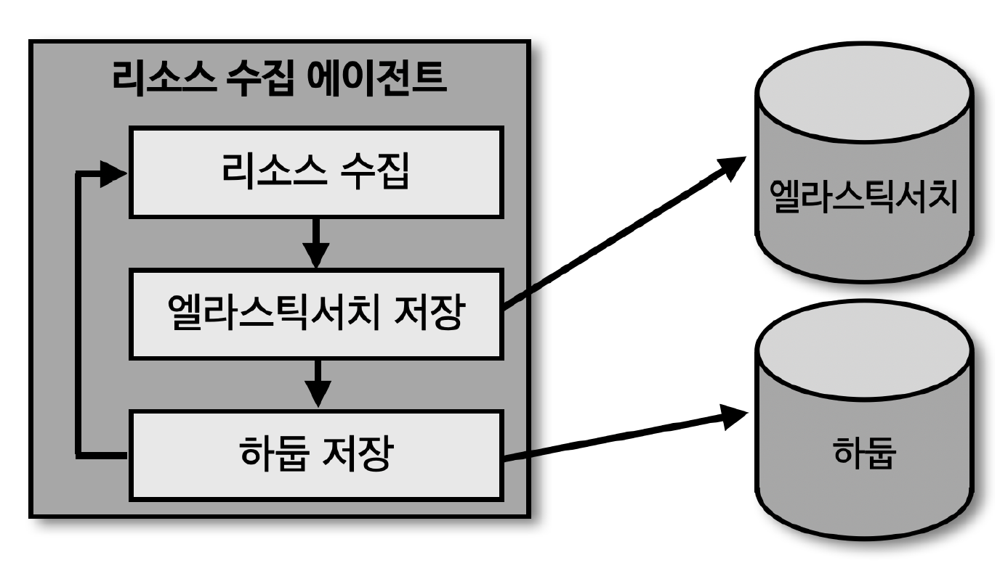
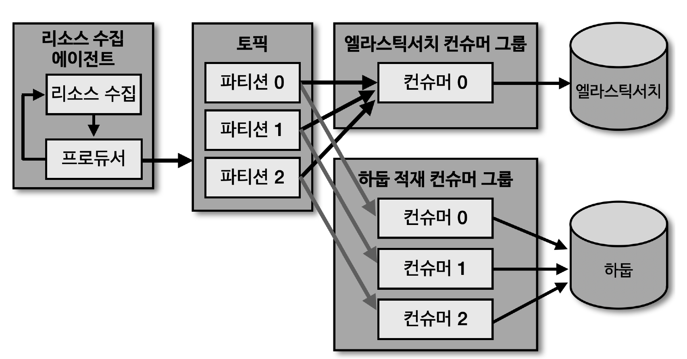

## 컨슈머 그룹

> 컨슈머 그룹으로 운영하는 방법은 컨슈머를 각 컨슈머 그룹으로부터 격리된 환경에서 안전하게 운영할 수 있도록 도와주는 카프카의 독특한 방식

- 컨슈머 그룹으로 묶인 컨슈머들은 토픽의 1개 이상 파티션들에 할당되어 데이터를 가져갈 수 있음
- 1개의 파티션은 최대 1개의 컨슈머에 할당 가능
- 1개의 컨슈머는 여러 개의 파티션에 할당 가능
  - 파티션 (N) : 컨슈머 (1)
    - 파티션 (1) : 컨슈머 (1) 이 가장 효율적
  - 이러한 특징으로 인하여 컨슈머 그룹의 컨슈머 개수는 가져가고자 하는 토픽의 파티션 개수보다 같거나 작아야 함

## 컨슈머 그룹의 컨슈머가 파티션 개수보다 많을 경우

> 4개의 컨슈머로 이루어진 컨슈머 그룹으로 3개의 파티션을 가진 토픽에서 데이터를 가져가기 위해 할당하는 경우, 1개의 컨슈머는 파티션을 할당 받지 못하고, '유휴 상태' 로 남게 됨

- 파티션이 미할당된 컨슈머는 쓰레드만 차지하고, 실질적으로 데이터 처리를 하지 못하므로 어플리케이션 실행에 있어서 '불필요 쓰레드'로 남게 됨

## 컨슈머 그룹을 활용하는 이유

> 운영 서버 주요 리소스 (CPU, 메모리 정보) 수집 데이터 파이프라인 구축 가정

- 위 가정에서 만약 카프카를 활용한 파이프라인이 아닌 경우, 서버에서 실행되는 리소스 및 전송 에이전트는 수집한 리소스를 'ES' 와 '하둡' 에 적재하기 위해 동기적으로 적재 요청 해야 함
  - 동기적으로 실행되는 방식에서는 'ES' 또는 '하둡' 둘 중 하나에 장애 발생 시, 장애가 발생한 어플리케이션에는 추가 적재 불가능

## 어플리케이션 간 결합도를 낮춘 유연한 구조

- 각기 다른 저장소에 저장하는 컨슈머를 각각의 컨슈머 그룹으로 묶어 각 저장소의 장애에 격리되게 운영 가능
- 만약, 'ES' 장애 시, 장애 영향도는 'ES' 에만 적용
  - 'ES' 장애 해소 시, 해당 컨슈머 그룹은 마지막으로 적재 완료한 데이터 이후부터 재적재하여 최종적으로는 정상화 가능
