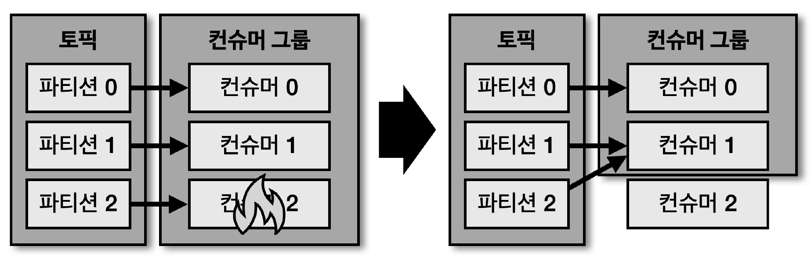

## 리밸런싱

> 컨슈머 그룹으로 이루어진 컨슈머들 중 일부 컨슈머에 장애 발생 시, 장애가 발생한 컨슈머에 할당된 파티션은 장애가 발생하지 않은 컨슈머에게 재할당 됨 (리밸런싱)

- 리밸런싱은 크게 2가지 경우에 발생

  1. 컨슈머 추가 시
  2. 컨슈머 제외 시
- 이슈가 발생한 컨슈머를 컨슈머 그룹에서 제외하여 모든 파티션이 지속적으로 데이터를 처리할 수 있도록 '가용성'을 높여줌

  - 토픽의 개수가 많을수록 리밸런싱 소요 시간이 길어짐
  - 되도록 리밸런싱이 발생할 상황이 생기지 않는 것이 좋음
- \* 리밸런싱은 컨슈머가 데이터를 처리하는 도중에 언제든지 발생 가능하므로 '데이터 처리 중 발생한 리밸런싱에 대응하는 코드 작성 필요'

  - 리밸런싱 수행을 감지하는 리밸런싱 리스너인 'ConsumerRebalanceListener' 인터페이스 구현
    - onPartitionAssigned : 리밸런싱이 끝나고 파티션이 할당될때 호출되는 메서드
    - onPartitionRevoked : 리밸런싱 수행직전 호출되는 메서드 (해당 메서드에서 커밋 필요)
