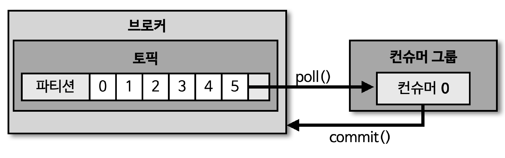

## 커밋

> 컨슈머는 카프카 브로커로부터 데이터를 어디까지 가져갔는지 Commit 을 통해 기록

- 특정 토픽의 파티션을 어떤 컨슈머 그룹이 몇 번째까지 가져갔는지, 카프카 브로커 내부에서 사용되는 내부 토픽 (__consumer_offsets) 에 기록
- \* 컨슈머에서 데이터 처리중 장애 발생 시 특정 토픽의 어느 레코드까지 가져갔는지 '__consumer_offsets' 에 오프셋 커밋이 기록되지 못했다면, 데이터 처리의 중복 발생 가능
  - 중복 데이터가 발생하지 않게 하기 위해서는, 컨슈머 어플리케이션이 '오프셋 커밋' 을 정상적으로 처리했는지 검증 필요
