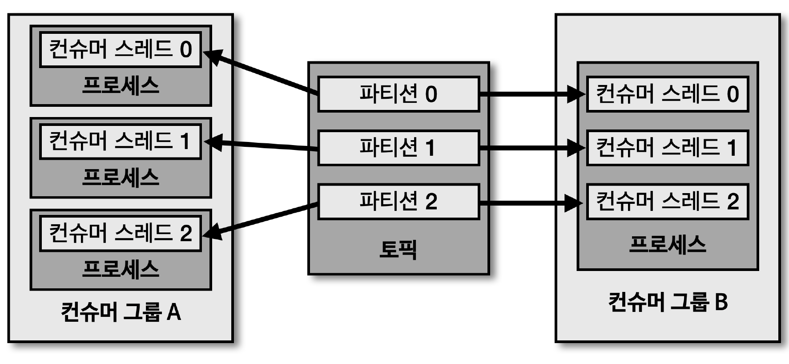

## 멀티쓰레드 컨슈머

> 카프카는 처리량을 늘리기 위해 '파티션'과 '컨슈머' 개수를 늘려서 운영 가능

- 파티션을 여러 개로 운영하는 경우, 데이터를 병렬 처리하기 위해 파티션 개수와 컨슈머 개수를 동일하게 맞추는 것이 가장 좋은 방법
- 토픽의 파티션은 1개 이상으로 이루어져 있으며, 1개의 파티션은 1개의 컨슈머가 할당되어 데이터 처리 가능
- 파티션 개수가 N개인 경우, 동일 컨슈머 그룹으로 묶인 컨슈머 쓰레드를 최대 N개 운영 가능
  - 운영 방법
  - 1. N개의 쓰레드를 가진 1개의 프로세스 운영
  - 2. 1개의 쓰레드를 가진 N개의 프로세스 운영
