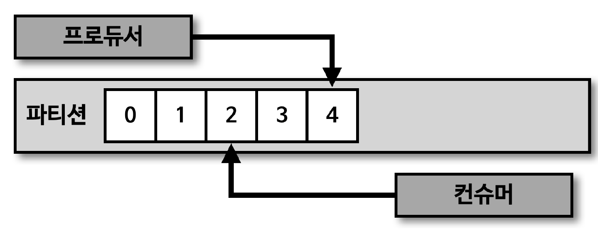
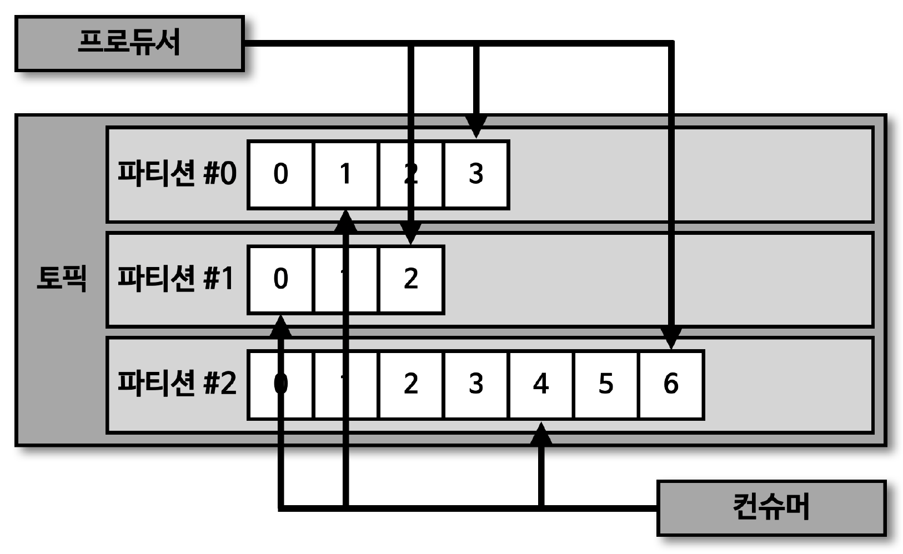
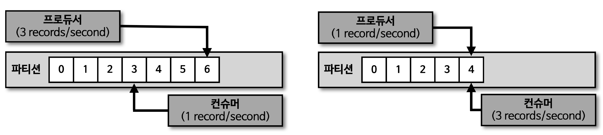
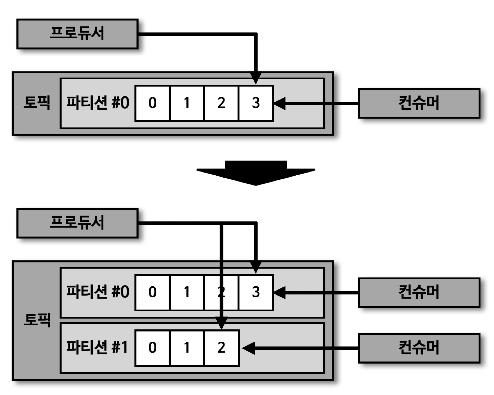
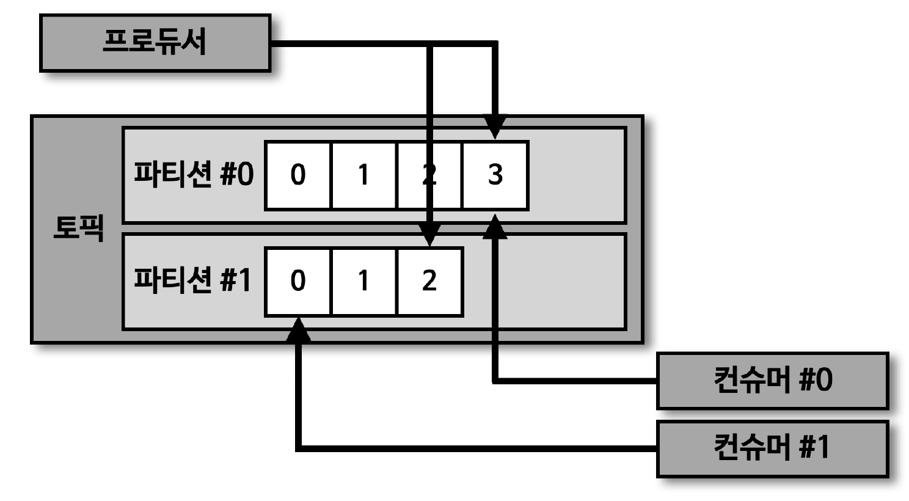

## 컨슈머 랙

> 컨슈머 랙(LAG) 은 파티션의 최신 오프셋 (LOG-END-OFFSET) 과 컨슈머 오프셋 (CURRENT-OFFSET) 간의 차이

- 프로듀서는 계속해서 새로운 데이터를 파티션에 저장하고, 컨슈머는 자신이 처리할 수 있는 만큼 데이터를 가져가서 처리
- \* 컨슈머 랙은 컨슈머가 정상 동작하는지에 대한 여부를 확인할 수 있기 때문에 컨슈머 어플리케이션 운영 시 필수적으로 모니터링해야 하는 지표

> 컨슈머 랙은 컨슈머 그룹, 토픽, 파티션별로 생성

- 1개의 토픽에 3개의 파티션이 있고, 1개의 컨슈머 그룹이 토픽을 구독하여 데이터를 가져가면 컨슈머 랙은 총 3개가 됨
  - 위 상황에서 컨슈머 그룹을 2개 운영중인 경우, 컨슈머 랙의 개수는 6개

## 프로듀서와 컨슈머의 데이터 처리량

> 프로듀서가 보내는 데이터양이 컨슈머의 데이터 처리량보다 크다면, 컨슈머 랙은 늘어남

- 프로듀서가 보내는 데이터양이 컨슈머의 데이터 처리량보다 적으면, 컨슈머 랙은 줄어들고 최솟값은 0으로 지연이 없음을 의미

## 컨슈머 랙 모니터링

> 컨슈머 랙을 모니터링함으로써 컨슈머의 장애 확인 및 파티션 개수를 정하는 데 참고 가능

- 네비게이션 사용자 데이터를 전송하는 프로듀서가 있다고 가정
  - 설, 추석과 같이 네비게이션 사용량이 많을 때, 프로듀서가 카프카 클러스터로 전송하는 데이터양은 급증
  - 반면, 컨슈머는 프로듀서가 전송하는 데이터양이 늘어나더라도 최대 처리량은 한정되어 있기 때문에 컨슈머 랙 발생 가능
  - \* 이러한 경우, 지연을 줄이기 위해 일시적으로 파티션 개수와 컨슈머 개수를 늘려서 병렬처리량을 늘려 해소 가능

## 컨슈머 랙 모니터링 - 처리량 이슈

> 프로듀서의 데이터양이 늘어날 경우, 컨슈머 랙 증가 가능

- 이러한 경우, 파티션 개수와 컨슈머 개수를 늘려 병렬처리량을 늘려서 컨슈머 랙을 줄일 수 있음
  - 컨슈머 개수를 2개로 늘림으로써 컨슈머의 데이터 처리량을 2배로 늘릴 수 있음

## 컨슈머 랙 모니터링 - 파티션 이슈

> 1. 컨슈머 이슈 발생 (프로듀서의 데이터양이 일정함에도 불구하고 컨슈머의 장애로 인해 컨슈머 랙 증가 가능)

- 프로듀서가 보내는 데이터양은 동일한데, 파티션 1번의 컨슈머 랙이 늘어나는 상황 발생 시 1번 파티션에 할당된 컨슈머에 이슈 발생 유추 가능

> 2. 파티션 자체 이슈 발생 (리더 파티션 장애)

- 컨슈머 동작은 정상적이지만, 리더 파티션 동작이 안 되는 경우
  - 오프셋 커밋이 비정상이거나, 새로운 레코드가 쌓이지 않는 경우 리더 파티션 이슈 확인 가능
