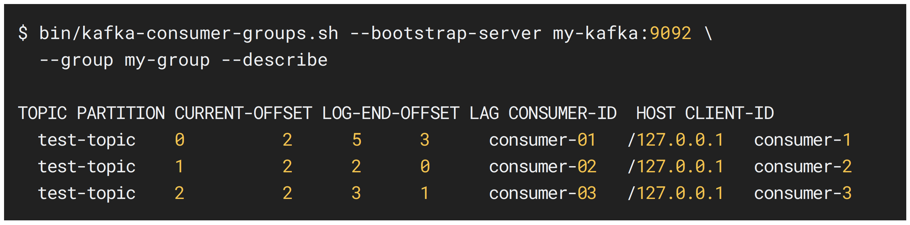
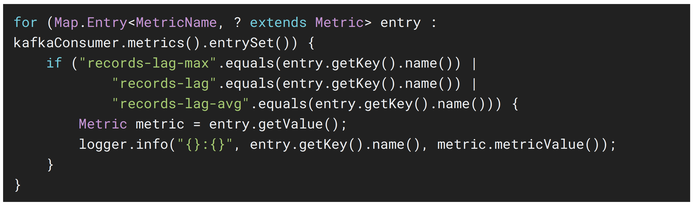

## 컨슈머 랙을 모니터링하는 방법 3가지 - 카프카 명령어 사용

> kafka-consumer-groups.sh 명령어를 사용하여 컨슈머 랙을 포함한 특정 컨슈머 그룹의 상태 확인 가능

- 하지만, 카프카 명령어를 통해 컨슈머 랙을 확인하는 방법은 1회성에 그치기 때문에 지표를 지속적으로 기록하고 모니터링하기는 부족
- 따라서, kafka-consumer-groups.sh 명령어를 통해 컨슈머 랙을 확인하는 것은 테스트용 카프카에서 주로 사용

## 컨슈머 랙을 모니터링하는 방법 3가지 - metrics() 메소드 사용

> 컨슈머 어플리케이션에서 KafkaConsumer 인스턴스의 'metrics()' 메소드를 활용하여 컨슈머 랙 지표 확인 가능

- 컨슈머 인스턴스가 제공하는 컨슈머 랙 관련 모니터링 지표 3가지
  1. records-lag-max
  2. records-lag
  3. records-lag-avg

## 컨슈머 랙을 모니터링하는 방법 3가지 - metrics() 메소드 사용 사용 이슈

> 컨슈머 정상 동작중에만 사용 가능

- metrics() 메소드는 컨슈머가 정상 실행중인 경우에만 호출 가능
  - 컨슈머 어플리케이션 내부에서 metrics() 메소드를 호출하여 사용하기 때문
- 따라서, 컨슈머 어플리케이션 비정상 종료 시 컨슈머 랙 모니터링 불가

> 모든 컨슈머 어플리케이션에서 컨슈머 랙 모니터링 관련 코드를 중복해서 작성

- 각기 다른 컨슈머 어플리케이션에서 metrics() 메소드를 호출하여 컨슈머 랙을 수집하는 로직을 중복해서 작성 필요
  - 특정 컨슈머 그룹에 해당하는 어플리케이션이 수집하는 컨슈머 랙은 자기 자신 컨슈머 그룹에 대한 컨슈머 랙만 한정되기 때문

> 컨슈머 랙을 모니터링하는 코드를 추가할 수 없는 카프커 3th Party 어플리케이션의 컨슈머 랙은 모니터링 불가능
>
> - metrics() 메소드는 공식 라이브러리에서만 지원하기 때문

## 컨슈머 랙을 모니터링하는 방법 3가지 - 외부 모니터링 툴 사용

> Datadog, Confluent Control Center 와 같은 카프카 클러스터 종합 모니터링 툴을 사용하면, 카프카 운영에 필요한 다양한 지표 모니터링 가능

- 모니터링 지표에는 컨슈머 랙도 포함되어 있기 때문에 클러스터 모니터링과 더불어 컨슈머 랙을 함께 모니터링하기에 적합
  - 카프카 클러스터의 모든 컨슈머 그룹, 모든 토픽에 대한 컨슈머 랙 모니터링 가능
- \* 컨슈머 랙 모니터링만을 위한 툴로는 오픈소스인 '버로우 (Burrow)' 가 있음
