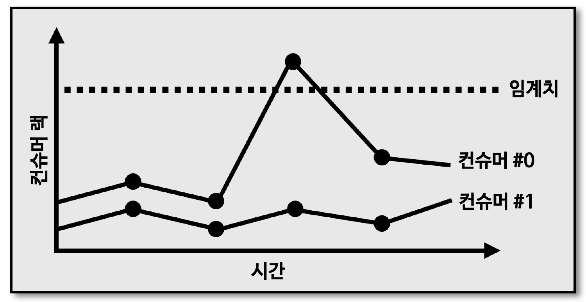

## 카프카 버로우

> 버로우는 링크드인에서 개발하여 오픈소스로 공개한 컨슈머 랙 체크 툴로서 REST API 를 통해 컨슈머 그룹별로 컨슈머 랙 확인 가능

- 외부 모니터링 툴을 사용 시 장점
  1. 카프카 클러스터에 연결된 모든 컨슈머, 토픽들의 랙 정보를 한번에 모니터링 할 수 있다는 장점이 있음
  2. 클러스터와 연동되어 컨슈머의 데이터 처리와는 별개로 지표를 수집하기 때문에 데이터를 활용하는 프로듀서나 컨슈머의 동작에 영향을 미치지 않는 장점이 있음

> 버로우는 다수의 카프카 클러스터를 동시에 연결하여 컨슈머 랙 확인 가능

- 기업 환경에서는 카프카 클러스터를 2개 이상으로 구축하고 운영하는 경우가 많음
  - DEV, QA, STG, PROD 등
  - 따라서, 한 번의 설정으로 다수의 카프카 클러스터 컨슈머 랙 확인 가능

## 카프카 버로우 - REST API

> 버로우를 카프카 클러스터와 연동하면, REST API 를 통해 컨슈머 그룹별 컨슈머 랙 조회 가능

## 카프카 버로우 - 컨슈머 랙 이슈 판별

> 버로우의 가장 큰 특징은 컨슈머와 파티션의 상태를 단순히 컨슈머 랙의 임계치 (threshold) 로 나타내지 않은 점

- 특정 파티션의 컨슈머 랙이 특정 시점에 100만이 넘었다고 해서 컨슈머 또는 파티션에 이슈가 있다고 단정 짓기는 어려움
  - 프로듀서가 데이터를 많이 보내면 일시적으로 임계치가 넘어가는 현상이 발생할 수도 있기 때문
  - \* 따라서, 컨슈머 어플리케이션 운영 시 컨슈머 랙이 임계치에 도달할 때마다 알람을 설정하는 것은 무의미

## 카프카 버로우 - 컨슈머 랙 평가 (Evaluation)

> 버로우에서는 임계치가 아닌 시간의 순서대로 '슬라이딩 윈도우 (Sliding Window)' 계산을 통해 문제가 생긴 파티션과 컨슈머의 상태를 표현

- 위와 같이 버로우에서 컨슈머 랙의 상태를 표현하는 것을 '컨슈머 랙 평가 (Evaluation)' 이라고 부름
  - 컨슈머 랙과 파티션의 오프셋을 슬라이딩 윈도우로 계산 시 상태가 정해짐
- 파티션의 상태를 OK, STALLED, STOPPED 로 표현
- 컨슈머의 상태를 OK, WARNING, ERROR 로 표현

## 카프카 버로우 - 정상적인 경우

> 프로듀서가 지속적으로 데이터를 추가하기 때문에 최신 오프셋은 계속해서 증가

- 컨슈머는 데이터를 처리하며 때때로 컨슈머 랙이 증가하지만, 다시 컨슈머 랙이 0으로 줄어드는 추이 확인 가능
- 이러한 경우, 컨슈머가 정상적으로 동작하고 있다고 볼 수 있음
- 버로우 상태
  - 파티션 : OK
  - 컨슈머 : OK

## 카프카 버로우 - 컨슈머 처리량 이슈

> 프로듀서가 추가하는 최신 오프셋에 비해 컨슈머 오프셋이 따라가지 못하는 추이

- 최신 오프셋과 컨슈머 오프셋의 거리가 계속 벌어지며 컨슈머 랙이 지속적으로 증가
- 이러한 그래프가 나오는 이유는 컨슈머의 데이터 처리량이 프로듀서가 보내는 데이터양에 비해 적기 때문
- 해결 방안
  - 파티션, 컨슈머 개수 추가
- 버로우 상태
  - 파티션 : OK
  - 컨슈머 : WARNING

## 카프카 버로우 - 컨슈머 이슈

> 최신 오프셋이 지속적으로 증가하고 있지만, 컨슈머 오프셋이 멈춘 그래프로 컨슈머 랙 급증

- 컨슈머가 어떠한 이유로 데이터를 처리하지 못하는 현상
- 컨슈머 상태가 ERROR 인 경우, 컨슈머가 확실히 비정상 동작하고 있으므로 이메일, SMS 등의 알람을 통해 즉각 조치 필요
  - 컨슈머 어플리케이션 자체 이슈, 휴먼 에러, 데이터 파이프라인 자체 이슈 등
- 버로우 상태
  - 파티션 : STALLED
  - 컨슈머 : ERROR

## 컨슈머 랙 모니터링 아키텍처

> 버로우를 통한 컨슈머 랙 모니터링 시 과거 컨슈머 랙을 개별적으로 모니터링 하기 위해 별개의 저장소와 대시보드를 사용하는 것이 효과적

- 버로우에서 제공하는 REST API 를 텔레그래프를 통해 호출하여 ES 에 저장
- 그라파나를 통해 대시보드로 시각화
- 버로우 : github.com/linkedin/Burrow
- 텔레그래프 : github.com/influxdata/telegraf
- 엘라스틱서치 : www.elastic.co.kr
- 그라파나 : grafana.com
- 설치방법 : blog.voidmainvoid.net/279
