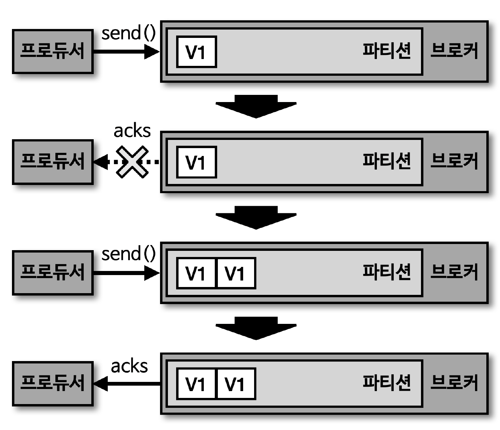
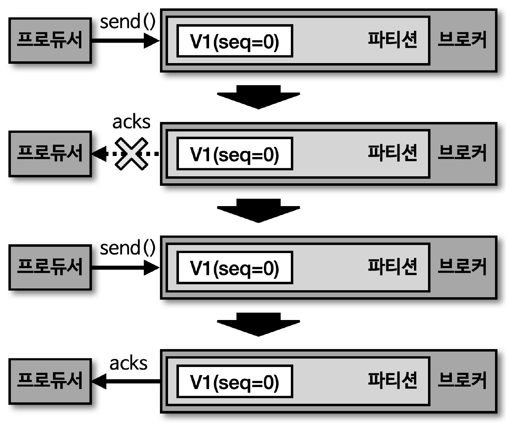
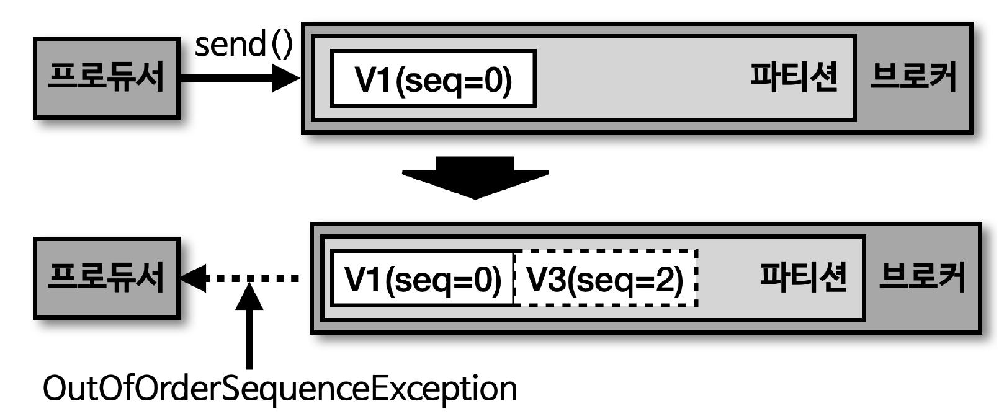

## 전달 신뢰성

> '멱등성'이란, 여러 번 연산을 수행하더라도 동일한 결과를 나타내는 것

- 이러한 의미에서 멱등성 프로듀서는 동일한 데이터를 여러 번 전송하더라도 카프카 클러스터에 단 1번만 저장됨을 의미
- 기본 프로듀서의 동작 방식은 '적어도 한번 (at least once delivery)' 지원
- 적어도 한번 전달 방식은 프로듀서가 클러스터에 데이터를 전송하여 저장할 때, '적어도 한번 이상 데이터 적재 가능'하며, '데이터가 유실되지 않음'을 의미

  - 하지만, 2번 이상 적재될 가능성이 있으므로 '데이터 중복' 발생 가능
- 프로듀서의 동작 방식

  - at least once : 적어도 한번 이상 전달
  - at most once : 최대 한번 전달
  - exactly once : 정확히 한번 전달

## 멱등성 프로듀서

> 프로듀서가 보내는 데이터의 중복 적재를 방지하기 위해 '0.11.0' 버전 이후부터 프로듀서에서 'enable.idempotence' 옵션을 사용하여 '정확히 한번 전달 (exactly once delivery)' 지원

- enable.idempotence 옵션 기본값은 false

  - 정확히 한번 전달 방식을 위해서는 해당 옵션을 true 설정하여 멱등성 프로듀서로 동작하도록 설정 필요
- \* 카프카 3.0.0 버전부터 enable.idempotence 옵션 기본값은 true 이며, acks=all 로 변경됨

  - acks=all 로 설정될 경우, 리더 파티션과 팔로우 파티션에 데이터 적재여부를 모두 파악하므로 응답 속도가 느려짐
  - 신규 버전에서 프로듀서 동작에 유의하여 사용 필요

> 멱등성 프로듀서 설정 방법

````java
Properties configs = new Properties();
configs.put(ProducerConfig.BOOTSTRAP_SERVERS_CONFIG, BOOTSTRAP_SERVERS);
configs.put(ProducerConfig.KEY_SERIALIZER_CLASS_CONFIG, StringSerializer.class.getName());
configs.put(ProducerConfig.VALUE_SERIALIZER_CLASS_CONFIG, StringSerializer.class.getName());
configs.put(ProducerConfig.ENABLE_IDEMPOTENCE_CONFIG, true); // 멱등성 프로듀서 설정

KafkaProducer<String, String> producer = new KafkaProducer<>(configs);
````

## 멱등성 프로듀서의 동작

> 멱등성 프로듀서는 기본 프로듀서와 다르게 데이터를 브로커로 전달할 때, 프로듀서 PID (Producer unique ID) 와 시퀀스 넘버 (sequence number) 를 함께 전달

- 브로커는 프로듀서의 PID 와 시퀀스 넘버를 확인하여 동일한 메시지의 적재 요청이 오더라도 단 1번만 데이터를 적재하므로 프로듀서의 데이터는 정확히 한번만 브로커에 적재되도록 동작
- PID (Producer unique ID) : 프로듀서의 고유한 ID
- SID (Sequence ID) : 레코드의 전달 번호 ID

## 멱등성 프로듀서가 아닌 경우

> 데이터 중복 발생 가능



- 프로듀서가 브로커로부터 acks 를 받지 못한 경우, 해당 데이터를 다시 적재 요청하여 중복 데이터 발생 가능

## 멱등성 프로듀서인 경우

> 데이터 중복 발생 불가



## 멱등성 프로듀서의 한계

> 멱등성 프로듀서는 동일한 세션에서만 정확히 한번 전달 보장

- 여기서 말하는 세션이란, PID 의 생명주기
- 만약 멱등성 프로듀서로 동작하는 프로듀서 어플리케이션에 이슈가 발생하여 종료 후 재시작 시 PID 가 달라짐
  - 동일한 데이터를 보내더라도 PID 가 달라지면, 브로커는 다른 프로듀서 어플리케이션에서 다른 데이터를 보냈다고 판단
  - 따라서, 멱등성 프로듀서는 장애가 발생하지 않을 경우에만 '정확히 한 번 적재' 하는 것을 보장한다는 점 고려

## 멱등성 프로듀서로 설정할 경우 옵션

> 멱등성 프로듀서 사용을 위해 enable.idempotence 옵션을 true 로 설정 시 정확히 한 번 적재하는 로직이 성립되기 때문에 프로듀서의 일부 옵션이 강제 설정됨

- retries

  - 프로듀서의 데이터 재전송 횟수 설정 옵션
  - Integer.MAX_VALUE 로 설정
- acks

  - 브로커의 데이터 수신 여부 확인
  - all 로 설정 (리더, 팔로워 파티션 적재 유무 모두 확인)
- 멱등성 프로듀서는 정확히 한번 브로커에 데이터를 적재하기 위해 한번만 전송하는 것이 아님

  - 상황에 따라 프로듀서가 여러 번 전송하되, 브로커가 여러 번 전송된 데이터를 확인하고 중복된 데이터는 적재하지 않는 것

## 멱등성 프로듀서 사용 시 오류 확인



> OutOfOrderSequenceException

- 멱등성 프로듀서의 시퀀스 넘버는 0부터 시작하여 숫자를 1씩 더한 값이 브로커로 전달
- 브로커에서 멱등성 프로듀서가 전송한 데이터의 PID 와 시퀀스 넘버를 확인하는 과정에서 시퀀스 넘버가 일정하지 않은 경우, 'OutOfOrderSequenceException' 발생

  - 브로커가 예상한 시퀀스 넘버와 다른 번호의 데이터 적재 요청이 온 경우 발생
- OutOfOrderSequenceException 이 발생한 경우, '시퀀스 넘버의 역전 현상'이 발생 가능

  - 순서가 중요한 데이터를 전송하는 프로듀서는 해당 예외가 발생한 경우, 대응 방안 고려 필요
- 운영 환경 실적용 시 OutOfOrderSequenceException 에러 발생은 극히 드뭄
- 또한, 멱등성 프로듀서 사용 대신 컨슈머 어플리케이션에서 멱등성을 보장하도록 구현한다면, 멱등성 프로듀서를 굳이 사용하지 않아도 됨
