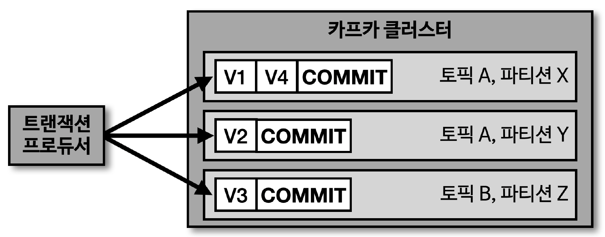
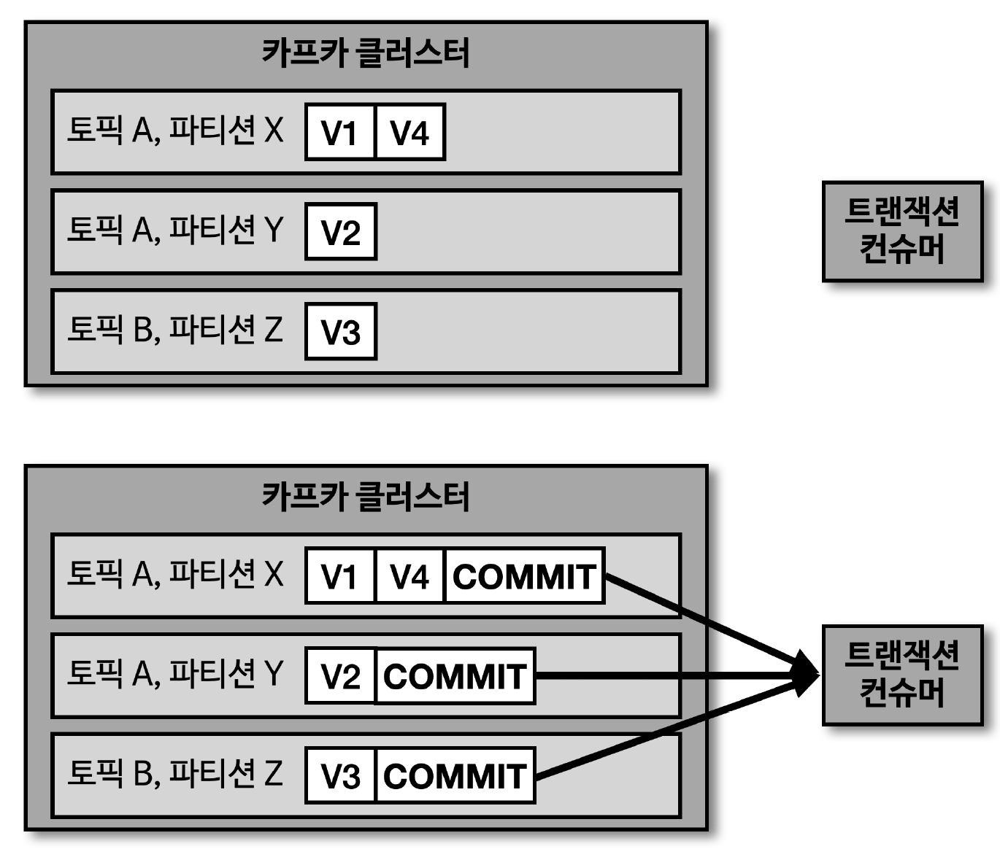

## 트랜잭션 프로듀서의 동작



> 카프카에서 트랜잭션은 다수의 파티션에 데이터를 저장할 경우, 모든 데이터에 대해 동일한 원자성 (Atomic) 을 만족시키기 위해 사용

- 원자성을 만족시키는 의미는 다수의 데이터를 동일 트랜잭션으로 묶음으로써 전체 데이터를 처리하거나 처리하지 않도록 하는 것을 의미
- 트랜잭션 프로듀서는 사용자가 보낸 데이터를 레코드로 파티션에 저장할 뿐만 아니라 트랜잭션의 시작과 끝을 표현하기 위해 '트랜잭션 레코드'를 1개 더 보낸다

## 트랜잭션 컨슈머의 동작



> 트랜잭션 컨슈머는 파티션에 저장된 트랜잭션 레코드를 보고 트랜잭션이 '완료 (commit)' 되었음을 확인 후 데이터를 가져감

- 트랜잭션 레코드는 실직적인 데이터는 가지고 있지 않으며, 트랜잭션이 끝난 상태를 표시하는 정보만 가지고 있음

## 트랜잭션 프로듀서 설정

> 트랜잭션 프로듀서로 동작하려면, 'transactional.id' 설정 필요

- 프로듀서별로 고유한 ID 값을 사용해야 함
- init, begin, commit 순서대로 수행 필요

---


````java
configs.put(ProducerConfig.TRANSACTIONAL_ID_CONFIG, UUID.randomUUID());

Producer<String, String> producer = new KafkaProducer<>(configs);

producer.initTransactions();

producer.beginTransaction();
// 복수의 레코드 전송 시 원자성으로 묶임
producer.send(new ProducerRecord<>(TOPIC, "전달하는 메시지 값"));
producer.commitTransaction();

producer.close();
````

## 트랜잭션 컨슈머 설정

> 트랜잭션 컨슈머는 커밋이 완료된 레코드들만 읽기 위해 'isolation.level' 옵션을 'read_committed' 로 설정 필요

- 기본값은 'read_uncommitted' 로서 트랜잭션 프로듀서가 레코드를 보낸 후 커밋 여부와 상관 없이 모두 읽음
- 'read_committed' 로 설정된 컨슈머는 커밋이 완료된 레코드들만 읽어서 처리

````java
configs.put(ConsumerConfig.ISOLATION_LEVEL_CONFIG, "read_committed");

KafkaConsumer<String, String> consumer = new KafkaConsumer<>(configs);
````
