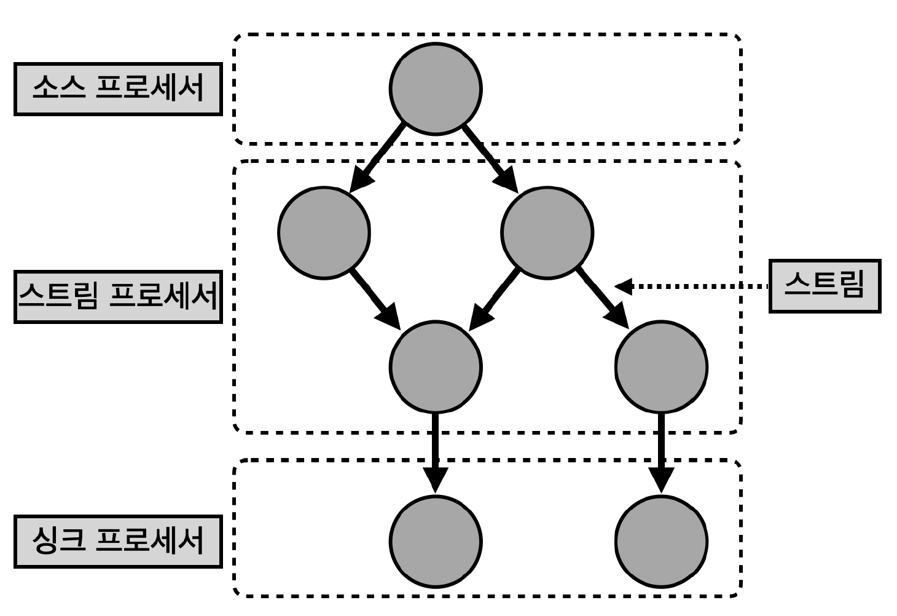

## 카프카 스트림즈

> 카프카 스트림즈는 토픽에 적재된 데이터를 실시간으로 변환하여 다른 토픽에 적재하는 라이브러리로 '카프카에서 공식 지원하는 라이브러리'

- 매번 새로운 카프카 버전이 출시될 때마다 스트림즈 자바 라이브러리도 같이 릴리즈
    - 따라서, 자바 기반 스트림즈 어플리케이션은 카프카 클러스터와 완벽 호환되며 스트림 처리에 필요한 편리한 기능 제공

- 스트림즈 어플리케이션은 카프카 브로커의 장애가 발생하더라도 '정확히 한번 (exactly once)' 할 수 있도록 장애 허용 시스템 (fault tolerant system) 을 가지고 있어서 데이터 처리 안정성이 뛰어남
- 카프카 클러스터를 운영하며 실시간 스트림 처리 필요성이 있다면, 카프카 스트림즈 어플리케이션 개발을 1순위로 고려하는 것이 좋음

## 프로듀서와 컨슈머를 조합하지 않고, 스트림즈를 사용해야 하는 이유

> 스트림 데이터 처리에 있어 필요한 다양한 기능을 '스트림즈DSL' 로 제공하며, 필요 시 '프로세서 API' 를 사용하여 기능 확장이 가능하기 때문

- 컨슈머와 프로듀서를 조합하여 스트림즈가 제공하는 기능과 유사하게 만들 수 있음
    - '하지만, 스트림즈 라이브러리를 통해 제공하는 단 한 번의 데이터 처리, 장애 허용 시스템 등의 특징들은 컨슈머와 프로듀서의 조합만으로는 완벽히 구현하기 어려움'

- 다만, 스트림즈가 제공하지 못하는 기능을 구현할 때는 컨슈머와 프로듀서를 조합하여 구현하는 것이 좋음
    - 예를 들어 소스 토픽 (사용하는 토픽)과 싱크 토픽 (저장하는 토픽)의 카프카 클러스터가 서로 다른 경우는 스트림즈가 지원하지 않음
    - 따라서 컨슈머와 프로듀서 조합으로 직접 클러스터를 지정하는 방식으로 개발 가능

## 스트림즈 내부 구조

> 스트림즈 어플리케이션은 내부적으로 쓰레드를 1개 이상 생성 가능하며, 쓰레드는 1개 이상의 Task 를 가짐

- 스트림즈의 'Task' 는 스트림즈 어플리케이션을 실행하면 생기는 데이터 처리 최소 단위
    - 만약, 3개의 파티션으로 이루어진 토픽을 처리하는 스트림즈 어플리케이션을 실행하면, 내부에 3개의 Task 가 생김
    - 컨슈머의 병렬 처리를 위해 컨슈머 그룹으로 이루어진 컨슈머 쓰레드를 여러 개 실행하는 것과 비슷

- 카프카 스트림즈는 컨슈머 쓰레드를 늘리는 방법과 동일하게 병렬 처리를 위해 파티션과 스트림즈 쓰레드 (또는 프로세스) 개수를 늘림으로써 처리량을 늘릴 수 있음

## 스트림즈 어플리케이션 스케일 아웃

> 실제 운영 환경에서는 장애가 발생하더라도 안정적으로 운영할 수 있도록 2개 이상의 서버로 구성하여 스트림즈 어플리케이션 운영

- 컨슈머의 group.id 와 비슷하게 'application.id' 를 통해 동일한 스트림즈 어플리케이션을 묶는 것이 가능

## 토폴로지

> 카프카 스트림즈의 구조와 사용 방법을 알기 위해서는 '토폴로지 (topology)' 관련 개념을 익히는 것이 필수

- 토폴로지란 2개 이상의 노드들과 선으로 이러어진 집합
- 카프카 스트림즈에서 사용하는 토폴로지는 '트리형' 토폴로지와 유사

## 프로세서와 스트림

> 카프카 스트림즈에서는 토폴로지를 이루는 노드를 하나의 '프로세서 (processor)' 라고 하며, 노드와 노드를 이은 선을 '스트림 (stream)' 이라고 함

- 스트림은 토픽의 데이터를 뜻하는데, 프로듀서와 컨슈머에서 활용했던 레코드와 동일

## 소스 프로세서, 스트림 프로세서, 싱크 프로세서

> 소스 프로세서

- 데이터를 처리하기 위해 최초로 선언해야 하는 노드
- 하나 이상의 토픽에서 데이터를 가져오는 역할

> 스트림 프로세서

- 다른 프로세서가 반환한 데이터를 처리하는 역할
- 변환, 분기 처리와 같은 로직이 데이터 처리의 일종이라고 볼 수 있음

> 싱크 프로세서

- 데이터를 특정 카프카 토픽으로 저장하는 역할
- 스트림즈로 처리된 데이터의 최종 종착지

## 스트림즈DSL 과 프로세서 API

> 스트림즈DSL (Domain Specific Language) 과 프로세서 API 2가지 방법으로 개발 가능

- 스트림즈DSL은 스트림 프로세싱에 쓰일 만한 다양한 기능들을 자체 API 로 만들어 놓았기 때문에 대부분의 변환 로직을 어렵지 않게 개발 가능
- 만약 스트림즈DSL 에서 제공하지 않는 일부 기능들의 경우, 프로세서 API 를 사용하여 구현 가능

> 스트림즈DSL로 구현하는 데이터 처리 예시

- 메시지 값을 기반으로 토픽 분기 처리
- 지난 10분간 들어온 데이터의 개수 집계

> 프로세서 API 로 구현하는 데이터 처리 예시

- 메시지 값의 종류에 따라 토픽을 가변적으로 전송
- 일정한 시간 간격으로 데이터 처리
