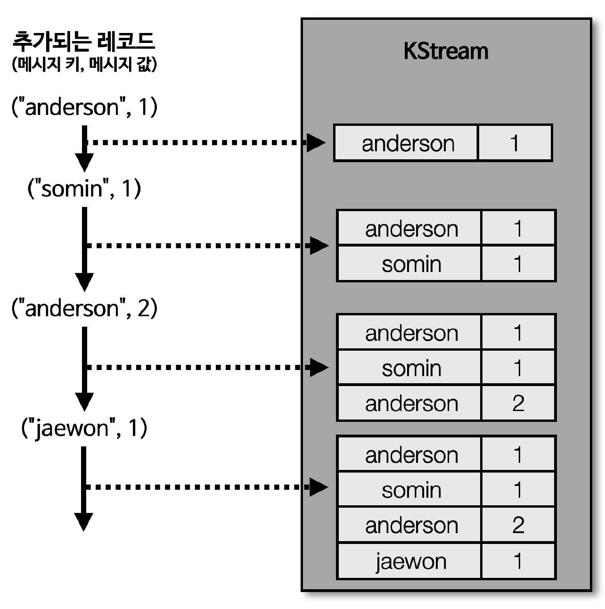
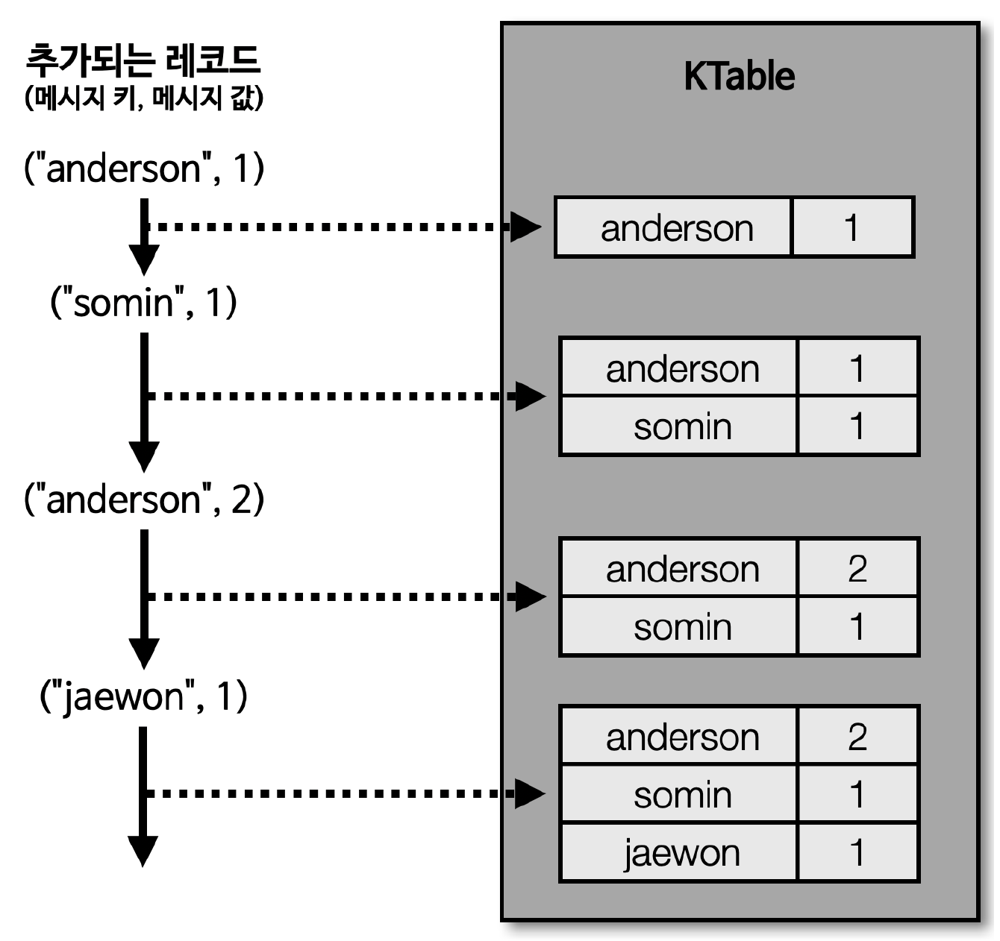
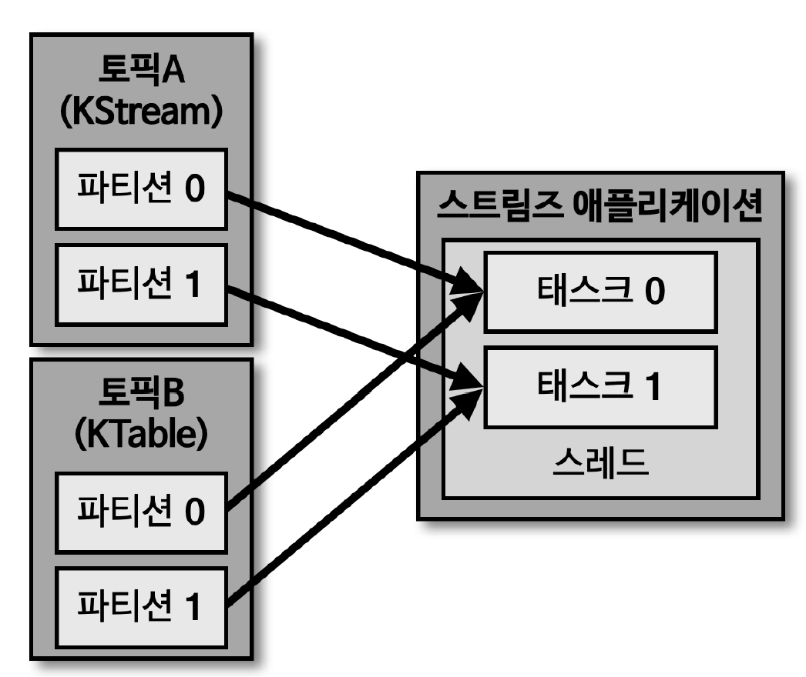
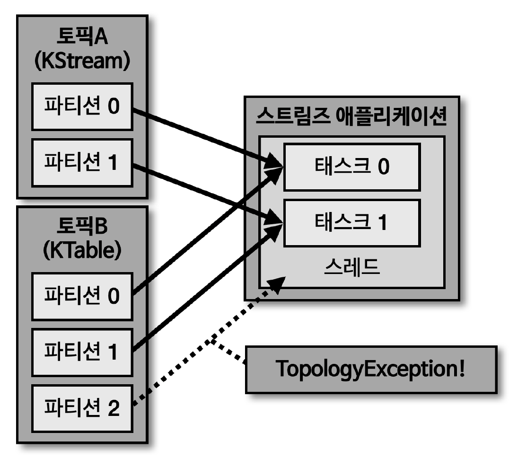
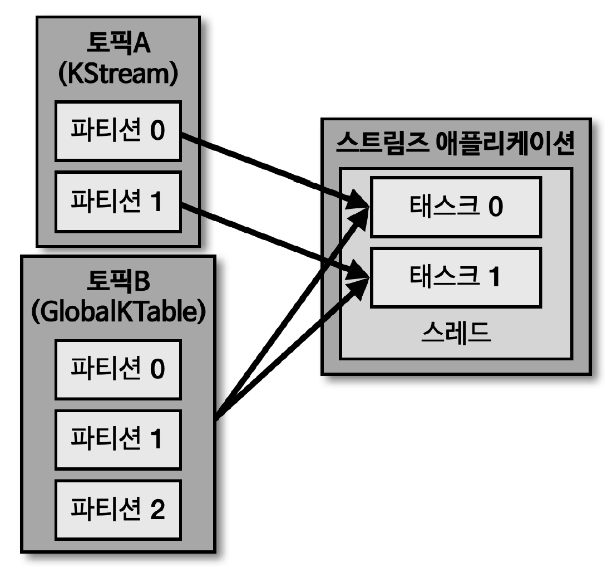

## KStream

> KStream 은 레코드의 흐름을 표현한 것으로 메시지 키와 메시지 값으로 구성

- KStream 으로 데이터를 조회하면, '토픽에 존재하는 (또는 KStream 에 존재하는) 모든 레코드가 출력됨'
- KStream 은 컨슈머로 토픽을 구독하는 것과 동일한 선상에서 사용하는 것으로 볼 수 있음

## KTable

> KTable 은 KStream 과 다르게 메시지 키를 기준으로 묶어서 사용

- KStream 은 토픽의 모든 레코드를 조회할 수 있지만, KTable 은 '유니크한 메시지 키를 기준으로 가장 최신 레코드를 사용'
- 따라서, KTable 로 데이터를 조회하면, 메시지 키를 기준으로 가장 최신에 추가된 레코드의 데이터가 출력됨
    - 새로 데이터를 적재할 때, 동일한 메시지 키가 존재하는 경우, 데이터가 업데이트 되었다고 볼 수 있음
    - 메시지 키의 가장 최신 레코드가 추가되었기 때문

## 코파티셔닝 (co-partitioning)

> KStream 과 KTable 데이터를 조인해야하는 상황 가정 시, KStream 과 KTable 을 조인하려면 반드시 '코파티셔닝' 되어 있어야 함

- '코파티셔닝이란 조인을 하는 2개 데이터의 '파티션 개수가 동일'하고, '파티셔닝 전략을 동일'하게 맞추는 작업'
    - \* 파티션 개수가 동일하고, 파티셔닝 전략이 같은 경우에는 동일한 메시지 키를 가진 데이터가 동일한 Task 에 들어가는 것을 보장
    - 이를 통하여 각 태스크는 KStream 의 레코드와 KTable 의 메시지 키가 동일할 경우 조인 수행 가능

## 코파티셔닝되지 않은 2개 토픽의 이슈

> KStream 과 KTable 로 사용하는 2개의 토픽이 파티션 개수가 다를 수도 있고, 파티션 전략이 다를 수도 있음

- \* 조인을 수행하려는 토픽들이 코파티셔닝되어 있음을 보장할 수 없음
    - 이러한 경우, 조인 수행 불가
- \* 코파티셔닝 되지 않은 2개의 토픽을 조인하는 로직이 담긴 스트림즈 어플리케이션 실행 시 'TopologyException' 발생

## GlobalKTable

> 코파티셔닝되지 않은 KStream 과 KTable 을 조인해서 사용하고 싶은 경우, KTable 을 GlobalKTable 로 선언하여 사용하면 됨

- GlobalKTable 은 KTable 과 다르게 스트림즈 어플리케이션의 모든 Task 에 동일하게 공유되어 사용되기 때문
    - GlobalKTable 파티션의 모든 데이터를 스트림즈 어플리케이션이 각 Task 마다 사용
        - 따라서, GlobalKTable 만 사용할 경우 GlobalKTable 의 사이즈가 클 경우 속도 저하 이슈 발생 가능
