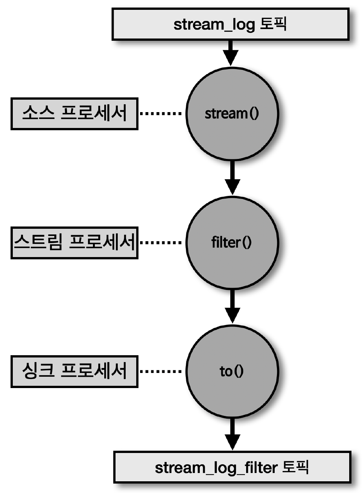
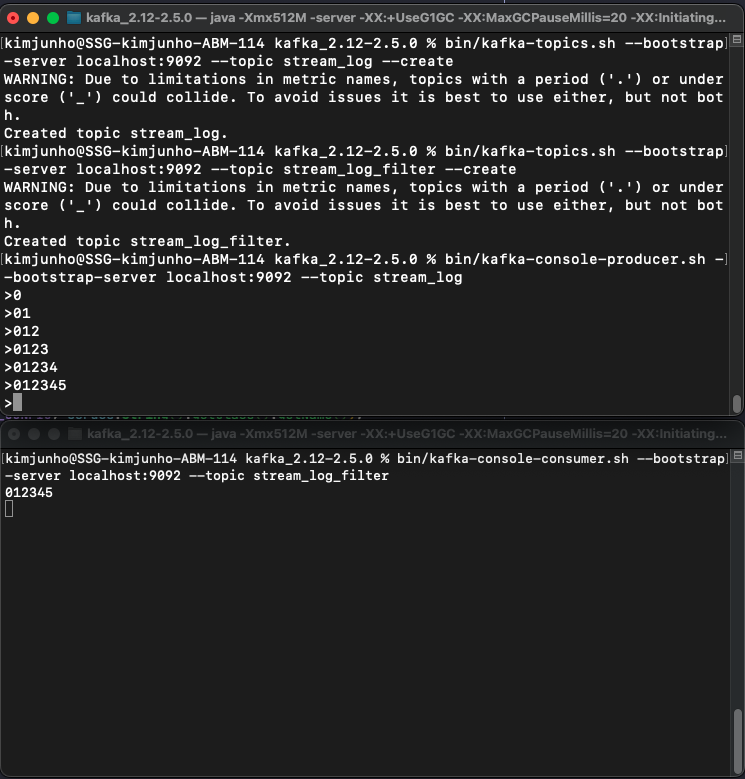

## 스트림즈DSL 라이브러리 추가

````yml
dependencies {
    implements 'org.apache.kafka:kafka-streams:2.5.0'
    implements 'org.slf4j:slf4j-simple:1.7.30'
}
````

## 필터링 스트림즈 어플리케이션



> 토픽으로 들어온 문자열 데이터 중 문자열의 길이가 5보다 큰 경우만 필터링하는 스트림즈 어플리케이션을 스트림 프로세서를 사용하여 구현 가능

- 메시지 키 또는 메시지 값을 필터링하여 특정 조건에 맞는 데이터를 골라낼 때는 'filter()' 메소드 사용

````java
public class StreamsFilter {
    ...
    public static void main(String[] args) {
        ...
        StreamsBuilder builder = new StreamsBuilder();
        KStream<String, String> streamLog = builder.stream(STREAM_LOG); // 소스 프로세서 - 특정 토픽에서 데이터 추출
        KStream<String, String> filteredStream = streamLog // 스트림 프로세서 - 필터링
            .filter((key, value) -> value.length() > 5);
        filteredStream.to(STREAM_LOG_FILTER); // 싱크 프로세서 - 특정 토픽에 스트림 처리한 데이터 저장

        // 아래와 같이 한줄로도 간소화 가능
        // streamLog.filter((key, value) -> value.length() > 5).to(STREAM_LOG_FILTER);

        KafkaStreams streams;
        streams = new KafkaStreams(builder.build(), props);
        streams.start();
    }
}
````

````shell
# stream_log 토픽 생성

$bin/kafka-topics.sh --bootstrap-server localhost:9092 --topic stream_log --create


# stream_log_filter 토픽 생성

$bin/kafka-topics.sh --bootstrap-server localhost:9092 --topic stream_log_filter --create
````

````shell
# stream_log 토픽으로 레코드 생성

$bin/kafka-console-producer.sh --bootstrap-server localhost:9092 --topic stream_log
>0
>01
>012
>0123
>01234
>012345
````

````shell
# StreamsFilter 스트림즈 어플리케이션에 의해 5자리가 넘는 값에 대해 필터링한 데이터를 stream_log_filter 토픽으로 전달

$bin/kafka-console-consumer.sh --bootstrap-server localhost:9092 --topic stream_log_filter
012345
````


