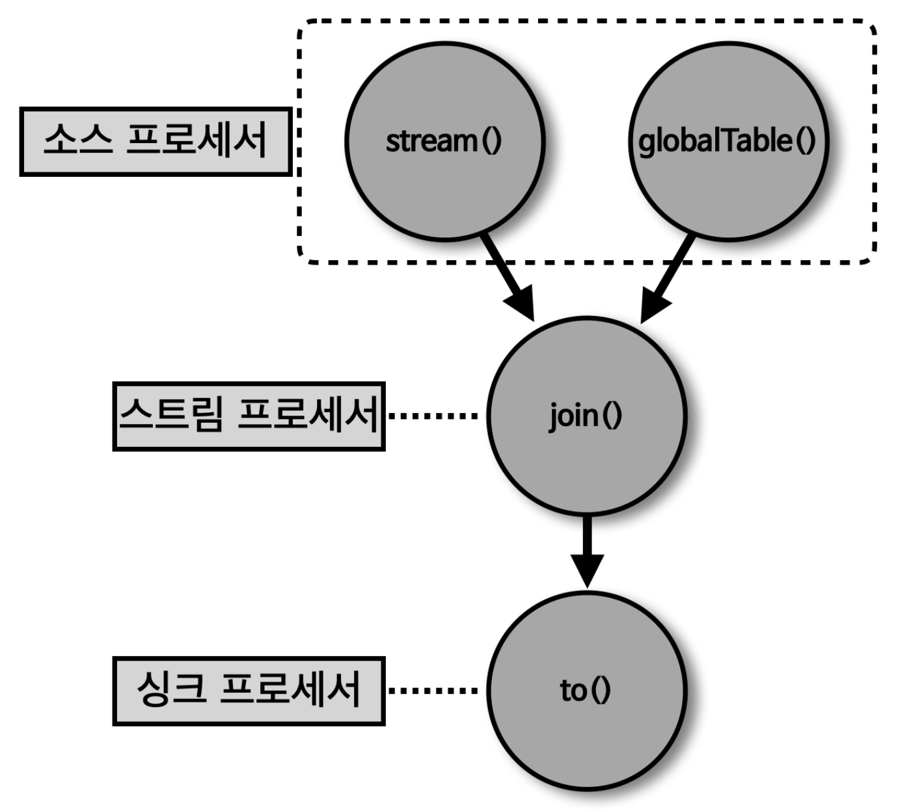

## 스트림즈DSL - GlobalKTable 과 KStream 을 join()



> 코파티셔닝이 되지 않은 토픽을 조인해야 하는 경우 조인하는 방법 2가지

1. '리파티셔닝' 수행 후 코파티셔닝 된 상태로 KStream 과 KTable 을 사용하여 조인 수행
   - 파티션 개수를 맞추는 작업
2. KTable 로 사용하는 토픽을 GlobalKTable 로 선언하여 조인 수행

> 파티션 개수가 다른 2개의 토픽을 조인하는 예제를 GlobalKTable 을 사용하여 조인 수행 예제

- 파티션 개수 2개의 'address_v2' 토픽과 파티션 개수 3개의 'order' 토픽 - 코파티셔닝 미충족

````shell
## 파티션 개수가 2개인 'address_v2' 토픽 생성
$bin/kafka-topics.sh --create --bootstrap-server localhost:9092 --partitions 2 --topic address_v2

Created topic address_v2
````

````java
public class KStreamJoinGlobalKTable {
    ...
    public static void main(String[] args) {
        ...
        StreamsBuilder builder = new StreamsBuilder();
        GlobalKTable<String, String> addressGlobalTable = builder.globalTable(ADDRESS_GLOBAL_TABLE);
        KStream<String, String> orderStream = builder.stream(ORDER_STREAM);

        orderStream.join(addressGlobalTable, (orderKey, orderValue) -> orderKey, (order, address) -> order + " send to " + address).to(ORDER_JOIN_STREAM);

        KafkaStreams streams;
        streams = new KafkaStreams(builder.build(), props);
        stream.start();
    }
}
````
