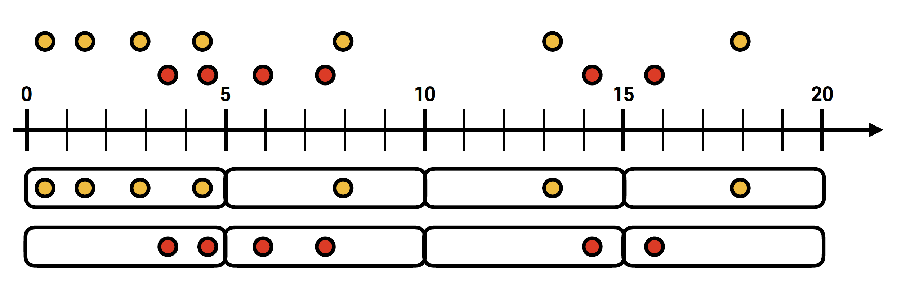
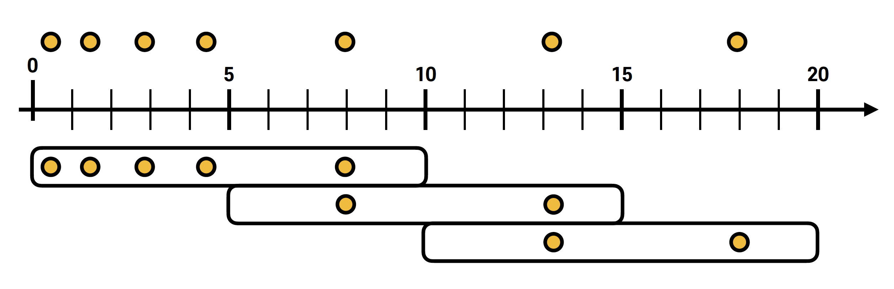
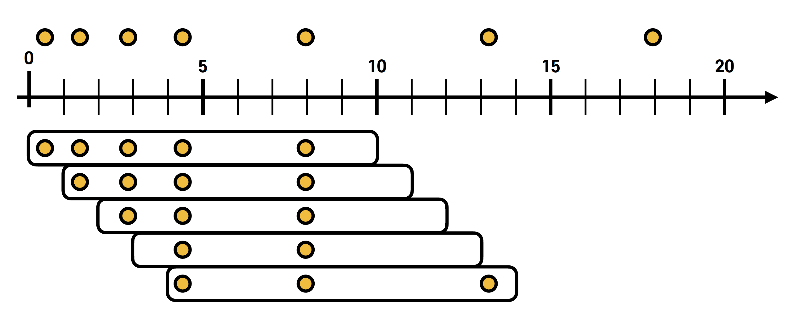
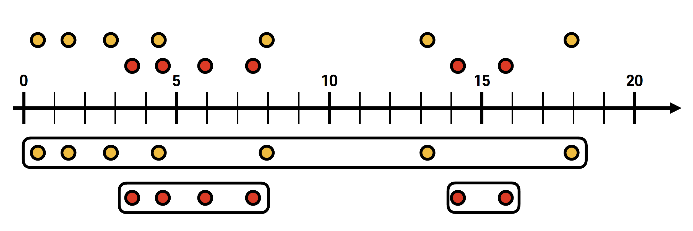
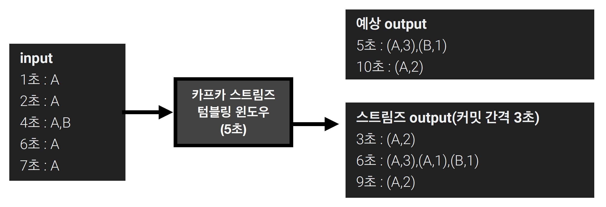
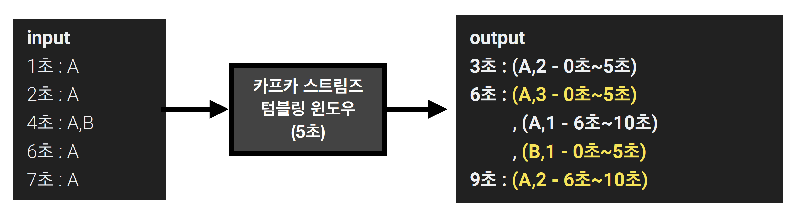

## 스트림즈DSL - window processing

> 스트림 데이터를 분석할 때 가장 많이 활용하는 프로세싱 중 하나는 '윈도우 연산'

- 윈도우 연산은 특정 시간에 대응하여 취합 연산을 처리할 때 활용
- 카프카 스트림즈에서는 4가지 윈도우 프로세싱 지원
  - 텀블링 윈도우
  - 호핑 윈도우
  - 슬라이딩 윈도우
  - 세션 윈도우
- 모든 프로세싱은 '메시지 키를 기준으로 취합'
  - 따라서, 해당 토픽에 동일한 파티션에는 동일한 메시지 키가 있는 레코드가 존재해야만 정확한 취합 가능
  - 만약, 커스텀 파티셔너를 사용하여 동일 메시지 키가 동일한 파티션에 저장되는 것을 보장하지 못하거나 메시지 키를 넣지 않으면, 관련 연산 불가

## 텀블링 윈도우



> 텀블링 윈도우는 서로 겹치지 않은 윈도우를 특정 간격으로 지속적으로 처리할 때 사용

- 윈도우 최대 사이즈에 도달하면, 해당 시점에 데이터를 취합하여 결과 도출
- 텀블링 윈도우는 단위 시간당 데이터가 필요할 경우 사용
  - 예 : 매 5분간 접속한 고객의 수를 측정하여 방문자 추이를 실시간으로 취합하는 경우 사용 가능

## 호핑 윈도우



> 호핑 윈도우는 일정 시간 간격으로 겹치는 윈도우가 존재하는 윈도우 연산을 처리할 경우 사용

- 호핑 윈도우는 '윈도우 사이즈'와 '윈도우 간격' 2가지 변수를 가짐
- 윈도우 사이즈
  - 연산을 수행할 최대 윈도우 사이즈
- 윈도우 간격
  - 서로 다른 윈도우 간 간격
- \* 텀블링 윈도우와 다르게 동일한 키의 데이터는 서로 다른 윈도우에서 여러 번 연산될 수 있음

## 슬라이딩 윈도우



> 슬라이딩 윈도우는 호핑 윈도우와 유사하지만, 데이터의 정확한 시간을 바탕으로 윈도우 사이즈에 포함되는 데이터를 모두 연산에 포함시키는 특징을 가짐

- 시간
  1. System 시간
  2. Record 시간

## 세션 윈도우



> 세션 윈도우는 동일 메시지 키의 데이터를 한 세션에 묶어 연산할 때 사용

- 세션의 최대 만료 시간에 따라 윈도우 사이즈가 달라짐
- 세션 만료 시간이 지나게 되면, 세션 윈도우가 종료되고 해당 윈도우의 모든 데이터를 취합하여 연산

## 텀블링 윈도우 예제 코드

> 카프카 스트림즈에서 텀블링 윈도우 사용을 위해 'groupByKey()' 와 'windowedBy()' 메소드 사용

- windowedBy() 메소드의 파라미터는 텀블링 윈도우의 '사이즈' 를 의미
- 이후 텀블링 연산으로 출력된 데이터는 KTable 로 커밋 interval 마다 출력

````java
StreamsBuilder builder = new StreamsBuilder();
KStream<String, String> stream = builder.stream(TEST_LOG); // KStream 으로 특정 토픽 지정

KTable<Windowed<String>, Long> countTable = stream.groupByKey() // 메시지 키를 기준으로 그룹핑
    .windowedBy(TimeWindows.of(Duration.ofSeconds(5))) // 5초 마다
    .count(); // 메시지 개수 카운팅

countTable.toStream().foreach(((key, value) -> {
    log.info(key.key() + " is [" + key.window().startTime() + "~" + key.window().endTime() + "] count : " + value);
}));
````

## 윈도우 연산 시 주의 사항



> 카프카 스트림즈는 커밋 (기본값 : 30초) 을 수행할 때, 윈도우 사이즈가 종료되지 않아도 중간 정산 데이터를 출력

- 커밋 시점마다 윈도우의 연산 데이터를 출력하기 때문에 동일 윈도우 사이즈 (시간) 의 데이터는 2개 이상 출력 가능



> 최종적으로 각 윈도우에 맞는 데이터를 출력하고자 한다면, 'Windowed' 를 기준으로 동일 윈도우 시간 데이터는 겹쳐쓰기 (upsert) 하는 방식으로 처리하는 것이 좋음

- 예를 들어, 0~5초의 A 데이터가 포함된 윈도우 취합 데이터가 들어오면, 해당 데이터를 '유니크 키' 로 설정하고 새로 들어온 데이터를 겹쳐쓰는 것
  - 위 예시의 경우, 최초 0~5초에 A가 2개 취합된 데이터 최초 저장
  - 추후 6초에 출력된 3개의 취합된 데이터가 최종 저장
  - 결과적으로 A가 0~5초에 3개 count
