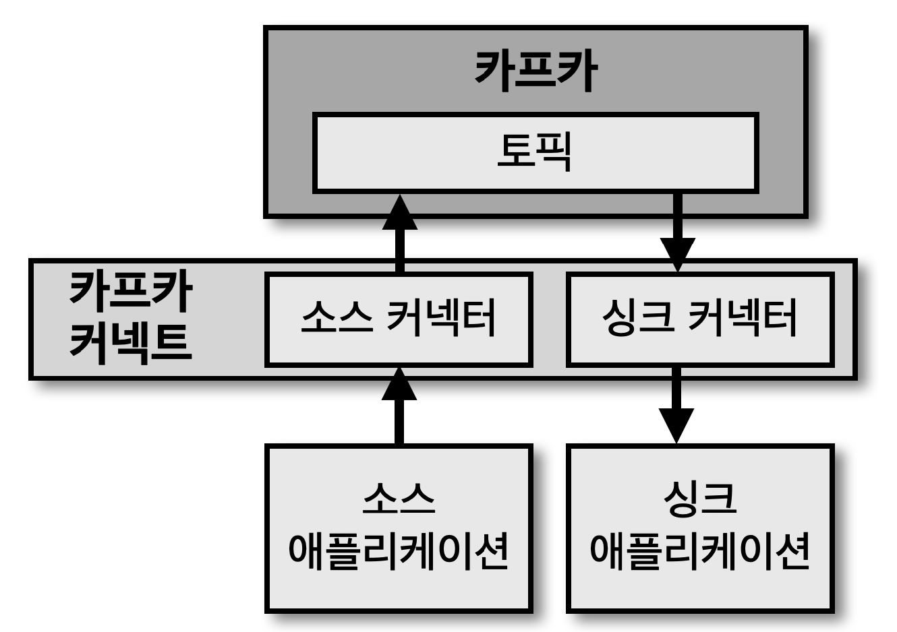
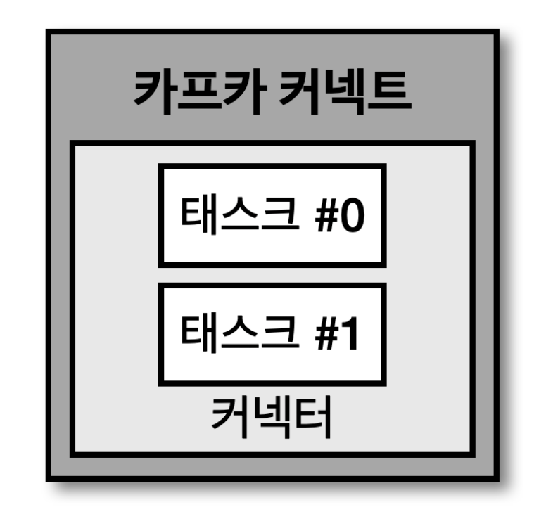

## 카프카 커넥트

> 카프카 커넥트는 카프카 오픈소스에 포함된 툴 중 하나로 데이터 파이프라인 생성 시 반복 작업을 줄이고, 효율적인 전송을 위한 어플리케이션

- 커넥트는 특정한 작업 형태를 '템플릿' 으로 만들어놓은 '커넥터' 를 실행함으로써 반복 작업을 줄일 수 있음
  - JMX (Java Management Extensions) 제공
- 소스 커넥터 : 프로듀서 역할
- 싱크 커넥터 : 컨슈머 역할

## 커넥트 내부 구조

> 사용자가 커넥트에 커넥터 생성 명령 실행 시 커넥트는 내부에 '커넥터' 와 '태스크' 생성 (커넥트는 태스크들을 관리)

- 태스크는 커넥터에 종속되는 개념으로 실질적인 데이터 처리를 함
- 따라서, 데이터 처리를 정상적으로 하는지 확인하기 위해서는 각 태스크의 상태 확인 필요
