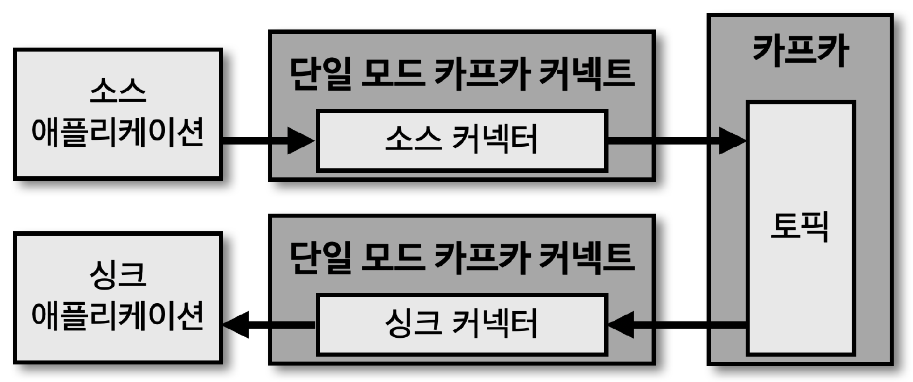

## 커넥트 실행 방법

> 커넥트 실행 방법 2가지 - 단일 모드 커넥트 (standalone mode kafka connect), 분산 모드 커넥트 (distributed mode kafka connect)

- 단일 모드 커넥트
    - 단일 어플리케이션으로 실행
    - 커넥터를 정의하는 파일을 작성하고, 해당 파일을 참조하는 단일 모드 커넥트를 실행함으로써 파이프라인 생성

## 단일 모드 커넥트

- 단일 모드 커넥트는 1개의 프로세스만 실행되는 점이 특징
- 단일 프로세스로 실행되기 때문에 고가용성 구성이 되지 않아 '단일 장애점 (SPOF : Single Point Of Failure)' 이 될 수 있음
- 그렇기 때문에 주로 '개발 환경' 이나 '중요도 낮은 파이프라인 운영' 시 사용

## 분산 모드 커넥트

- 분산 모드 커넥트는 2대 이상의 서버에서 클러스터 형태로 운영함으로써 단일 모드 커넥트 대비 안전하게 운영 가능한 장점
    - 고가용성 확보
    - 데이터 처리량 변화에 유연하게 대응 가능 (커넥트 실행 서버를 스케일 아웃하여 처리량 증가)
- 그렇기 때문에 운영 환경에서 사용 시 분산 모드 커넥트르 2대 이상으로 구성 및 설정하여 운영하는 것이 좋음

## 커넥트 REST API 인터페이스

> REST API 사용 시 현재 실행 중인 커넥트의 '커넥터 플러그인 종류', '태스크 상태', '커넥터 상태' 등 조회 가능

- 커넥트는 '8083' 포트로 호출 가능

