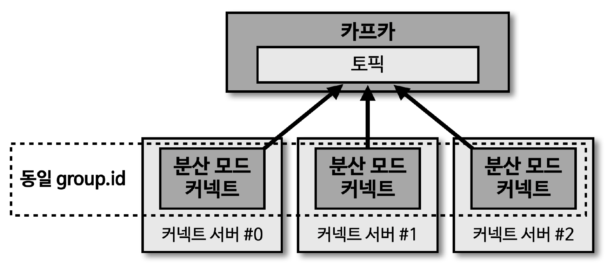

## 분산 모드 커넥트



> 분산 모드 커넥트는 단일 모드 커넥트와 다르게 2개 이상의 프로세스가 1개의 그룹으로 묶여 운영 (동일 group.id 로 설정)

- 1개의 커넥트 프로세스에 이슈 발생으로 인한 종료 시 '나머지 1개의 커넥트 프로세스가 커넥터를 이어받아서 파이프라인을 지속적으로 실행 가능'
- 경로 : /config/connect-distributed.properties

````shell
## connect-distributed.properties

# 브로커 설정
bootstrap.servers=localhost:9092
# group.id (cluster)
group.id=connect-cluster
# converter
key.converter=org.apache.kafka.connect.json.JsonConverter
value.converter=org.apache.kafka.connect.json.JsonConverter
key.converter.schemas.enable=false
value.converter.schemas.enable=false
# offset
offset.storage.topic=connect-offsets
offset.storage.replication.factor=1
# config
config.storage.topic=connect-configs
config.storage.replication.factor=1
# status
status.storage.topic=connect-status
status.storage.replication.factor=1

offset.flush.interval.ms=10000
# 플러그인 경로
plugin.path=/usr/local/share/java,/usr/local/share/kafka/plugins
````
