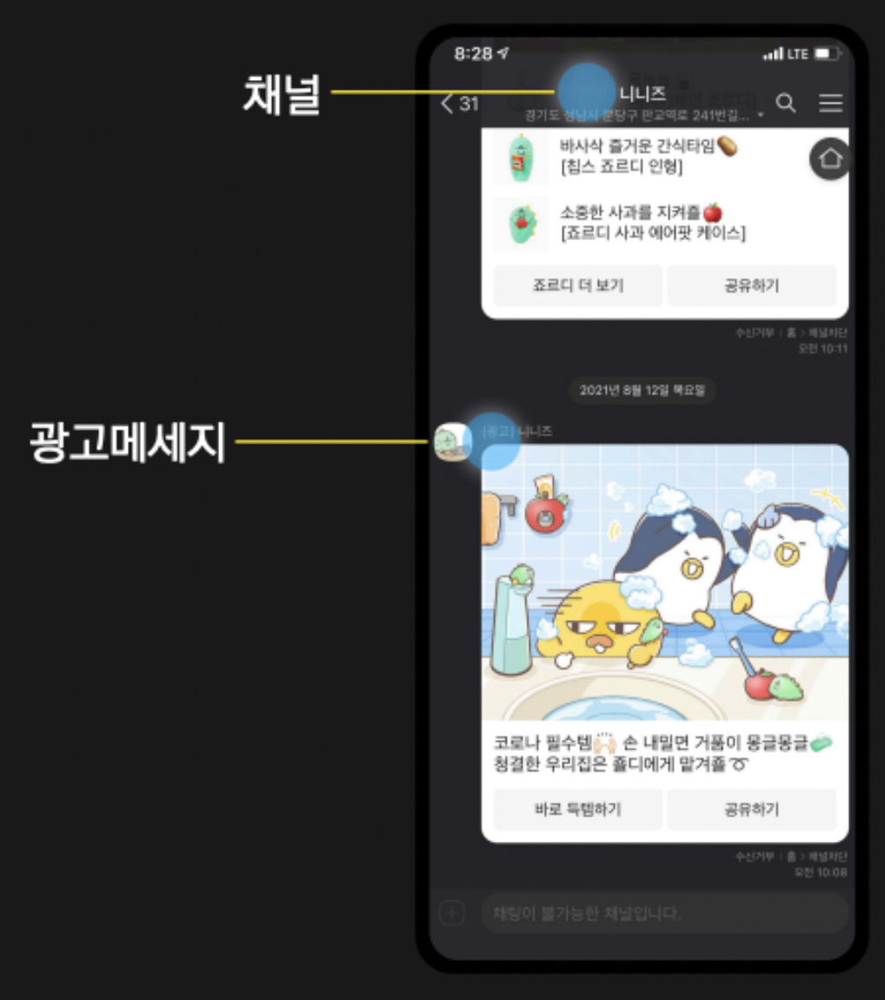
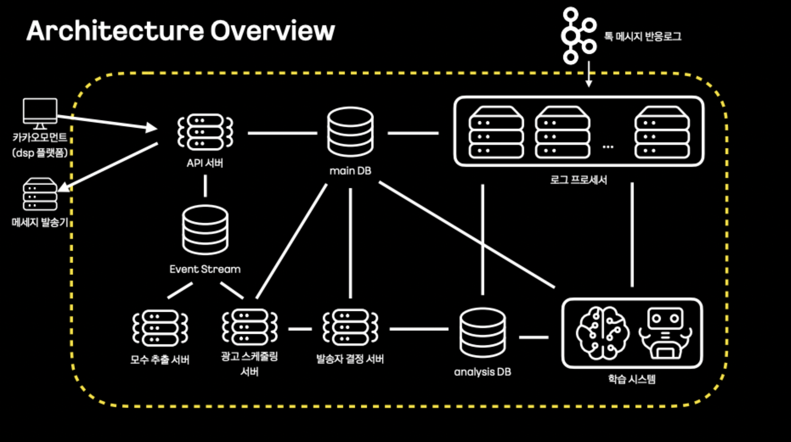
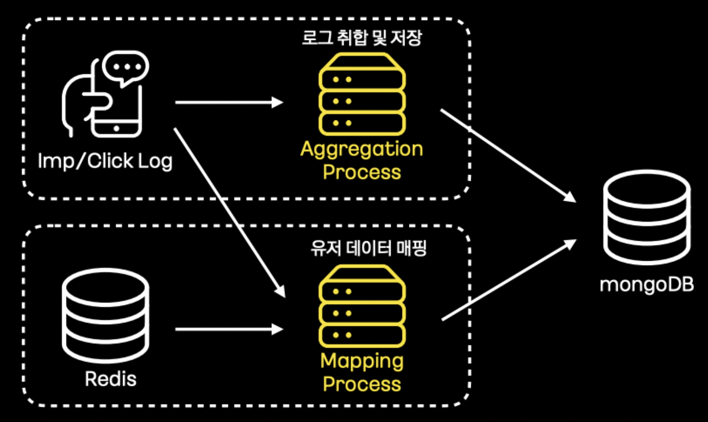
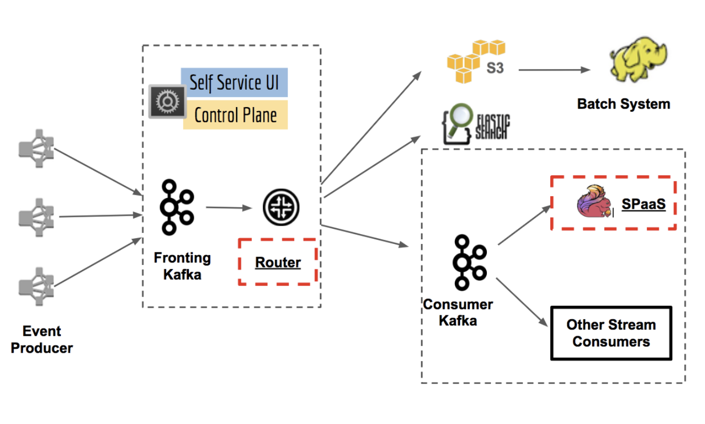
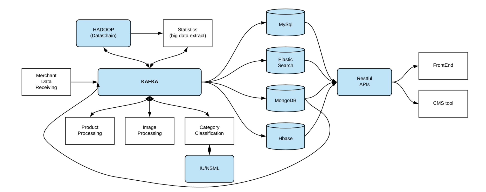
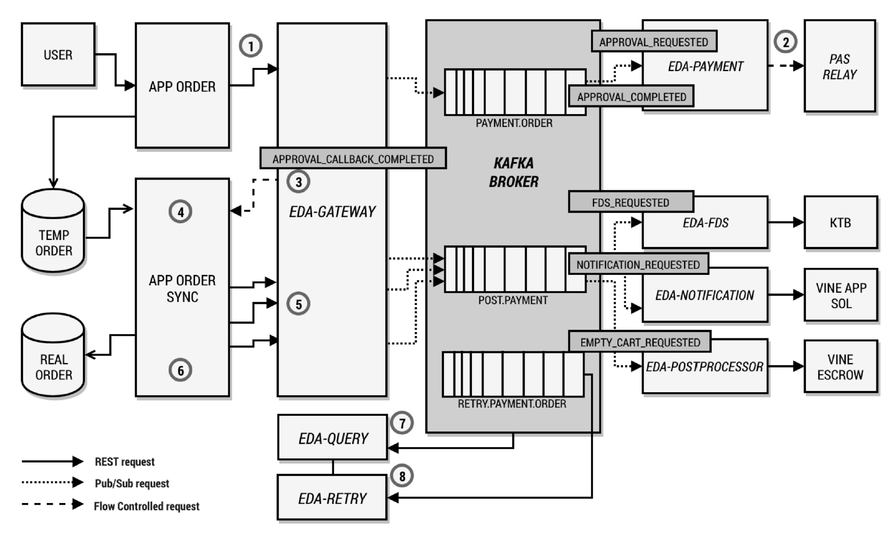
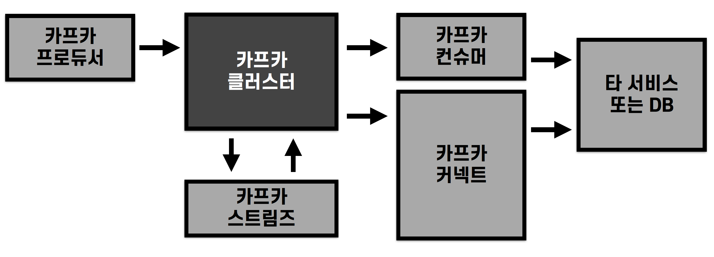

## 카카오 - 스마트 메시지 서비스

- 스마트 메시지 서비스는 소재최적화와 유저타겟팅을 통해 적합한 유저에게 광고 메시지를 개인화 전송하는 서비스
- 사용자에게 흥미가 있는 소재를 최적화하고, 적합한 유저에게 타겟팅하여 광고를 선별 전송

- 톡 메시지 반응 로그를 로그 프로세서를 통해 'Main DB' 와 'Analysis DB' 에 적재

## 스마트 메시지의 카프카 스트림즈 활용

- 사용자의 반응 로그 (imp, click) 를 취합하여 저장하고, 유저 데이터를 매핑하여 처리하는 용도로 카프카 스트림즈 활용
- 1. 카프카 스트림즈의 groupByKey, windowedBy, aggregate 구문을 통해 1분 로그를 window 취합하여 적재
- 2. map 구문을 통해 'Redis'의 유저데이터와 결합 처리하는 로직 수행

## 넷플릭스 - 키스톤 프로젝트

- https://netflixtechblog.com/keystone-real-time-stream-processing-platform-a3ee651812a
- 1. 첫번째 단계의 카프카 (Fronting Kafka) 는 라우팅 용도로 모든 데이터 수집
- 2. Router (자체 스트림 프로세싱, 라우팅 어플리케이션) 를 사용하여 두번째 카프카 (Consumer Kafka) 또는 하둡, 엘라스틱서치와 같은 DB 로 전달

## 라인 - 쇼핑 플랫폼

- https://engineering.linecorp.com/ko/blog/line-shopping-platform-kafka-mongodb-kubernetes
- 시스템 유연성을 개선하고, 처리량의 한계를 극복하기 위해 카프카를 중앙에 둔 아키텍처 적용
- 카프카 커넥트 도입
    - MongoDB CDC 커넥터 활용
- 이벤트 기반 데이터 처리로 상품 처리가 상당 속도 빨라짐

## 11번가 - 주문/결제 시스템

- 데이터베이스 병목 현상을 해소하기 위해 도입
- 카프카를 '단일 진실 공급원 (Source of Truth)' 으로 정의
    - 모든 비즈니스 데이터를 하나의 공간에 저장하는 것
- 메시지를 Materialized View 로 구축하여 배치 데이터처럼 활용

## 카프카 기술별 아키텍처 적용 방법 정리

> 카프카 커넥트

- 반복적 파이프라인을 만들어야 할 경우, 분산 모드 커넥트를 설치하고 운영
- 가급적 오픈소스 커넥트를 사용하되, 필요 시 커스텀 커넥터를 개발하여 운영
- REST API 와 통신하여 동작할 수 있는 웹 화면을 개발하거나 오픈소스를 활용하여 개발하는 것을 추천

> 카프카 스트림즈

- 강력한 stateful, stateless 프로세싱 기능을 지원하기 때문에 카프카 토픽의 데이터 처리 시 선택

> 카프카 컨슈머, 프로듀서

- 커넥트와 스트림즈로 구현할 수 없거나 '단일성 파이프라인' 개발일 경우 컨슈머 또는 프로듀서로 개발

- 프로듀서를 통해 데이터 최초 유입
- 토픽 기반 데이터 프로세싱은 카프카 스트림즈로 처리
- 반복적 파이프라인은 카프카 커넥트에서 운영 (단발성 처리는 컨슈머로 개발)
