## 1. 엘라스틱서치의 탄생

- 엘라스틱이 등장했을 무렵, 사용자들의 요구사항은 명확
  - 사이트 내에서 `전문 검색 (full text search)`` 기능을 제공하는 강력한 소프트웨어의 필요성
- `Doug Cutting` 이 `Excite` 에서 검색 엔진을 만들던 역량을 통해 자신의 5번째 검색 엔진 라이브러리를 만듬
  - `Doug Cutting` 부인의 중간 이름을 따서 `루씬(Lucene)` 으로 명명
- `Shay Bannon` 은 요리 학교를 다니던 자신의 부인이 손쉽게 레시피를 검색할 수 있도록 `루씬(Lucene)`을 기반으로 `컴파스` 프로젝트 진행
  - 분산 환경을 위한 솔루션, HTTP 상에서 JSON 으로 인터페이스르르 지원하는 솔루션, 자바 외에도 다양한 프로그래밍 언어를 지원하는 솔루션을 표방하고 작업을 진행했으며, 2010년 2월에 `엘라스틱 서치` 공개

## 2. 엘라스틱 스택으로 발전

- 데이터가 점점 늘어나는 상황에서 전문 검색은 대량의 데이터를 저장해서 처리하는 1가지 방법에 불과
  - 다양한 사용 사례를 유연하게 지원하기 위해서는 검색 엔진을 뛰어넘는 플랫폼 필요성 인지
  - 유연성을 확보하기 위해서는 데이터 수집, 가공, 저장, 분석, 시각화하는 일련의 파이프라인을 구성하기 위한 다양한 오픈소스 소프트웨어를 조합해야 하는 불편함
- 엘라스틱서치 개발 무렵, 아래와 같은 프로젝트 진행
  - `Jordan Sissel` 은 사용자가 선택한 보관함(stash)으로 Log 를 보내는 오픈소스 데이터 수집 도구인 `로그스태시(Logstash)` 개발
  - `Rashid Khan` 은 오픈소스 시각화 UI 인 `키바나(Kibana)` 개발
  - `Packetbeat` 라는 회사에서 네트워크 데이터를 엘라스틱서치로 보내는 방법을 연구해서 제품 개발을 하고 있다는 사실을 엘라스틱 개발팀이 알게 됨
    - 로그스태시와 엘라스틱서치로 네트워크 데이터, 로그, 메트릭, 성능 진단 데이터를 보내는 경량 데이터 수집기의 가능성을 고려
    - Packetbeat 와 연합하여 `Beat(비츠)` 탄생

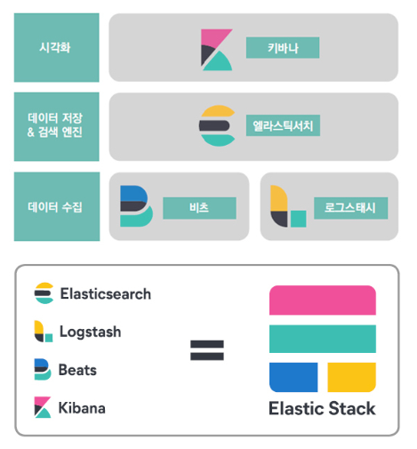

## 3. 엘라스틱 스택의 구성요소

> 엘라스틱 스택은 일반적인 빅데이터 파이프라인을 구성하기 위한 데이터 수집, 가공, 저장, 분석, 시각화에 필요한 모든 소프트웨어를 갖춤

- 필요에 따라 `Kibana` 를 제외한 엘라스틱 스택의 나머지 구성요소만으로도 개별적인 빅데이터 파이프라인의 일부로 사용

> 데이터 수집

- Beat

> 데이터 가공

- Logstash

> 데이터 저장 및 분석

- Elastic Search

> 데이터 시각화 및 모니터링

- Kibana

### 3-1. 엘라스틱서치 : 분산 검색 엔진

> 검색 엔진은 내부적으로 각 Document 를 Indexing 하고 빠르게 검색하는 데 사용하는 기술로 엘라스틱서치는 검색 엔진이면서 동시에 데이터베이스 (`엘라스틱서치가 빠른 검색과 집계 성능을 실현하는 이유`)

- 엘라스틱서치는 `모든 레코드를 JSON 도큐먼트 형태로 입력 및 관리`
  - 일반적인 DB 와 마찬가지로 쿼리한 결과에 대해 일치하는 원본 도큐먼트 반환

> 엘라스틱서치 장점

- 다양한 데이터 타입 지원
  - 텍스트, 숫자, 날짜, IP 주소, 지리 정보 등
- Scoring (연관도) 에 따른 정렬 제공
  - 검색어에 대한 유사도 스코어를 기반으로 한 정렬 기능 제공
- 분산 처리 가능
  - 복수의 루씬 인스턴스를 병렬로 배치하고 분산 처리하여 검색 속도 확장 가능
- 고가용성 확보
  - 노드 간 복제 기능을 통해 일부 노드가 down 되더라도 정상적으로 서비스 지속 가능
- REST API 제공
  - 프로그래밍 언어와 무관하게 사용자가 쉽게 접근 가능

> 엘라스틱서치 단점

- 저장 공간이 크게 압축되지 않음
- 많은 시스템 리소스 사용
- DSL 쿼리 사용에 의한 JOIN 쿼리 어려움 (`반정규화를 기본으로 모델링 필요`)
- 인덱스가 불변의 자료구조이다
  - 도큐먼트를 수정하거나 삭제할 경우 비용이 저렴하지 않음

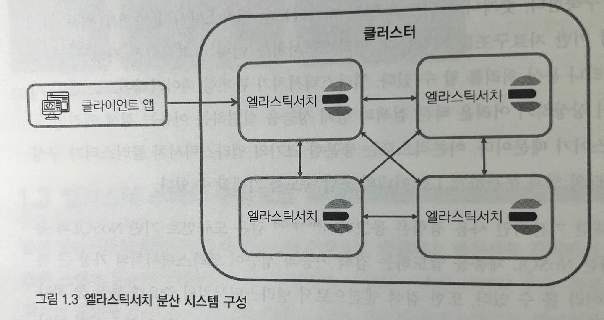

### 3-2. 키바나 : 시각화와 엘라스틱서치 관리 도구

> 엘라스틱 스택의 UI 담당

- 키바나의 가장 중요한 기능 : 시각화, 대시보드
- 엘라스틱서치에 대한 대부분의 관리 기능, API를 실행할 수 있는 콘솔, 솔루션 페이지, 스택의 각 구성요소들을 위한 모니터링 페이지 등 포함

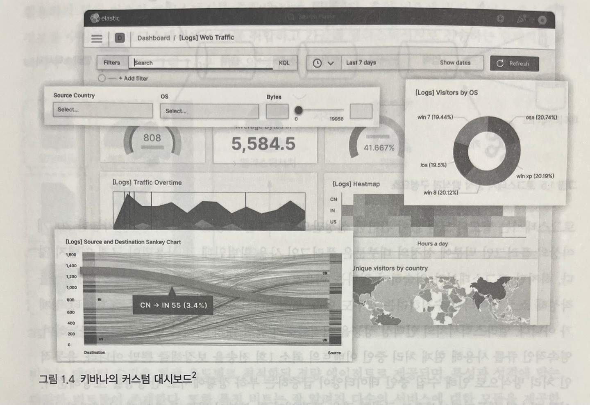

### 3-3. 로그스태시 : 이벤트 수집과 정제를 위한 도구

> 로그스태시는 형식에 무관하게 데이터를 동적으로 수집, 변환, 전송하는 구조

- 대량의 데이터를 검색하기 위해서는 데이터 적재 작업 선행 필요

  - 로그, 메트릭, 웹 어플리케이션 등 다양한 소스로부터 로그 수집 가능
  - 필터 기능을 통해 비정형이나 반정형 데이터를 분석하기 쉬운 형태로 정제 가능
  - 비구조적 데이터에서 구조 도출 및 IP 주소에서 위치 정보 좌표 해독, 민감 필드 익명화 등의 전반적인 작업을 쉽게 처리
- 로그스태시는 별도의 코딩 없이 간단한 설정만으로 로그 데이터 가공 가능

  - 확장 가능한 200개 이상의 플러그인을 통해 설정의 대부분은 플러그인 사용법

> 특징

- 배치 처리 및 병렬 처리 가능
- 영속적인 큐를 통해 현재 처리 중인 이벤트에 대한 최소 1회 전송 보장
- 유동적인 처리 방식으로 인한 데이터 급증 상황에서 안정성 확보

### 3-4. 비츠 : 엣지단에서 동작하는 경량 수집 도구

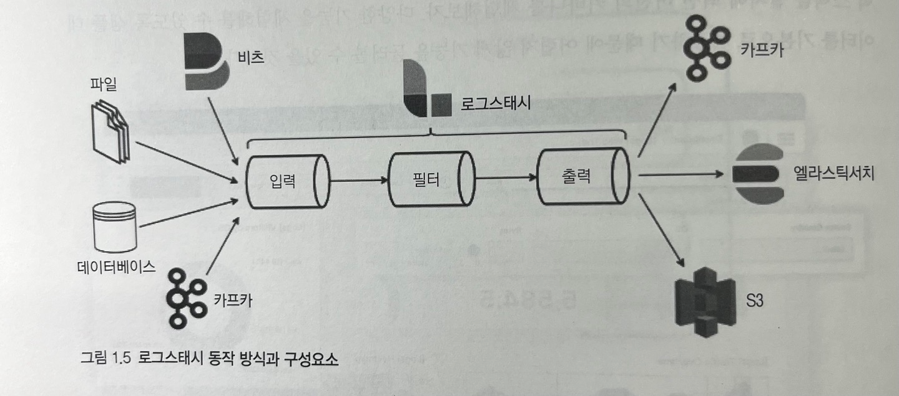

> 비트는 로그 수집, 시스템 지표 수집 등 특정 목적에 최적화된 에이전트 (Golang)

- 이벤트 정보를 수집하기 위해 실제 서비스가 동작하는 호스트에 수집기를 설치해야 하는 경우, 사용
- 로그스태시는 다양한 필터와 설정을 지원하는 만큼 무거움
  - 로그스태시 수준의 복잡한 이벤트 가공은 지원하지 않으므로 가볍기 때문에, 각 서비스 호스트에 부담 없이 설치 가능
- 비츠는 데이터 수집을 위해 용도별로 최적화된 경량 에이전트로 제공
  - 특성과 성격에 맞는 다양한 비트들 존재
- 흔히 비츠를 통해 각 서비스 호스트의 정보를 수집하고, 로그스태시에서 이를 취합하고 가공하여 엘라스틱서치로 전송하는 형태의 아키텍처를 많이 사용

> 비츠의 종류와 구조

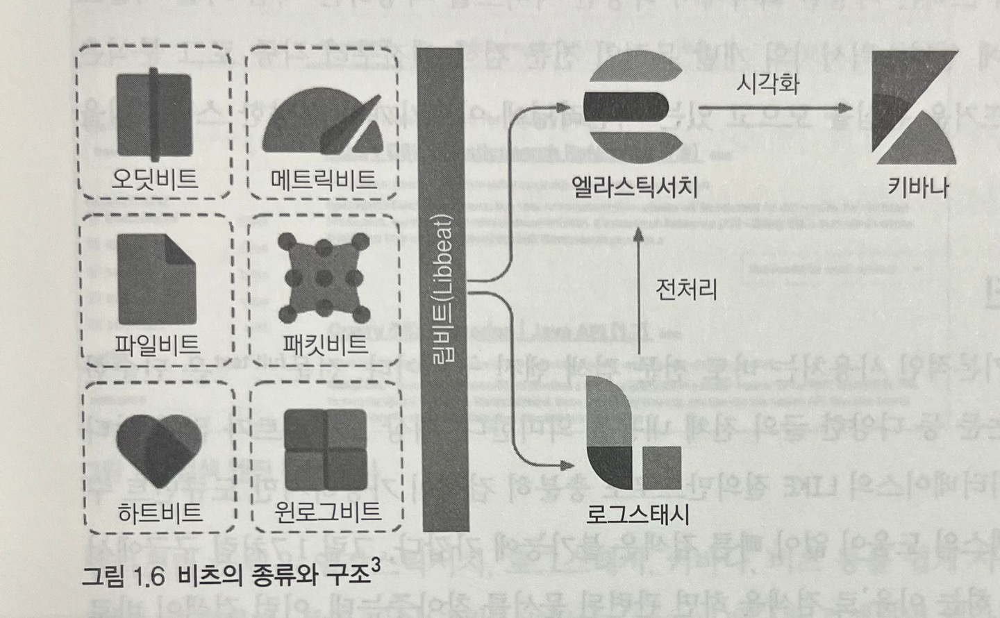

## 4. 엘라스틱 스택의 용도

### 4-1. 전문 검색 엔진

> 엘라스틱 스택의 가장 기본적인 사용처는 `전문 검색 엔진` 구현

- 전문(full text)은 단순한 문장부터 뉴스 기사나 논문 등 다양한 글의 전체 내용 의미
  - 대상 도큐먼트가 적다면 일반적인 관계형 데이터베이스의 `LIKE 질의` 만으로도 충분
  - 하지만, 도큐먼트 수가 증가하는 경우 인덱스의 도움 없이 빠른 검색은 불가능에 가까움
  - 구글과 같은 검색 엔진에 `엘라스틱서치 사용해야 하는 이유` 로 검색하면 관련 문서가 검색되는데, 이러한 검색이 `전문 검색`
- 전문을 빠르고 정확하게 검색하기 위해 전문을 `용어(terms)` 단위로 분석하여 인덱싱해두고 이를 기반으로 검색을 수행하는 `역인덱싱(inverted indexing)` 기법이 많이 활용

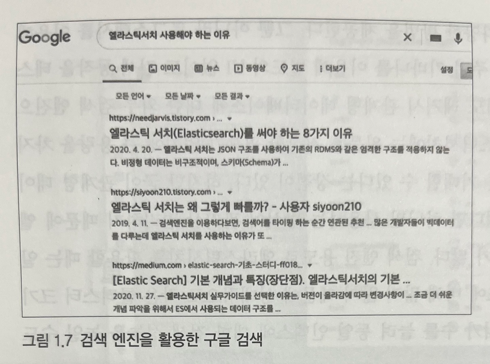

### 4-2. 로그 통합 분석

> 엘라스틱 스택은 여러 장비와 서비스에서 발생하는 로그들을 통합하고 검색하는 데 최적화된 솔루션 (한 페이지에서 확인 가능)

- `Beats` 사용 시, 적은 리소스로 각 장비의 로그들을 빠르게 수집 가능
  - 파일비트는 내장된 모듈을 이용하여 별도의 설정 없이도 빠르게 로그 수집 가능
- `Logstash` 사용 시, 다양한 필터를 통해 일원화된 형태로 가공 가능
- `Elastic Search` 의 대용량 로그에 대한 빠른 인덱싱 성능 및 텍스트 검색 기능을 통해 여러 곳에 흩어진 서비스 로그들을 통합해서 연관 분석 지원
- `Kibana` 의 로그 UI 나 대시보드는 시계열로 발생하는 직관적으로 모니터링할 수 있도록 지원

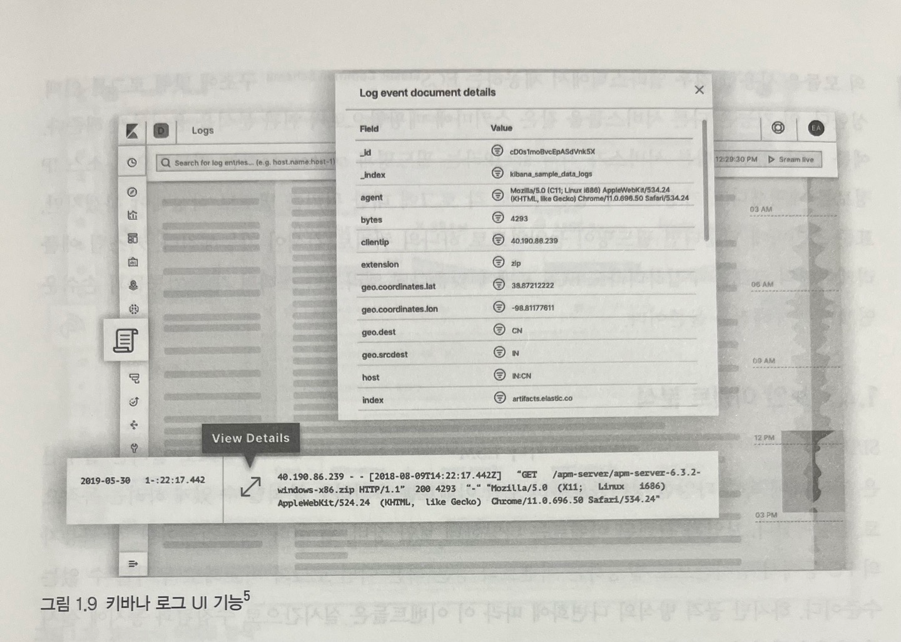

### 4-3. 보안 이벤트 분석

> SIEM(Security Information and Event Management)나 ESM(Enterprise Security Management) 등으로 불리는 솔루션은 조직 내 속한 다양한 장비들로부터 보안 이벤트를 수집하고 분석할 수 있게 하려는 목적으로 개발

- 엘라스틱 SIEM 은 비츠의 모듈을 이요하여 어플리케이션, 엔드포인트, 인프라스트럭처, 클라우드, 네트워크 등 다양한 소스에서 수집한 이벤트를 기반으로 엔드포인트 활동, 인증 로그, DNS 트래픽, 네트워크 플로우에서 이상 징후, 불법적인 로그인 시도, 사용자 접근 패턴 등의 문제를 빠르게 찾아냄
- 또한 SIEM UI 를 통해 분석을 비롯한 고유한 탐지 규칙 관리 가능

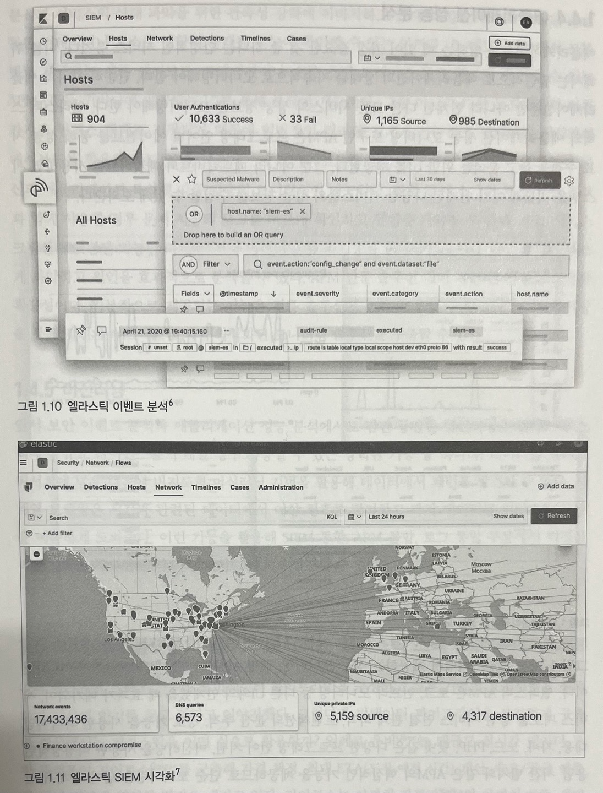

### 4-4. 어플리케이션 성능 분석

> 엘라스틱 스택의 어플리케이션 성능 모니터링 도구인 `APM`은 프로그래밍 언어별 에이전트를 통해 성능 지표 수집을 돕고 분석을 위한 UI 제공

- 엘라스틱 APM 은 `로그, 인프라 모니터링 등 다른 UI 와 연계했을 때 더욱 효과적`
- 다양한 경로를 통해 수집된 정보들은 컨테이너나 호스트 집합의 상태를 한눈에 확인할 수 있는 인프라 UI, 메트릭 비트에서 모듈별로 제공하는 `샘플 대시보드`, `트랜잭션`, `오류 스택 트레이스` 등을 Kibana 에서 제공되는 UI를 통해 분석 가능
- 다른 도큐먼트와 마찬가지로 인덱스 형태로 저장되기 때문에 일반적인 `쿼리 및 집계` 가능

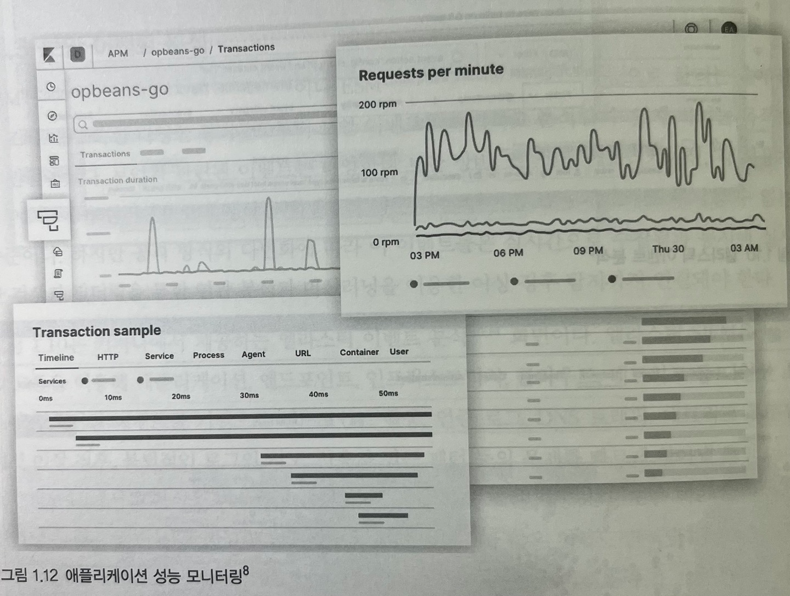

## 5. 빅데이터 플랫폼의 일부로 동작하는 엘라스틱 스택

> Uber(우버) 의 대규모 실시간 데이터 통찰 플랫폼 `가이로스` 단순화 구성 요소

- Kafka 토픽으로부터 가이로스 수집 파이프라인을 거쳐서 분석 대상 데이터 저장
- 고객 질의가 가이로스 질의 서비스를 거쳐 엘라스틱의 검색/집계 쿼리 활용
- 장기 분석을 위한 엘라스틱서치에 저장된 분석 데이터를 HDFS 에 저장

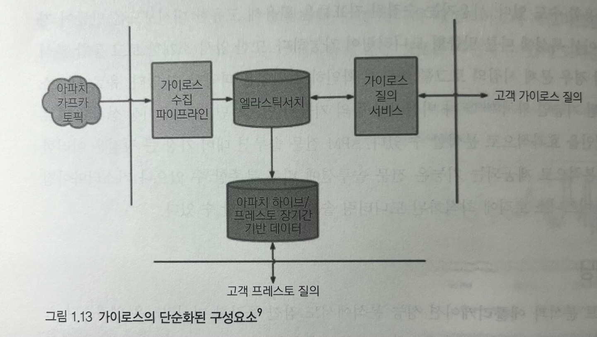

### 5.1. 엔터프라이즈 데이터 버스인 카프카와 연동

> 카프카를 사용하는 경우, 엘라스틱서치의 인덱싱 성능이 순간적으로 충분하지 않거나 로그스태시나 엘라스틱서치의 불안정으로 정상적인 인덱싱이 불가능한 경우에도 `데이터 유실 방지` 가능

- 아파치 카프카는 분산 데이터 스트리밍 플랫폼
- 카프카와 엘라스틱 스택은 데이터 수집 시점에서 많이 연계되어 사용

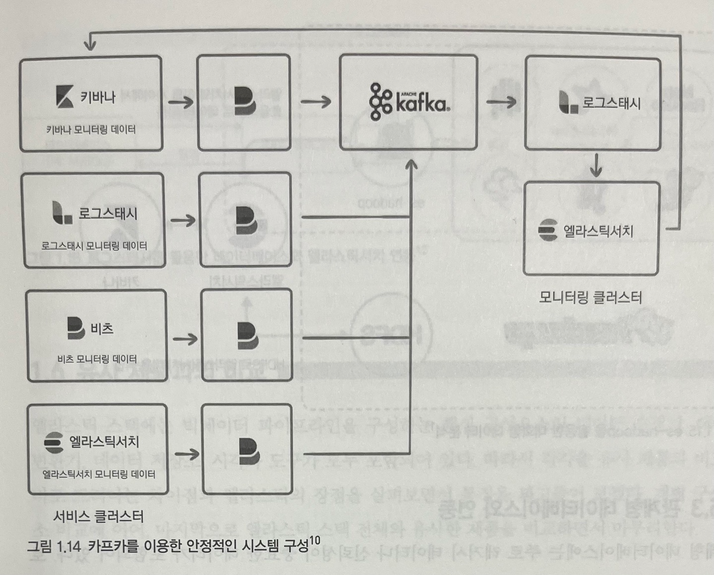

### 5.2. 하둡 생태계와 연동

> 엘라스틱 스택에서 `es-hadoop` 모듈 사용 시, 스파크에서 엘라스틱서치 API를 사용해 도큐먼트를 읽어 들이고, 반대로 인덱싱하는 등 서로 상호작용 수행 가능

- 엘라스틱서치는 `이미 인덱싱된 결과에 대해 빠른 검색 제공`
- 스파크는 기존에 `인덱싱되지 않은 데이터에 대한 빠른 일괄 처리` 제공
  - 엘라스틱서치를 `중간 집계 엔진`이나 `결과를 저장해 재활용`하는 용도 등으로 활용 가능

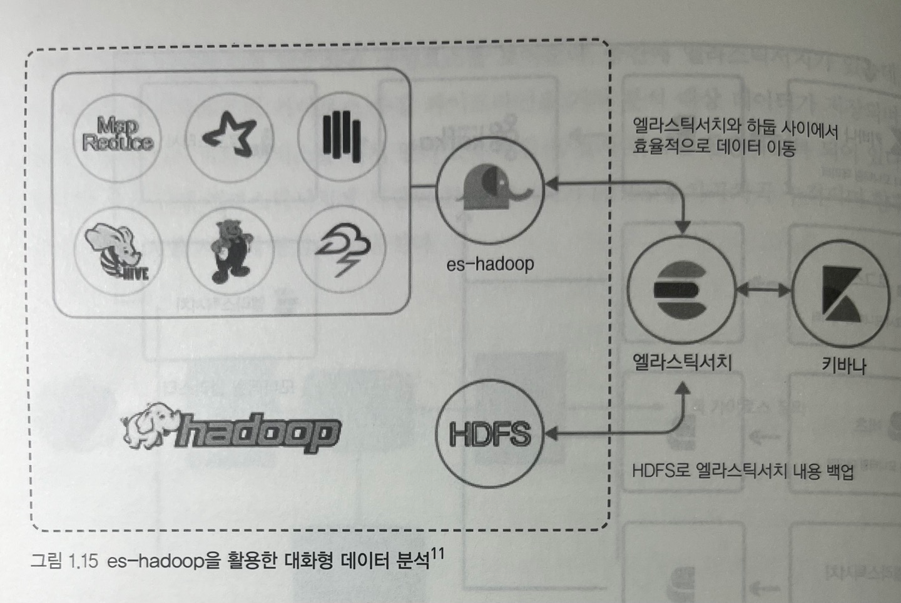

### 5.3. 관계형 데이터베이스와 연동

> 로그스태시는 JDBC 입력 플러그인, 필터 등 관계형 데이터베이스와 연계할 수 있는 다양한 방법 제공

- 텍스트 데이터의 경우, 엘라스틱서치에서는 색인만 수행하고, 원문을 저장하지 않게 설정하는 방식을 통해 저장소 용량을 아끼고 검색 엔진의 전문 검색 기능만 활용하는 것도 가능

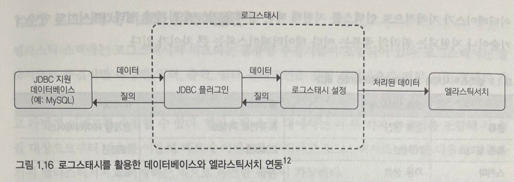

### 5.4. 엘라스틱서치와 그 밖의 데이터베이스 비교

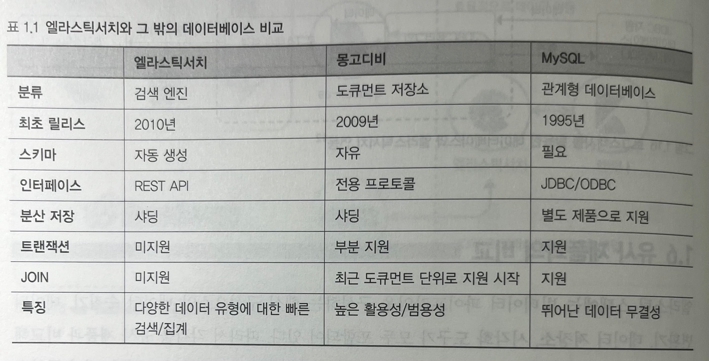

### 5.5. Elastic Search 와 Solr

> 솔라는 엘라스틱 서치와 마찬가지로 루씬을 기반으로 만들어졌기 때문에 상당히 유사하지만, 솔라는 통합 플랫폼으로 발전하지 못했기 때문에 엘라스틱이 압도적으로 앞서는 상황

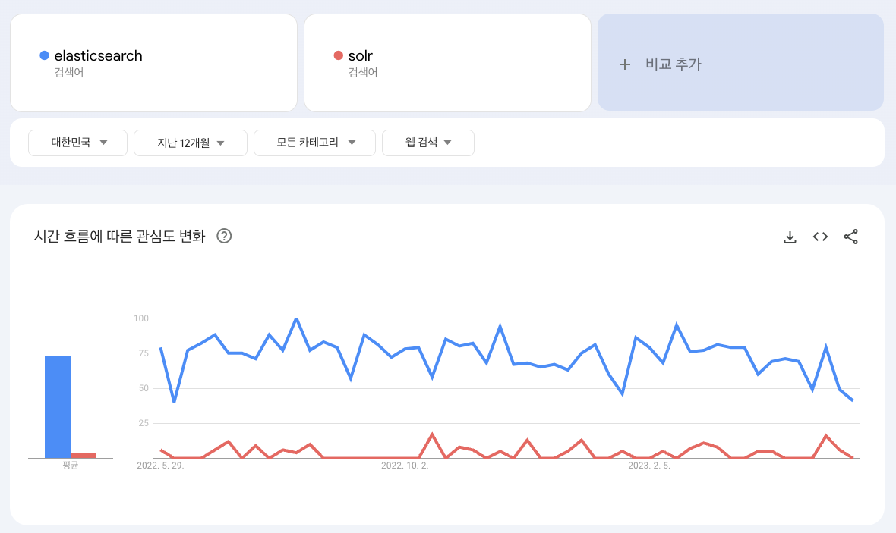

### 5.6. Logstash 와 Fluentd

> 플루언트디는 로그스태시와 설정의 형태만 다를 뿐 기능상으로는 거의 동일한 역할 수행

- 엘라스틱 스택에 한정 지어 사용하는 경우, 로그스태시를 사용하여 엘라스틱서치, 키바나와 연계하여 모니터링, 중앙 고나리 등의 기능을 제공 받는 것이 유리

  - 플루언트디는 위와 같은 지원을 받을 수 없기 때문에 되도록 엘라스틱 스택 사용 시, 로그스태시와 비츠의 조합을 사용하는 것을 권장
- 플루언트디는 CNCF (Cloud Native Computing Foundation) 스택

  - 쿠버네티스나 오픈트레이싱을 사용하는 경우, 사실상 필수 구성 요소
- 로그스태시와 플루언트디는 각자의 영역을 점유

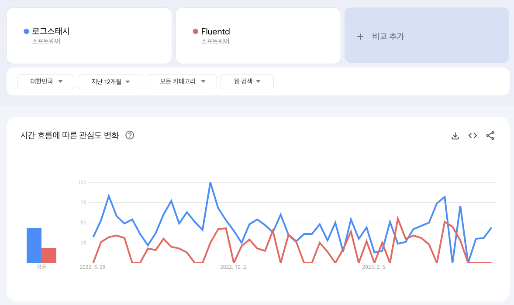

### 5.7. Kibana 와 Grafana

> 가장 많이 비교되는 시각화 도구로는 Kibana 를 fork 해서 만든 Grafana 가 대표적

- 전반적으로 키바나보다 기능은 부족할 수 있으나, 데이터 소스로 엘라스틱서치 외의 다양한 시계열 데이터베이스를 활용할 수 있다는 장점 존재
- 데이터 플랫폼 내의 여러 데이터베이스들을 UI수준에서 통합해보고 싶다면, Kibana 와 Grafana 를 함께 사용하는 것도 좋은 선택

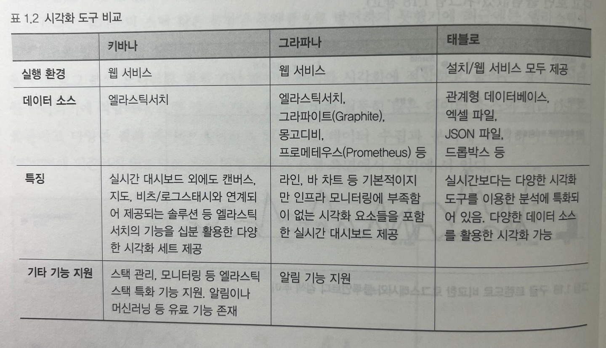
## 1. 엘라스틱서치의 탄생

- 엘라스틱이 등장했을 무렵, 사용자들의 요구사항은 명확
  - 사이트 내에서 `전문 검색 (full text search)`` 기능을 제공하는 강력한 소프트웨어의 필요성
- `Doug Cutting` 이 `Excite` 에서 검색 엔진을 만들던 역량을 통해 자신의 5번째 검색 엔진 라이브러리를 만듬
  - `Doug Cutting` 부인의 중간 이름을 따서 `루씬(Lucene)` 으로 명명
- `Shay Bannon` 은 요리 학교를 다니던 자신의 부인이 손쉽게 레시피를 검색할 수 있도록 `루씬(Lucene)`을 기반으로 `컴파스` 프로젝트 진행
  - 분산 환경을 위한 솔루션, HTTP 상에서 JSON 으로 인터페이스르르 지원하는 솔루션, 자바 외에도 다양한 프로그래밍 언어를 지원하는 솔루션을 표방하고 작업을 진행했으며, 2010년 2월에 `엘라스틱 서치` 공개

## 2. 엘라스틱 스택으로 발전

- 데이터가 점점 늘어나는 상황에서 전문 검색은 대량의 데이터를 저장해서 처리하는 1가지 방법에 불과
  - 다양한 사용 사례를 유연하게 지원하기 위해서는 검색 엔진을 뛰어넘는 플랫폼 필요성 인지
  - 유연성을 확보하기 위해서는 데이터 수집, 가공, 저장, 분석, 시각화하는 일련의 파이프라인을 구성하기 위한 다양한 오픈소스 소프트웨어를 조합해야 하는 불편함
- 엘라스틱서치 개발 무렵, 아래와 같은 프로젝트 진행
  - `Jordan Sissel` 은 사용자가 선택한 보관함(stash)으로 Log 를 보내는 오픈소스 데이터 수집 도구인 `로그스태시(Logstash)` 개발
  - `Rashid Khan` 은 오픈소스 시각화 UI 인 `키바나(Kibana)` 개발
  - `Packetbeat` 라는 회사에서 네트워크 데이터를 엘라스틱서치로 보내는 방법을 연구해서 제품 개발을 하고 있다는 사실을 엘라스틱 개발팀이 알게 됨
    - 로그스태시와 엘라스틱서치로 네트워크 데이터, 로그, 메트릭, 성능 진단 데이터를 보내는 경량 데이터 수집기의 가능성을 고려
    - Packetbeat 와 연합하여 `Beat(비츠)` 탄생

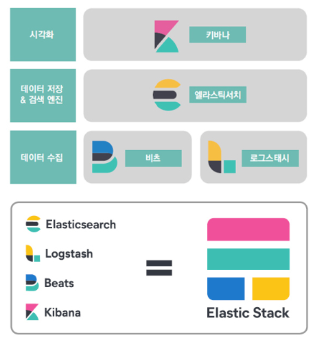

## 3. 엘라스틱 스택의 구성요소

> 엘라스틱 스택은 일반적인 빅데이터 파이프라인을 구성하기 위한 데이터 수집, 가공, 저장, 분석, 시각화에 필요한 모든 소프트웨어를 갖춤

- 필요에 따라 `Kibana` 를 제외한 엘라스틱 스택의 나머지 구성요소만으로도 개별적인 빅데이터 파이프라인의 일부로 사용

> 데이터 수집

- Beat

> 데이터 가공

- Logstash

> 데이터 저장 및 분석

- Elastic Search

> 데이터 시각화 및 모니터링

- Kibana

### 3-1. 엘라스틱서치 : 분산 검색 엔진

> 검색 엔진은 내부적으로 각 Document 를 Indexing 하고 빠르게 검색하는 데 사용하는 기술로 엘라스틱서치는 검색 엔진이면서 동시에 데이터베이스 (`엘라스틱서치가 빠른 검색과 집계 성능을 실현하는 이유`)

- 엘라스틱서치는 `모든 레코드를 JSON 도큐먼트 형태로 입력 및 관리`
  - 일반적인 DB 와 마찬가지로 쿼리한 결과에 대해 일치하는 원본 도큐먼트 반환

> 엘라스틱서치 장점

- 다양한 데이터 타입 지원
  - 텍스트, 숫자, 날짜, IP 주소, 지리 정보 등
- Scoring (연관도) 에 따른 정렬 제공
  - 검색어에 대한 유사도 스코어를 기반으로 한 정렬 기능 제공
- 분산 처리 가능
  - 복수의 루씬 인스턴스를 병렬로 배치하고 분산 처리하여 검색 속도 확장 가능
- 고가용성 확보
  - 노드 간 복제 기능을 통해 일부 노드가 down 되더라도 정상적으로 서비스 지속 가능
- REST API 제공
  - 프로그래밍 언어와 무관하게 사용자가 쉽게 접근 가능

> 엘라스틱서치 단점

- 저장 공간이 크게 압축되지 않음
- 많은 시스템 리소스 사용
- DSL 쿼리 사용에 의한 JOIN 쿼리 어려움 (`반정규화를 기본으로 모델링 필요`)
- 인덱스가 불변의 자료구조이다
  - 도큐먼트를 수정하거나 삭제할 경우 비용이 저렴하지 않음

### 3-2. 키바나 : 시각화와 엘라스틱서치 관리 도구

> 엘라스틱 스택의 UI 담당

- 키바나의 가장 중요한 기능 : 시각화, 대시보드
- 엘라스틱서치에 대한 대부분의 관리 기능, API를 실행할 수 있는 콘솔, 솔루션 페이지, 스택의 각 구성요소들을 위한 모니터링 페이지 등 포함

### 3-3. 로그스태시 : 이벤트 수집과 정제를 위한 도구

> 로그스태시는 형식에 무관하게 데이터를 동적으로 수집, 변환, 전송하는 구조

- 대량의 데이터를 검색하기 위해서는 데이터 적재 작업 선행 필요

  - 로그, 메트릭, 웹 어플리케이션 등 다양한 소스로부터 로그 수집 가능
  - 필터 기능을 통해 비정형이나 반정형 데이터를 분석하기 쉬운 형태로 정제 가능
  - 비구조적 데이터에서 구조 도출 및 IP 주소에서 위치 정보 좌표 해독, 민감 필드 익명화 등의 전반적인 작업을 쉽게 처리
- 로그스태시는 별도의 코딩 없이 간단한 설정만으로 로그 데이터 가공 가능

  - 확장 가능한 200개 이상의 플러그인을 통해 설정의 대부분은 플러그인 사용법

> 특징

- 배치 처리 및 병렬 처리 가능
- 영속적인 큐를 통해 현재 처리 중인 이벤트에 대한 최소 1회 전송 보장
- 유동적인 처리 방식으로 인한 데이터 급증 상황에서 안정성 확보

### 3-4. 비츠 : 엣지단에서 동작하는 경량 수집 도구

> 비트는 로그 수집, 시스템 지표 수집 등 특정 목적에 최적화된 에이전트 (Golang)

- 이벤트 정보를 수집하기 위해 실제 서비스가 동작하는 호스트에 수집기를 설치해야 하는 경우, 사용
- 로그스태시는 다양한 필터와 설정을 지원하는 만큼 무거움
  - 로그스태시 수준의 복잡한 이벤트 가공은 지원하지 않으므로 가볍기 때문에, 각 서비스 호스트에 부담 없이 설치 가능
- 비츠는 데이터 수집을 위해 용도별로 최적화된 경량 에이전트로 제공
  - 특성과 성격에 맞는 다양한 비트들 존재
- 흔히 비츠를 통해 각 서비스 호스트의 정보를 수집하고, 로그스태시에서 이를 취합하고 가공하여 엘라스틱서치로 전송하는 형태의 아키텍처를 많이 사용

> 비츠의 종류와 구조

## 4. 엘라스틱 스택의 용도

### 4-1. 전문 검색 엔진

> 엘라스틱 스택의 가장 기본적인 사용처는 `전문 검색 엔진` 구현

- 전문(full text)은 단순한 문장부터 뉴스 기사나 논문 등 다양한 글의 전체 내용 의미
  - 대상 도큐먼트가 적다면 일반적인 관계형 데이터베이스의 `LIKE 질의` 만으로도 충분
  - 하지만, 도큐먼트 수가 증가하는 경우 인덱스의 도움 없이 빠른 검색은 불가능에 가까움
  - 구글과 같은 검색 엔진에 `엘라스틱서치 사용해야 하는 이유` 로 검색하면 관련 문서가 검색되는데, 이러한 검색이 `전문 검색`
- 전문을 빠르고 정확하게 검색하기 위해 전문을 `용어(terms)` 단위로 분석하여 인덱싱해두고 이를 기반으로 검색을 수행하는 `역인덱싱(inverted indexing)` 기법이 많이 활용

### 4-2. 로그 통합 분석

> 엘라스틱 스택은 여러 장비와 서비스에서 발생하는 로그들을 통합하고 검색하는 데 최적화된 솔루션 (한 페이지에서 확인 가능)

- `Beats` 사용 시, 적은 리소스로 각 장비의 로그들을 빠르게 수집 가능
  - 파일비트는 내장된 모듈을 이용하여 별도의 설정 없이도 빠르게 로그 수집 가능
- `Logstash` 사용 시, 다양한 필터를 통해 일원화된 형태로 가공 가능
- `Elastic Search` 의 대용량 로그에 대한 빠른 인덱싱 성능 및 텍스트 검색 기능을 통해 여러 곳에 흩어진 서비스 로그들을 통합해서 연관 분석 지원
- `Kibana` 의 로그 UI 나 대시보드는 시계열로 발생하는 직관적으로 모니터링할 수 있도록 지원

### 4-3. 보안 이벤트 분석

> SIEM(Security Information and Event Management)나 ESM(Enterprise Security Management) 등으로 불리는 솔루션은 조직 내 속한 다양한 장비들로부터 보안 이벤트를 수집하고 분석할 수 있게 하려는 목적으로 개발

- 엘라스틱 SIEM 은 비츠의 모듈을 이요하여 어플리케이션, 엔드포인트, 인프라스트럭처, 클라우드, 네트워크 등 다양한 소스에서 수집한 이벤트를 기반으로 엔드포인트 활동, 인증 로그, DNS 트래픽, 네트워크 플로우에서 이상 징후, 불법적인 로그인 시도, 사용자 접근 패턴 등의 문제를 빠르게 찾아냄
- 또한 SIEM UI 를 통해 분석을 비롯한 고유한 탐지 규칙 관리 가능

### 4-4. 어플리케이션 성능 분석

> 엘라스틱 스택의 어플리케이션 성능 모니터링 도구인 `APM`은 프로그래밍 언어별 에이전트를 통해 성능 지표 수집을 돕고 분석을 위한 UI 제공

- 엘라스틱 APM 은 `로그, 인프라 모니터링 등 다른 UI 와 연계했을 때 더욱 효과적`
- 다양한 경로를 통해 수집된 정보들은 컨테이너나 호스트 집합의 상태를 한눈에 확인할 수 있는 인프라 UI, 메트릭 비트에서 모듈별로 제공하는 `샘플 대시보드`, `트랜잭션`, `오류 스택 트레이스` 등을 Kibana 에서 제공되는 UI를 통해 분석 가능
- 다른 도큐먼트와 마찬가지로 인덱스 형태로 저장되기 때문에 일반적인 `쿼리 및 집계` 가능

## 5. 빅데이터 플랫폼의 일부로 동작하는 엘라스틱 스택

> Uber(우버) 의 대규모 실시간 데이터 통찰 플랫폼 `가이로스` 단순화 구성 요소

- Kafka 토픽으로부터 가이로스 수집 파이프라인을 거쳐서 분석 대상 데이터 저장
- 고객 질의가 가이로스 질의 서비스를 거쳐 엘라스틱의 검색/집계 쿼리 활용
- 장기 분석을 위한 엘라스틱서치에 저장된 분석 데이터를 HDFS 에 저장

### 5.1. 엔터프라이즈 데이터 버스인 카프카와 연동

> 카프카를 사용하는 경우, 엘라스틱서치의 인덱싱 성능이 순간적으로 충분하지 않거나 로그스태시나 엘라스틱서치의 불안정으로 정상적인 인덱싱이 불가능한 경우에도 `데이터 유실 방지` 가능

- 아파치 카프카는 분산 데이터 스트리밍 플랫폼
- 카프카와 엘라스틱 스택은 데이터 수집 시점에서 많이 연계되어 사용

### 5.2. 하둡 생태계와 연동

> 엘라스틱 스택에서 `es-hadoop` 모듈 사용 시, 스파크에서 엘라스틱서치 API를 사용해 도큐먼트를 읽어 들이고, 반대로 인덱싱하는 등 서로 상호작용 수행 가능

- 엘라스틱서치는 `이미 인덱싱된 결과에 대해 빠른 검색 제공`
- 스파크는 기존에 `인덱싱되지 않은 데이터에 대한 빠른 일괄 처리` 제공
  - 엘라스틱서치를 `중간 집계 엔진`이나 `결과를 저장해 재활용`하는 용도 등으로 활용 가능

### 5.3. 관계형 데이터베이스와 연동

> 로그스태시는 JDBC 입력 플러그인, 필터 등 관계형 데이터베이스와 연계할 수 있는 다양한 방법 제공

- 텍스트 데이터의 경우, 엘라스틱서치에서는 색인만 수행하고, 원문을 저장하지 않게 설정하는 방식을 통해 저장소 용량을 아끼고 검색 엔진의 전문 검색 기능만 활용하는 것도 가능

### 5.4. 엘라스틱서치와 그 밖의 데이터베이스 비교

### 5.5. Elastic Search 와 Solr

> 솔라는 엘라스틱 서치와 마찬가지로 루씬을 기반으로 만들어졌기 때문에 상당히 유사하지만, 솔라는 통합 플랫폼으로 발전하지 못했기 때문에 엘라스틱이 압도적으로 앞서는 상황

### 5.6. Logstash 와 Fluentd

> 플루언트디는 로그스태시와 설정의 형태만 다를 뿐 기능상으로는 거의 동일한 역할 수행

- 엘라스틱 스택에 한정 지어 사용하는 경우, 로그스태시를 사용하여 엘라스틱서치, 키바나와 연계하여 모니터링, 중앙 고나리 등의 기능을 제공 받는 것이 유리

  - 플루언트디는 위와 같은 지원을 받을 수 없기 때문에 되도록 엘라스틱 스택 사용 시, 로그스태시와 비츠의 조합을 사용하는 것을 권장
- 플루언트디는 CNCF (Cloud Native Computing Foundation) 스택

  - 쿠버네티스나 오픈트레이싱을 사용하는 경우, 사실상 필수 구성 요소
- 로그스태시와 플루언트디는 각자의 영역을 점유

### 5.7. Kibana 와 Grafana

> 가장 많이 비교되는 시각화 도구로는 Kibana 를 fork 해서 만든 Grafana 가 대표적

- 전반적으로 키바나보다 기능은 부족할 수 있으나, 데이터 소스로 엘라스틱서치 외의 다양한 시계열 데이터베이스를 활용할 수 있다는 장점 존재
- 데이터 플랫폼 내의 여러 데이터베이스들을 UI수준에서 통합해보고 싶다면, Kibana 와 Grafana 를 함께 사용하는 것도 좋은 선택

