## 1. 준비 작업

> 엘라스틱서치의 모든 기능은 REST API 형태

### 1-1. 엘라스틱서치 요청과 응답

- REST 란 웹상의 모든 리소스에 URI를 부여하고 활용하는 아키텍처
- REST 는 `Representational State Transfer`의 약자로 웹(HTTP)의 장점을 이용해 리소스를 주고 받는 형태
  - REST API 는 REST 기반으로 API 를 서비스하는 것을 의미
  - REST API 는 메소드 (method) 와 경로 (URI) 가 합쳐진 형태
  - REST API 는 4가지 메소드 타입을 통해 리소스의 CRUD 작업을 진행
  - URI 는 리소스를 명시하는 방법

> POST

- 해당 리소스를 추가

> GET

- 해당 리소스를 조회

> PUT

- 해당 리소스를 수정

> DELETE

- 해당 리소스를 삭제

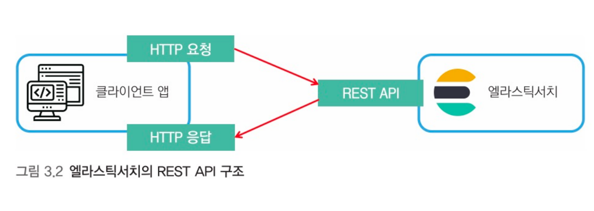

### 1-2. Kibana 콘솔 사용법

> Kibana - Dev Tools 의 콘솔을 이용하여 REST API 호출

- Kibana > Management > Dev Tools 메뉴
  - 엘라스틱서치와 REST API 통신 가능
  - REST API 입력 후 초록색 세모 모양 실행 버튼 클릭 시 HTTP Request

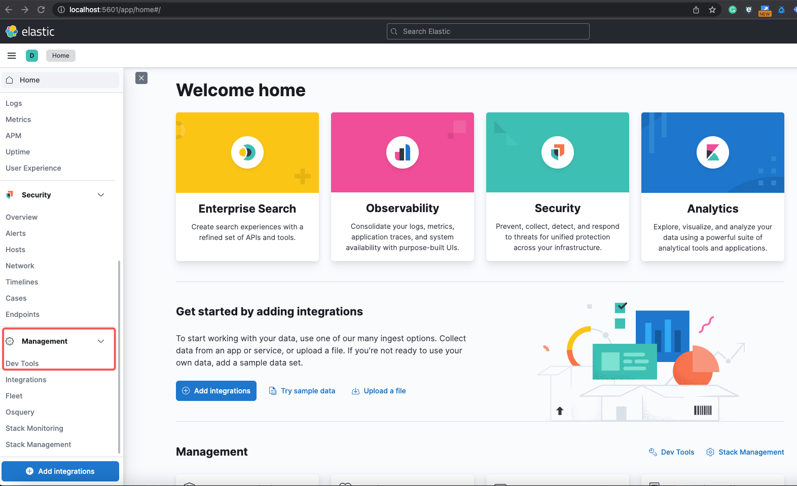

## 2. 인덱스와 도큐먼트

- `인덱스`
  - 도큐먼트를 저장하는 논리적 구분자
- `도큐먼트`
  - 실제 데이터를 저장하는 단위
- REST API 를 통하여 인덱스에 도큐먼트를 추가할 수 있는데, 이러한 작업을 `문서를 색인화` 한다고 지칭

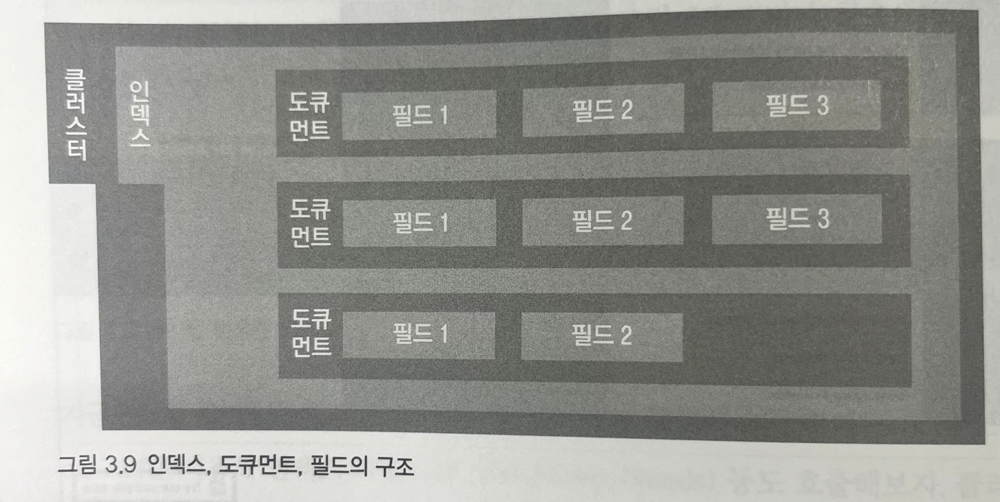

### 2-1. 도큐먼트

> 도큐먼트는 엘라스틱서치에서 `데이터가 저장되는 기본 단위`로 `JSON 형태`

- 하나의 도큐먼트는 여러 `필드`와 `값`을 가짐

> 엘라스틱서치와 관계형 데이터베이스 비교

- 데이터

````text
name: mike
age: 25
gender: male
````

- 관계형 데이터베이스

````sql
CREATE TABLE member (
    uid int not null AUTO_INCREMENT PRIMARY KEY,
    name varchar(50) not null,
    age int not null,
    gender varchar(6) not null
);

INSERT INTO member (name, age, gender) VALUES ("mike", 25, "male");
````

- 엘라스틱서치

````json
{
    "name": "mike",
    "age": 25,
    "gender": "male"
}
````

- 필드 : name, age, gender
- 값 : mike, 25, male
- 데이터 타입 : name (text), gender (text), 25 (int)

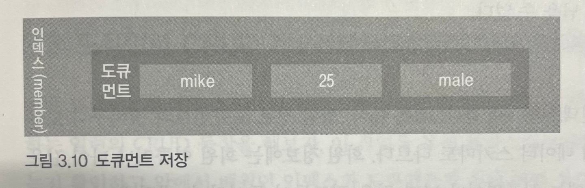

> MySQL 과 엘라스틱서치 비교

- MySQL | 엘라스틱서치
  - 테이블 | 인덱스
  - 레코드 | 도큐먼트
  - 컬럼 | 필드
  - 스키마 | 매핑

### 2-2. 인덱스

> 인덱스는 `도큐먼트를 저장하는 논리적 단위`로 관계형 데이터베이스의 `테이블`과 유사한 개념

- 동일한 인덱스에 있는 도큐먼트인 경우, `동일한 스키마를 갖음`
- 모든 도큐먼트는 `하나의 인덱스에 포함`되어야 함

> 스키마에 따른 그룹핑

- 일반적으로 스키마에 따라 인덱스를 구분
  - 회원 정보 도큐먼트와 장바구니 도큐먼트는 성격이 다르기 떄문에 데이터 스키마도 다름
  - 회원 정보에는 회원 이름이나 나이 같은 필드 사용
  - 장바구니 정보에는 상품명이나 날짜 같은 필드 사용
    - `서로 다른 스키마를 가진 도큐먼트를 하나의 인덱스에 저장하는 방법은 바람직하지 않음`

> 관리 목적의 그룹핑

- 기본적으로 인덱스는 용량이나 숫자 제한 없이 `무한대의 도큐먼트 포함 가능`
  - 하지만, 인덱스가 커지면 검색 시, 많은 도큐먼트를 참조해야하기 때문에 성능이 나빠짐
  - 따라서, ES 운영 시 `인덱스 용량 제한`을 두게 됨
- 기본적으로 `특정 도큐먼트 개수에 도달`하거나 `특정 용량`을 넘어서면 `인덱스를 분리`

### 3. 도큐먼트 CRUD

### 3.1. 인덱스 생성/확인/삭제

- 도큐먼트 CRUD 동작을 하기 위해서는 반드시 인덱스 필요

````shell
PUT index1
````

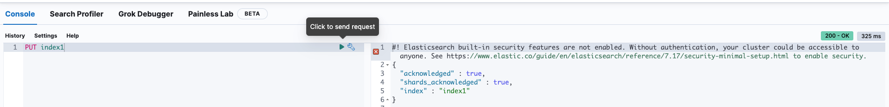

````shell
GET index1
````

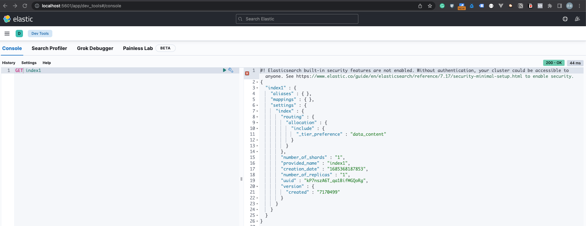

````shell
DELETE index1
````

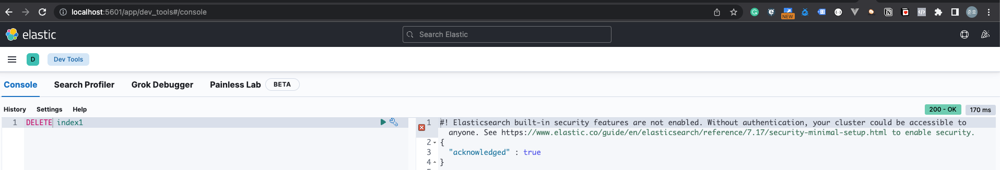

### 3.2. 도큐먼트 생성

> 엘라스틱서치에서 도큐먼트를 인덱스에 포함시키는 것을 `인덱싱(색인)` 이라고 함

- index2 라는 인덱스를 생성과 동시에 index2 인덱스에 도큐먼트 인덱싱
- 인덱스명 : index2
- 인트포인트 구분 예약어 : _doc
- 도큐먼트 고유 ID : 1

````json
PUT index2/_doc/1
{
  "name": "mike",
  "age": 25,
  "gender": "male"
}
````


> index2 인덱스 설정값 및 mappings 확인

- age : long 타입
- name/gender : text 타입

> `다이나믹 매핑(dynamic mapping)` : 데이터 타입을 지정하지 않아도 도큐먼트의 필드와 값을 보고 자동 지정하는 방식

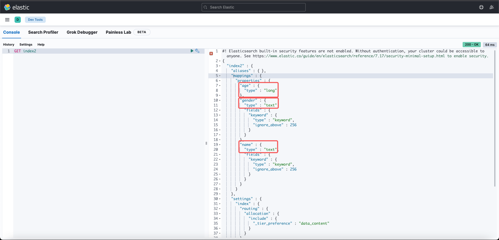

> index2 인덱스에 새로운 도큐먼트 추가 (인덱싱)

````json
PUT index2/_doc/2
{
  "name": "jane",
  "country": "france"
}
````

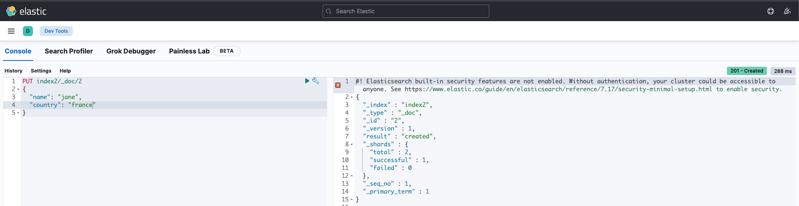

- 2번 도큐먼트에는 country 필드가 추가되었고, 기존에 있던 age, gender 필드는 사용하지 않았지만 인덱싱 성공

> 데이터 타입을 잘못 입력한 도큐먼트 인덱싱 (age 필드의 데이터 타입은 long 이지만, text 타입으로 입력)

- 데이터 타입을 잘못 입력하였지만, 정상 입력
- ES 에서는 타입을 변환하여 저장
  - 숫자 필드에 문자열 입력 시, 숫자로 변환
    - "age": "10" -> 10
  - 정수 필드에 소수 입력 시, 소수점 아래 자리 무시 후 변환
    - "age": 10.0 -> 10

````json
PUT index2/_doc/3
{
  "name": "kim",
  "age": "20",
  "gender": "female"
}
````

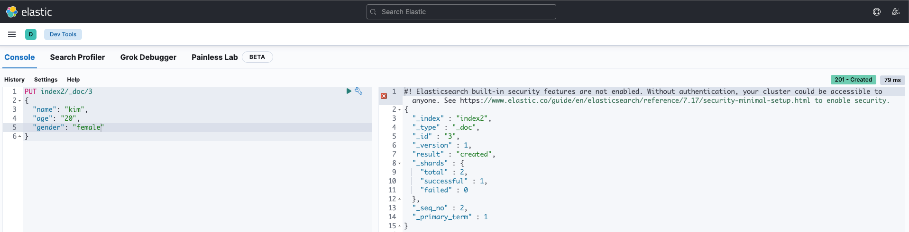

> index2 인덱스 도큐먼트

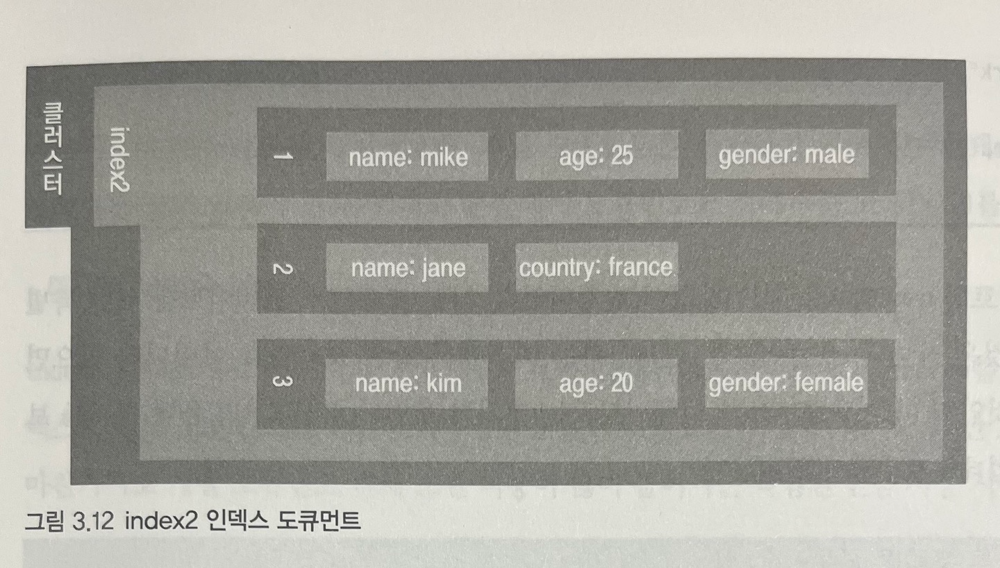
