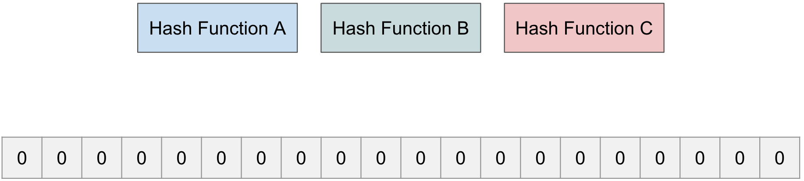
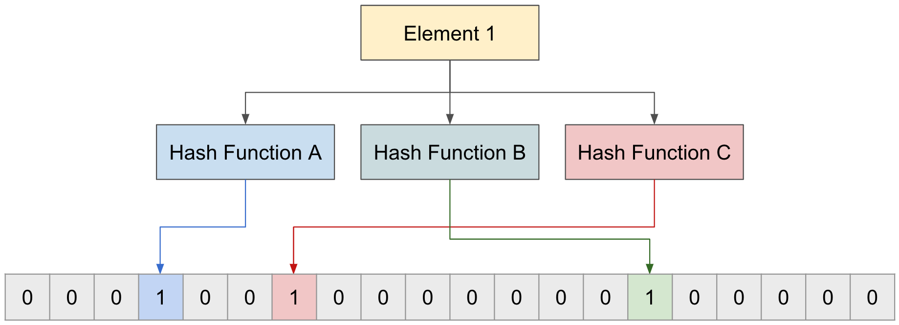
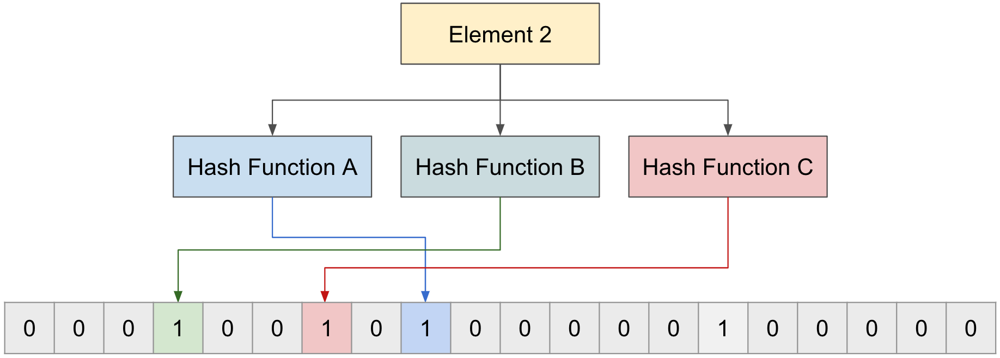
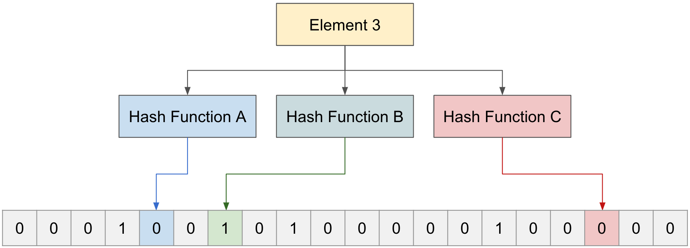
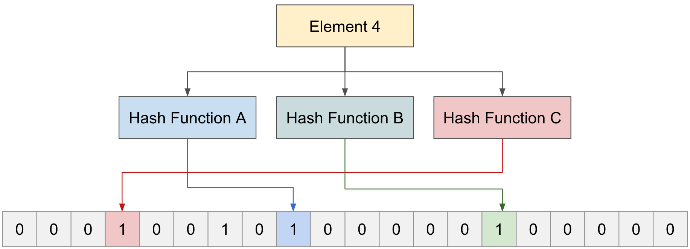

### Bloom Filter 란 ?

- Bloom Filter 는 효율이 좋은 `확률적인 자료 구조`이다. 요소가 집합의 요소인지 여부를 테스트하는 데 사용된다. Bloom Filter 는
  Binary Tree 나 Hash Map 처럼 자주 사용되는 자료구조는 아니지만, 간혹 사용되곤 한다.
- 어떤 Set (집합) 과 Element 가 있을 때, 특정 Element 가 그 Set 에 존재 여부를 Bloom Filter 를 사용하면 빠르게 알 수 있다.
  특정 Element 가 특정 Set 에 존재하냐고 했을 때, Bloom Filter 는 2가지 답을 할 수 있다.
  1. 특정 Element 가 특정 Set 안에 존재하지 않는다.
  2. 특정 Element 는 특정 Set 안에 존재할 수도 있다.
- 위 2가지 답은 Element 가 필터에 존재하지 않는 경우에는 확실히 알려줄 수 있지만, 존재하는 경우에는 확실하지 않다는 것을 의미한다.
- 정확하지 않은데도 사용하는 이유는 Bloom Filter 는 `공간 효율적인 데이터 구조` 때문이다.
  이는 사용하는 메모리 영역을 처음부터 고정해도 좋다. Bloom Filter 의 요소 단위는 Bit 이다.
  - 32 Bit 머신으로 integer 형이라면 최대 32개의 요소를 넣을 수 있다.

### Bloom Filter 구성 

> Bloom Filter 는 1개의 배열과 n개의 Hash 함수로 구성된다.

> n개의 Hash 함수 

- Bloom Filter 는 여러 Hash 함수를 사용한다. Hash 함수는 어떤 값을 전달했을 때, 그 값은 배열의 인덱스 중에 하나의 숫자로 바꿔주는 역할을 한다.
  Hash 함수의 개수는 여러 개로 정할 수 있으며 각 함수는 Hash 를 하는 방식이 각각 다르다.
- 함수의 기능
  1. Set 에 새로운 Element 를 추가한다.
  2. Set 에 입력한 Element 가 존재하는지 확인한다. 

> 여러 값을 갖는 배열 

- Bloom Filter 는 여러 값을 갖는 배열로 이루어져 있으며, 어떤 값을 Hash 함수를 통해서 나온 인덱스 중 하나의 숫자로 바꿔주게 된다. 
- 위 예제의 배열 크기는 '20' 의 크기를 갖는 Bloom Filter 

#### Bloom Filter 에 새로운 Element 추가 

1. Bloom Filter 에 `Element 1` 을 3개의 각 함수를 통해 인덱스를 받아오고 해당 인덱스에 값을 0에서 1로 변경한다.

2. 2번째 요소인  `Element 2` 도 동일하게 3개의 함수를 통해 인덱스를 받아오고 해당 인덱스의 배열 값을 0에서 1로 변경한다.

#### Bloom Filter 에 새로운 Element 확인

3. 'Element 3' 가 존재하는지 알아보기 위해 3개의 함수에 통과해 본다. (Hash 함수 A,B,C 에서 각각 0,1,0 을 가리키게 되고, 1개라도 0을 포함하게 되면, 입력 받은 'Element 3'은 존재하지 않는다.)

4. 'Element 4'가 존재하는지 알아보기 위해 3개의 함수에 통과해 본다. (함수 A,B,C가 모두 1을 값을 가리키고 있지만, 실제로는 'Element 1,2'만 존재하고, 'Element 4'는 존재하지 않았다.)

- 이렇게 존재하지 않는 'Element' 는 확실히 존재하지 않다는 것을 알려줄수 있지만, 확실히 존재하지 않았던 'Element' 에 대해서는 확률적으로나 알려줄수 있지 정확하지 않다.

