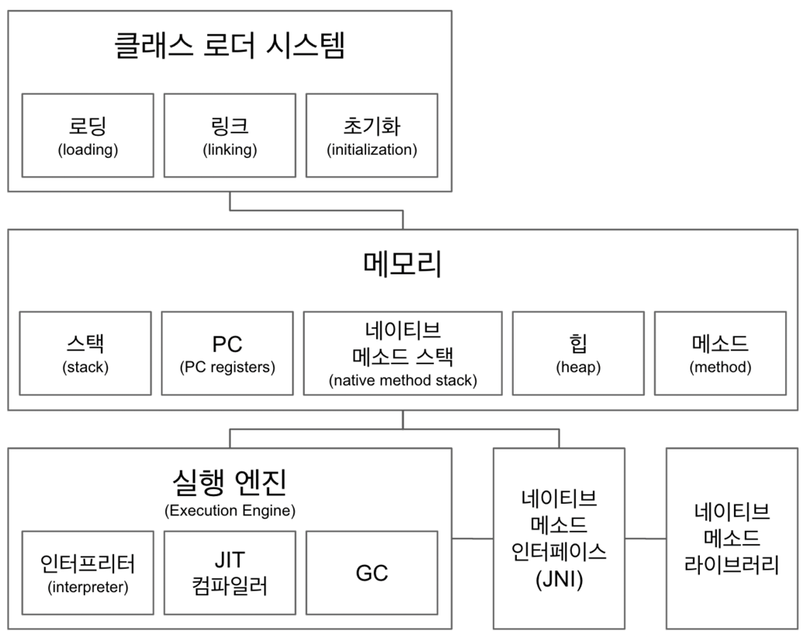

## JVM 구조

> 클래스 로더 시스템

- .class 파일에서 바이트 코드를 읽고, 메모리에 저장
- 로딩
    - 클래스를 읽어오는 과정
- 링크
    - 레퍼런스를 연결하는 과정
- 초기화
    - static 값 초기화 및 변수 할당

> 메모리

- 메소드
    - 클래스 수준의 정보 저장 (공유 자원)
    - 클래스명, 부모 클래스명, 메소드, 변수 (static 변수, local 변수 등)

- 힙
    - 객체 저장 (공유 자원)
    - 인스턴스

- 스택
    - 쓰레드마다 런타임 스택을 만들고, 그 안에 메소드 호출을 스택 프레임이라 부르는 블럭으로 쌓음
    - 쓰레드 종료 시, 런타임 스택도 소멸

- PC (Program Counter registers)
    - 쓰레드마다 쓰레드 내 현재 실행할 instruction 의 위치를 가리키는 포인터가 생성됨

- 네이티브 메소드 스택
    - 네이티브 메소드를 호출할 때 사용하는 별도의 스택
    - 네이티브 메소드
        - 'native' 키워드가 붙어있는 메소드
        - native 메소드의 구현은 C/C++ 로 구현
            - 예 : Thread.currentThread();
            - public static native Thread currentThread();
        - * native 메소드의 실제 구현은 '네이티브 메소드 라이브러리'에 있으며, 사용을 위해서는 '네이티브 메소드 인터페이스 (JNI)' 를 반드시 사용해야 함

> 실행 엔진

- 인터프리터
    - 바이트 코드를 한줄 씩 실행하여 native 코드로 컴파일
- JIT 컴파일러 (Just In Time)
    - 인터프리터 효율을 높이기 위해, 인터프리터가 반복되는 코드 발견 시, JIT 컴파일러로 반복되는 코드 (바이트 코드 -> native 코드) 를 모두 native 코드로 바꿔둠
    - 그 이후 인터프리터는 native 코드로 컴파일된 코드를 바로 사용
- GC
    - 더이상 참조되지 않는 객체를 모아 정리

> JNI (Java Native Interface)

- 자바 애플리케이션에서 C, C++, 어셈블리로 작성된 함수를 사용할 수 있는 방법 제공
- native 키워드를 사용한 메소드 호출

> 네이티브 메소드 라이브러리

- C, C++로 작성 된 라이브러리

