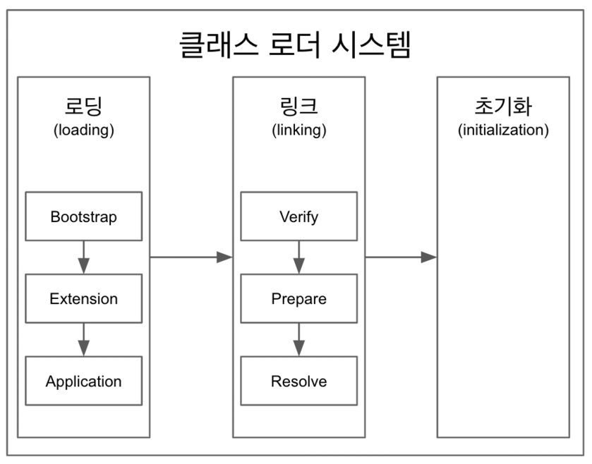

## 클래스 로더

- 로딩, 링크, 초기화 순으로 진행

> 로딩

- 클래스 로더가 .class 파일을 읽고, 그 내용에 따라 적절한 바이너리 데이터를 만든 뒤 '메소드' 영역에 저장
- 이때, 메소드 영역에 저장하는 데이터
    - FQCN (Fully Qualified Class Name) : 클래스가 속한 패키지명을 모두 포함한 클래스명
    - Class, Interface, Enum 등
    - 메소드, 변수
- 로딩이 끝나면, 해당 클래스 타입의 Class 객체를 생성하여 '힙' 영역에 저장

> 링크

- Verify, Prepare, Resolve(optional) 3단계로 나누어짐
- Verify : .class 파일 형식이 유효한지 체크
- Preparation : 클래스 변수 (static 변수) 와 기본값에 필요한 메모리 준비
- Resolve : 심볼릭 메모리 레퍼런스를 메소드 영역에 있는 실제 레퍼런스로 교체
    - 논리적 레퍼런스에서 실제 힙에 있는 레퍼런스를 가리키도록 교체

> 초기화

- static 변수의 값을 할당 (static 블럭이 있는 경우, 이때 실행)

> 3가지 클래스 로더

- 부트 스트랩 클래스 로더
    - JAVA_HOME\lib 에 있는 코어 자바 API를 제공 (최상위 우선순위를 가진 클래스 로더)

- 플랫폼 클래스 로더
    - JAVA_HOME\lib\ext 폴더 또는 java.ext.dirs 시스템 변수에 해당하는 위치에 있는 클래스를 읽음

- 어플리케이션 클래스 로더
    - 어플리케이션 클래스 패스(어플리케이션 실행 시 설정하는 -classpath 옵션 또는 java.class.path 환경 변수의 값에 해당하는 위치)에서 클래스를 읽음
