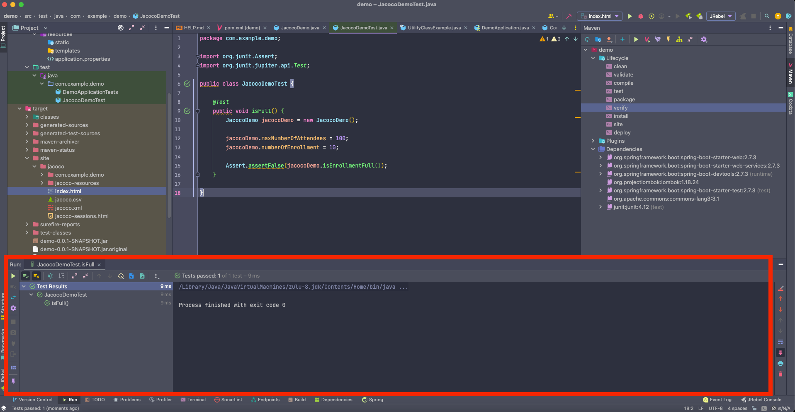
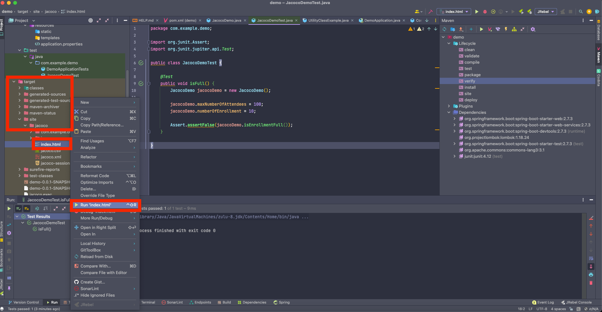
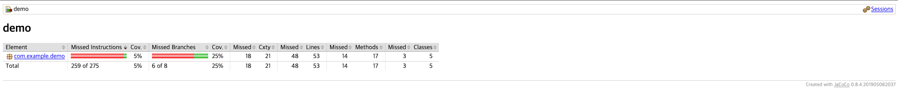
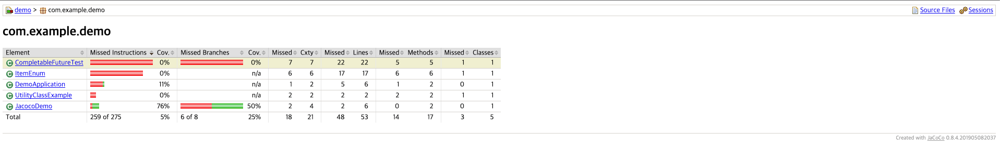
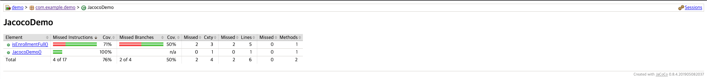
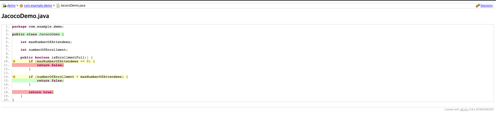

## 코드 커버리지는 어떻게 측정할까?

> 코드 커버리지

- 테스트 코드가 확인한 소스 코드의 비율
    - 대표 프레임워크 : JaCoCo

> 의존성 추가

````xml
<plugin>
    <groupId>org.jacoco</groupId>
    <artifactId>jacoco-maven-plugin</artifactId>
    <version>0.8.4</version>
    <executions>
        <execution>
            <goals>
                <goal>prepare-agent</goal>
            </goals>
        </execution>
        <execution>
            <id>report</id>
            <phase>prepare-package</phase>
            <goals>
                <goal>report</goal>
            </goals>
        </execution>
    </executions>
</plugin>
````

> Maven - Build

````shell
mvn clean verify
````

> 커버리지 미충족 시 빌드 실패 설정

````xml
<execution>
    <id>jacoco-check</id>
    <goals>
        <goal>check</goal>
    </goals>
    <configuration>
        <rules>
            <rule>
                <element>PACKAGE</element>
                <limits>
                    <limit>
                        <!-- 라인 커버리지 비율 50% -->
                        <counter>LINE</counter>
                        <value>COVEREDRATIO</value>
                        <minimum>0.50</minimum>
                    </limit>
                </limits>
            </rule>
        </rules>
    </configuration>
</execution>
````

> 코드 작성

````java
public class JacocoDemo {

    int maxNumberOfAttendees;

    int numberOfEnrollment;

    public boolean isEnrollmentFull() {
        if (maxNumberOfAttendees == 0) {
            return false;
        }

        if (numberOfEnrollment < maxNumberOfAttendees) {
            return false;
        }

        return true;
    }
}
````

> 테스트 코드 작성 및 실행

````java
// junit4
import org.junit.Assert;
import org.junit.jupiter.api.Test;

public class JacocoDemoTest {

    @Test
    public void isFull() {
        JacocoDemo jacocoDemo = new JacocoDemo();

        jacocoDemo.maxNumberOfAttendees = 100;
        jacocoDemo.numberOfEnrollment = 10;

        Assert.assertFalse(jacocoDemo.isEnrollmentFull());
    }

}
````



> 커버리지 확인

- target/site/jacoco/index.html 우클릭 > Run 'index.html' 클릭



- 커버리지 측정 결과 확인









- 노란색 : 반만 통과
- 초록색 : 통과
- 빨간색 : 미통과

> 동작 원리

- 바이트 코드에서 코드 커버리지를 측정해야하는 부분에 대해 마킹
- 코드 실행 시 마킹한 부분에서 몇 개를 실행했는지 카운팅


