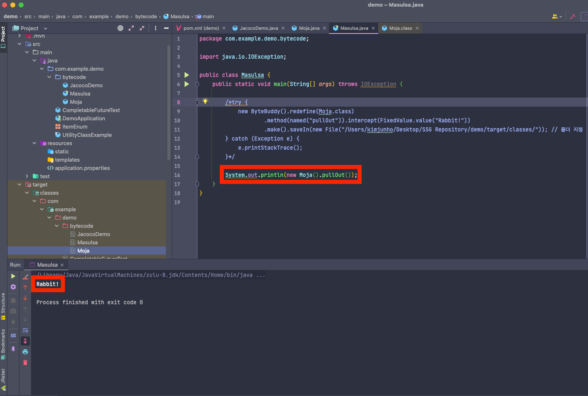

## 모자에서 토끼를 꺼내는 마술 (* 클래스 파일을 바꾸는 방식)

> 아무것도 없는 'Moja' 클래스에서 'Rabbit' 문자열을 출력해보자

````java
// Moja 클래스의 pullOut() 는 빈문자열을 리턴한다
public class Moja {
    public String pullOut() {
        return "";
    }
}
````

````java
public class Masulsa {
    public static void main(String[] args) {
        System.out.println(new Moja().pullOut());
    }
}
````

> 바이트코드 조작 라이브러리

- ByteBuddy : https://bytebuddy.net/#/
- ASM: https://asm.ow2.io/
- Javassist: https://www.javassist.org/

> 바이트 코드 조작 확인 (ByteBuddy)

- 1. 원본 파일 (Moja) 의 컴파일된 바이트 코드에는 pullOut 메소드에 return 값이 빈문자열


- 2. Moja 클래스의 pullOut 메소드 코드를 ByteBuddy 를 사용하여 컴파일 시 바이트 코드 변경

  - 반드시 아래 ByteBuddy 코드를 통해 컴파일 해야 바이트 코드가 변경된 클래스 사용 가능
  -

````java
public class Masulsa {
    public static void main(String[] args) throws IOException {

        try {
            new ByteBuddy().redefine(Moja.class)
                    .method(named("pullOut")).intercept(FixedValue.value("Rabbit!"))
                    .make().saveIn(new File("/Users/kimjunho/Desktop/SSG Repository/demo/target/classes/")); // 폴더 지정
        } catch (Exception e) {
            e.printStackTrace();
        }

        // System.out.println(new Moja().pullOut());
    }
}
````


- 3. 이후 아래 코드와 같이 ByteBuddy 사용 코드를 주석 처리 후 기존 코드인 pullOut() 메소드 호출 시 조작된 바이트코드를 통해 "Rabbit!" 문자열 출력

````java
public class Masulsa {
    public static void main(String[] args) throws IOException {
        /*
        try {
            new ByteBuddy().redefine(Moja.class)
                    .method(named("pullOut")).intercept(FixedValue.value("Rabbit!"))
                    .make().saveIn(new File("/Users/kimjunho/Desktop/SSG Repository/demo/target/classes/")); // 폴더 지정
        } catch (Exception e) {
            e.printStackTrace();
        }
        */

        System.out.println(new Moja().pullOut());
    }
}
````


