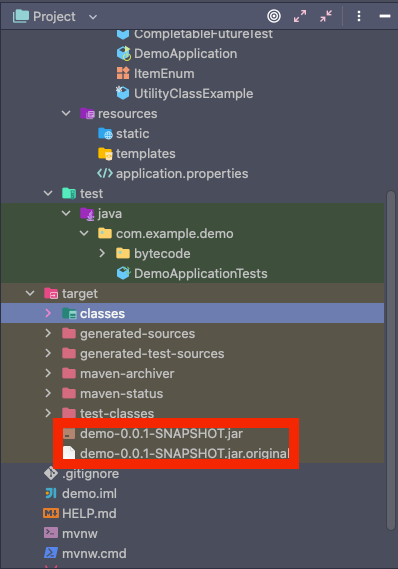
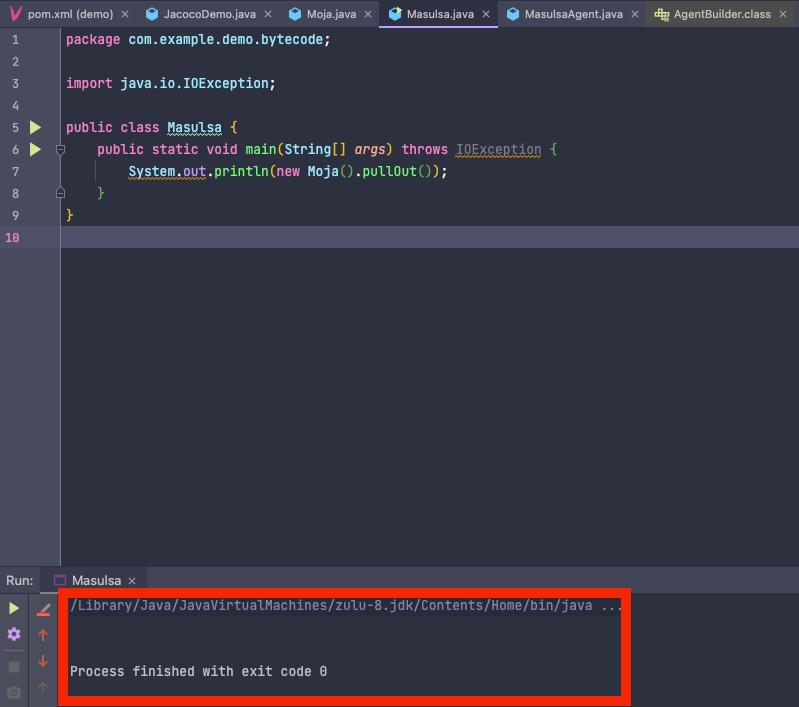
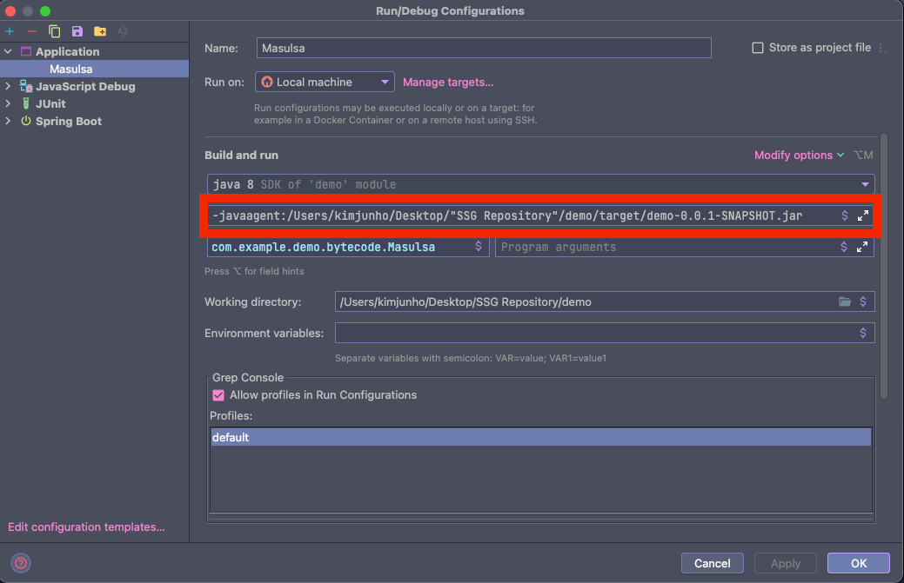
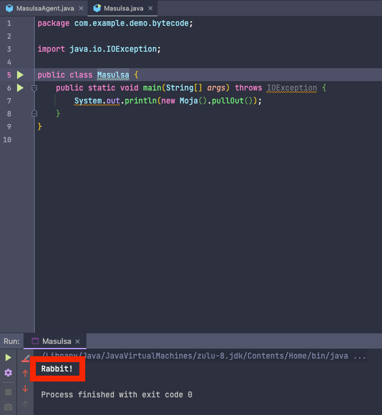
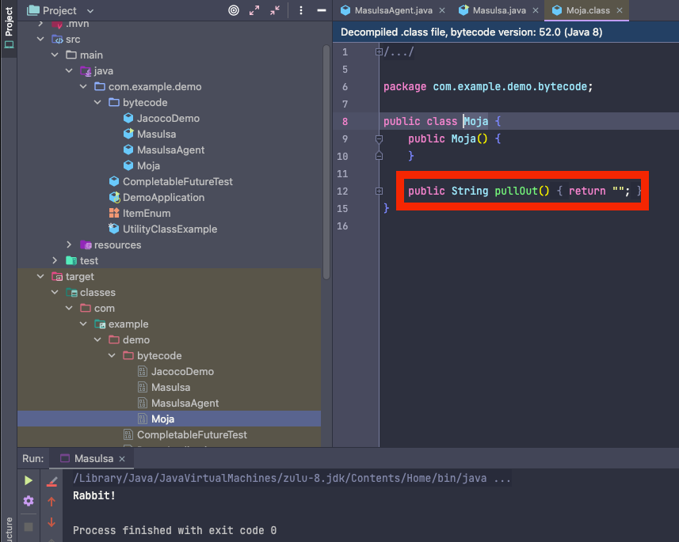

## javaagent 실습 (* 클래스 로드 시 변경된 바이트 코드를 통해 로드하여 메모리 적용 - 클래스 파일은 변경되지 않음)

> Javaagent JAR 파일 만들기

- https://docs.oracle.com/javase/8/docs/api/java/lang/instrument/package-summary.html
- 붙이는 방식은 시작시 붙이는 방식인 premain 과 런타임 중에 동적으로 붙이는 방식 agentmain 존재
- Instrumentation 사용

> Javaagent 붙여서 사용하기

- 클래스로더가 클래스를 읽어올 때, javaagent 를 거쳐서 변경된 바이트코드를 읽어들여 사용

- 1. instrument

````xml
<build>
    <plugin>
        <groupId>org.apache.maven.plugins</groupId>
        <artifactId>maven-surefire-plugin</artifactId>
        <version>2.19.1</version>
    </plugin>
    <plugin>
        <groupId>org.apache.maven.plugins</groupId>
        <artifactId>maven-jar-plugin</artifactId>
        <version>3.1.2</version>
        <configuration>
            <archive>
                <index>true</index>
                <manifest>
                    <addClasspath>true</addClasspath>
                </manifest>
                <manifestEntries>
                    <mode>development</mode>
                    <url>${project.url}</url>
                    <key>value</key>
                    <Premain-Class>com.example.demo.bytecode.MasulsaAgent</Premain-Class>
                    <Can-Redefine-Classes>true</Can-Redefine-Classes>
                    <Can-Retransform-Classes>true</Can-Retransform-Classes>
                </manifestEntries>
            </archive>
        </configuration>
    </plugin>
</build>
````

- 2. maven clean package
    - jar 파일 생성 확인



- 3. javaagent 미실행 시 기존 클래스 파일을 기준으로 클래스 로더가 읽기 때문에 "Rabbit!" 미출력



- 4. javaagent - VM 옵션 추가
    - 폴더명에 공백이 들어가서 "" 처리



- 5. Masulsa 클래스 재실행
    - Moja 클래스의 바이트코드는 변경되지 않았지만, javaagent 로 인하여 "Rabbit!" 출력






