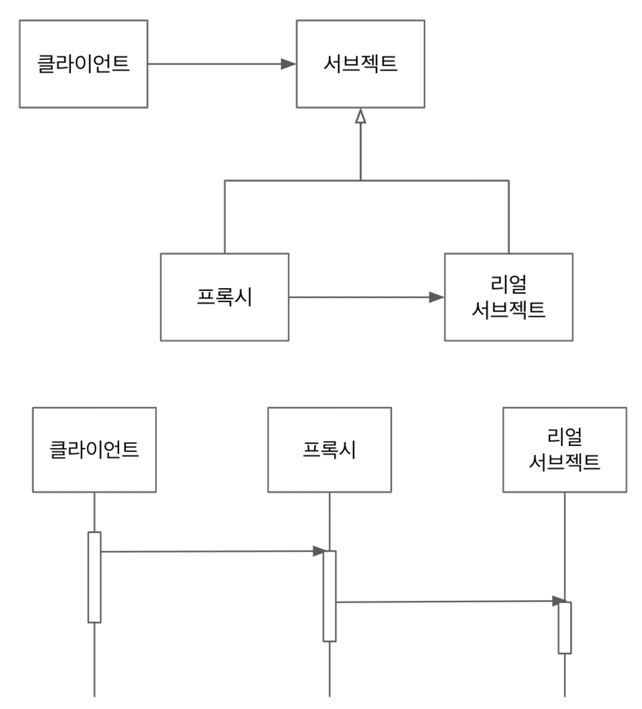

## 프록시 패턴



- 프록시와 리얼 서브젝트가 공유하는 인터페이스가 있고, 클라이언트는 해당 인터페이스 타입으로 프록시를 사용
- 클라이언트는 프록시를 거쳐서 리얼 서브젝트를 사용하기 때문에 프록시는 리얼 서브젝트에 대한 접근을 관리거나 부가 기능을 제공하거나, 리턴값 변경 가능
- 리얼 서브젝트는 자신이 해야 할 일만 하면서(SRP) 프록시를 사용해서 부가적인 기능(접근 제한, 로깅, 트랜잭션 등)을 제공할 때 이런 패턴을 주로 사용

````java
@Data
public class Book {
    String title;
}
````

````java
/**
 * 서브젝트
 */
public interface BookService {
    public void rent(Book book);
}
````

````java
/**
 * 리얼 서브젝트
 */
public class DefaultBookService implements BookService {

    @Override
    public void rent(Book book) {
        System.out.println("rent : " + book.getTitle());
    }

}
````

````java
/**
 * 프록시
 */
public class BookServiceProxy implements BookService {

    BookService bookService;

    public BookServiceProxy(BookService bookService) {
        this.bookService = bookService;
    }

    @Override
    public void rent(Book book) {
        System.out.println("[proxy init]");
        bookService.rent(book); // 리얼 서브젝트로 위임
        System.out.println("[proxy end]");
    }

}
````

````java
public class DefaultBookServiceTest {

    BookService bookService = new DefaultBookService(); // 프록시 미사용
    BookService proxyBookService = new BookServiceProxy(new DefaultBookService()); // 프록시 사용

    @Test
    @DisplayName("프록시 미사용")
    public void realsubject() {
        Book book = new Book();
        book.setTitle("spring");
        bookService.rent(book);
    }

    @Test
    @DisplayName("프록시 사용")
    public void proxy() {
        Book book = new Book();
        book.setTitle("spring");
        proxyBookService.rent(book);
    }
}
````
