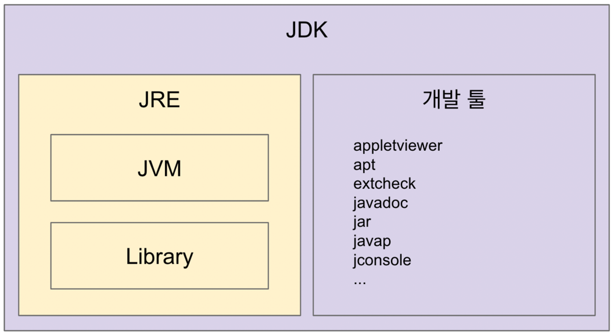

## 자바, JVM, JDK, JRE



> JVM (Java Virtual Machine)

- 자바 가상 머신으로 자바 바이트 코드 (.class 파일) 를 OS에 특화된 코드로 변환하여 실행
    - 인터프리터, JIT 컴파일러 사용
- 바이트 코드를 실행하는 표준이자 구현체
- JVM 스펙 : https://docs.oracle.com/javase/specs/jvms/se11/html
- JVM 벤더 : 오라클, 아마존, Azul 등
- 특정 플랫폼에 종속적
- 최소 배포 단위는 JRE

````java
// Java Code
public class HelloJava {
    public static void main(String args[]) {
        System.out.println("Hello, Java");
    }
}
````

````shell
# javac 를 사용하여 Java 파일 컴파일
javac HelloJava
ls
# 바이트코드 확인
HelloJava.class HelloJava.java
# javap -c 를 사용하여 바이트코드 확인
javap -c HelloJava
Compiled from "HelloJava.java"
public class HelloJava {
    public HelloJava();
        Code:
           0: aload_0
           1: invokespecial #1      // Method java/lang/Object. "<init>":()V
           4: return

    public static void main(java.lang.String[]);
        Code:
           0: getstatic     #2      // Field java/lang/System.out:Ljava/io/PrintStream;
           3: ldc           #3      // String Hello, Java
           5: invokevirtual #4      // Method java/io/PrintStream.println:(Ljava/lang/String;)V
           8: return
}
````

> JRE (Java Runtime Environment)

- JVM + 라이브러리
- 자바 어플리케이션을 실행할 수 있도록 구성된 배포판
- JVM 과 핵심 라이브러리 및 자바 런타임 환경에서 사용하는 프로퍼티 셋팅이나 리소스 파일 포함
- 개발 관련 도구는 미포함 (개발 관련 도구는 JDK 에서 제공)

> JDK (Java Development Kit)

- JRE + 개발 툴
- 소스 코드를 작성할 때 사용하는 자바 언어는 플랫폼에 독립적
- 오라클은 자바 11부터 JDK 만 제공하며, JRE 는 별도 제공 X
- Write Once Run Anywhere

> Java

- 프로그래밍 언어
- JDK 에 들어있는 자바 컴파일러 (javac) 를 사용하여 바이트 코드(.class 파일) 로 컴파일 가능
- 자바 유료화
    - 오라클에서 만든 Oracle JDK 11 버전부터 상용으로 사용 시 유료
    - 오라클에서 만든 Oracle Open JDK 는 무료
    - https://medium.com/@javachampions/java-is-still-free-c02aef8c9e04

> JVM 언어

- JVM 기반으로 동작하는 프로그래밍 언어
    - 컴파일 시 java 파일 또는 class 파일이 생성된다면, JVM 사용 가능
- Kotlin, Scala, Groovy 등

````kt
// 코틀린 코드 (vim Hello.kt)
fun main(args: Array<String>) {
    println("Hello, Kotlin");
}
````

````shell
# 코틀린 컴파일러를 통해 코틀린 파일 컴파일
kotlinc Hello.kt

# 클래스 파일 확인
Hello.kt HelloKt.class

# javap -c 를 통한 바이트 코드 확인
javap -c Hello.kt
````

