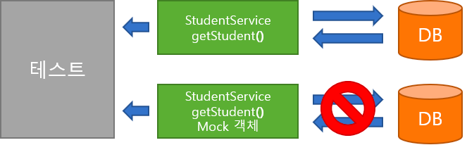

## 01. Mockito 개요

> Mock 이란 ?

- Mock 은 한글로 '모의, 가짜의'라는 뜻으로 테스트할 때, 필요한 실제 객체와 동일한 모의 객체를 만들어 테스트의 효용성을 높이기 위해 사용

````java
@Service
public class StudyService {

    public Student getStudent() {
        // DB 에서 Student 테이블 조회 (부하가 많이 걸리는 작업)
    }
}
````

- DB 에서 Student 테이블을 읽어 Student 객체를 리턴하는 메소드를 테스트
- 매번 테스트할 때마다 DB 에서 데이터를 조회하는 것은 부하가 많이 걸리고, 시간도 많이 소요
- 그래서 Student 를 DB 에서 읽어오지 않고, 이를 가짜 객체 즉, Mock 으로 만들어서 DB에 있는 테이블 접근을 최소화



> Mockito 란 ?

- Mock 을 쉽게 만들고 Mock 의 행동을 정하는 Stubbing, 정상적으로 작동하는지에 대한 Verify 등 다양한 기능을 제공해주는 프레임워크
